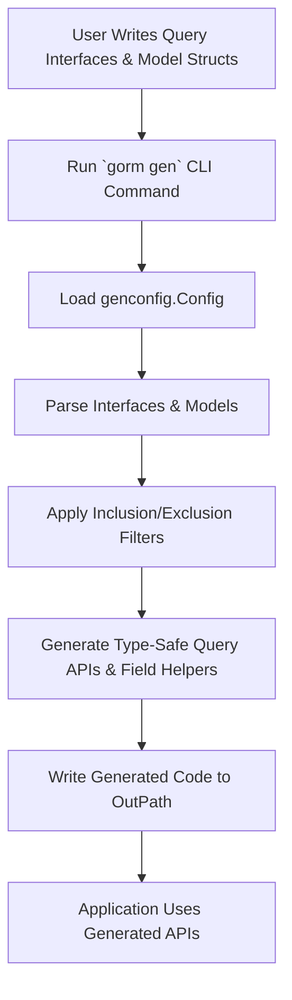

# Integration Points & Extensibility

Integrate GORM CLI smoothly within your Go and GORM workflows, customizing generation behavior and extending capabilities to fit your project's unique needs. This guide explains how GORM CLI acts as a flexible toolchain component you can embed into existing projects, configure precisely, and extend with custom field helpers and generation strategies.

---

## Why Integration and Extensibility Matter

When adopting GORM CLI, you want it to adapt to your workflow — not the other way around. Whether your project uses complex data models, custom SQL interfaces, or domain-specific field types, seamless integration ensures generated code fits naturally.

Extensibility allows you to plug in custom field helpers, fine-tune inclusion rules, and control how code is generated, maintaining stylistic consistency and supporting advanced use cases.

---

## Where GORM CLI Fits into Your Workflow

Typically, GORM CLI operates as a build-time code generation tool that you invoke via the CLI or embed in your build pipelines. Here’s how it fits:

1. **Write Go Interfaces with SQL Template Annotations**
   - You define query interfaces using Go generics and SQL DSL comments.
2. **Define Your Model Structs**
   - Models live alongside interfaces, decorated as desired with struct tags.
3. **Run GORM CLI Code Generation**
   - Invoke the `gorm gen` command to scan your input directory, parse interfaces and models, and produce type-safe, fluent query APIs alongside model-driven field helpers.
4. **Leverage Generated Code at Runtime**
   - Use generated interfaces and helpers seamlessly in your app’s database code.

> Integration focuses on running GORM CLI at the right moment with correct inputs and outputs, while extensibility controls what and how it generates.

---

## Configurability: Fine-Tuning Generation

You control GORM CLI's behavior via a package-level `genconfig.Config` struct inside your model or query interface packages. This config influences:

- **Output Path (`OutPath`)**
  - Directs generated files to a specific folder.
- **Inclusion & Exclusion Filters**
  - Include or exclude interfaces and structs by name or pattern.
- **File-Level Control (`FileLevel`)**
  - Generate code on a per-file basis or for whole packages.
- **Custom Field Type & Name Mapping**
  - Map Go types or struct tag identifiers to custom field helpers.

### Example: Customizing Generation Filters and Output

```go
package examples

import (
  "database/sql"
  "gorm.io/cli/gorm/field"
  "gorm.io/cli/gorm/genconfig"
)

var _ = genconfig.Config{
  OutPath: "examples/generated",
  IncludeInterfaces: []any{"Query*"},
  ExcludeInterfaces: []any{"QueryDeprecated*"},
  FieldTypeMap: map[any]any{
    sql.NullTime{}: field.Time{},
  },
  FieldNameMap: map[string]any{
    "json": JSON{},  // map `gen:"json"` tag to custom JSON helper
  },
  FileLevel: false,
}
```

> This configuration ensures only interfaces matching `Query*` are generated, excludes deprecated ones, customizes how certain fields are handled, and places output into a dedicated folder.

---

## Supporting Custom Field Helpers

Your project may have specialized field types that need their own SQL generation logic. GORM CLI supports this through:

- Implementing custom field helpers that embed the core `field.Field[T]` or its variants like `field.Struct[T]` or `field.Slice[T]`.
- Defining how these helpers produce expressions (e.g., for JSON, encrypted fields).
- Mapping them via `FieldNameMap` or `FieldTypeMap` in your generation config.

### Case Study: JSON Fields

You may want a JSON helper that emits database-specific JSON queries:

```go
// JSON is a custom field helper for JSON columns
// with database-aware SQL generation
// Usage example:
// generated.User.Profile.Equal("$.vip", true)
// generates different SQL based on your DB dialector

type JSON struct { column clause.Column }

func (j JSON) WithColumn(name string) JSON {
  c := j.column
  c.Name = name
  return JSON{column: c}
}

func (j JSON) Equal(path string, value any) clause.Expression {
  return jsonEqualExpr{col: j.column, path: path, val: value}
}

// ... implementation for database specific SQL omitted for brevity ...
```

Map this helper to fields tagged `gen:"json"` in your model to leverage it automatically.

---

## Controlling Interface and Struct Inclusion

By default, GORM CLI generates code for all interfaces and structs detected in the input directory. To tailor this:

- Use `IncludeInterfaces` / `ExcludeInterfaces` to whitelist or blacklist interfaces for code generation.
- Use `IncludeStructs` / `ExcludeStructs` similarly for model structs.
- Patterns (shell-style wildcards) and fully qualified type literals are supported for precise matching.

Example:

```go
var _ = genconfig.Config{
  IncludeInterfaces: []any{"Query*", models.Query(nil)},
  ExcludeInterfaces: []any{"*Deprecated*"},
  IncludeStructs: []any{"User", "Account*"},
  ExcludeStructs: []any{"*DTO"},
}
```

---

## File-Level vs. Package-Level Generation

- **File-Level (`FileLevel=true`)**
  - Generates code files per input Go source file.
  - Useful for fine-grained control or partial generation setups.
- **Package-Level (`FileLevel=false`)**
  - Generates one set of output files per package.
  - Suitable for typical use cases where all related definitions live in a package.

Adjust `FileLevel` in your config depending on your project’s code organization.

---

## Embedding and Extending GORM CLI

While GORM CLI is primarily a CLI tool, you can also embed the code generation engine programmatically by leveraging the internal `gen.Generator` struct.

This allows:

- Integration with custom build processes
- Programmatically triggering generation with custom inputs or configurations
- Extending parsing logic or adding programmatic hooks before code output

The main program initializes and runs the generator like this:

```go
package main

import (
  "gorm.io/cli/gorm/internal/gen"
)

func runGenerator(inputPath, outputPath string) error {
  g := gen.Generator{
    Files:   map[string]*gen.File{},
    outPath: outputPath,
  }

  if err := g.Process(inputPath); err != nil {
    return err
  }

  return g.Gen()
}
```

> Note: Direct embedding is advanced usage and requires understanding of generator internals.

---

## Common Integration Scenarios

### Scenario 1: Incorporating GORM CLI in CI/CD Pipeline

- Add a `gorm gen` command to your build scripts, specifying input interface file and output folder.
- Use a dedicated generation config at package-level for consistent output.
- Commit generated code or treat it as ephemeral depending on your deployment practices.

### Scenario 2: Using Custom Field Helpers for Domain Types

- Implement helper structs with SQL generation logic.
- Register them via `FieldTypeMap` or `FieldNameMap` in your config.
- Annotate models with appropriate `gen:"customTag"` struct tags.

### Scenario 3: Selective Generation in Monorepos

- Use inclusion/exclusion patterns to limit generation to relevant interfaces and structs.
- Set `FileLevel` to true if separation is needed per file for modular gen.

---

## Troubleshooting Integration Issues

<AccordionGroup title="Troubleshooting Common Issues">
<Accordion title="Generated Code Missing Interfaces or Structs">
Verify your `genconfig.Config` inclusion and exclusion patterns. Ensure they match your interfaces and struct names correctly. Patterns are shell-style and case-sensitive.
</Accordion>
<Accordion title="Output Directory Not Honored">
Ensure your `OutPath` is set either via CLI `-o` flag or via `genconfig.Config`. If multiple configs apply, the nearest takes precedence.
</Accordion>
<Accordion title="Custom Field Helper Not Applied">
Confirm that your custom helper is correctly mapped in `FieldTypeMap` or `FieldNameMap`. Also check struct field tags if mapping by name.
</Accordion>
<Accordion title="Integration With Build Tools Fails">
Check that the input path to `gorm gen` includes all required source files. If embedding programmatically, verify file path resolutions and config application.
</Accordion>
</AccordionGroup>

---

## Practical Tips for Successful Integration

- Place your `genconfig.Config` in the same package as your models and query interfaces to simplify discovery.
- Use shell glob patterns for flexible inclusion/exclusion but test carefully to avoid unintentional omissions.
- Leverage file-level generation if your project needs highly modular generation outputs.
- Keep custom field helpers focused on encapsulating SQL generation for complex types like JSON or encrypted data.
- Use CI checks to verify generated code is up-to-date.

---

## Summary

GORM CLI is designed to integrate naturally into your Go/GORM projects via a flexible command-line tool and a powerful programmatic API. Configurability through `genconfig.Config` lets you tailor generation output and supported features precisely, while extensibility enables custom helpers and generation behaviors critical for real-world applications. With correct setup, you harness type-safe, generated query APIs and field helpers seamlessly within your existing development lifecycle.

---

## Related Documentation

- [What is GORM CLI?](/overview/introduction/what-is-gorm-cli) – Product intro and core purpose
- [Product Value & Use Cases](/overview/introduction/value-prop-and-use-cases) – Why use GORM CLI?
- [Feature Summary](/overview/introduction/feature-overview) – Core features at a glance
- [Core Concepts & Terminology](/overview/core-architecture-concepts/core-concepts) – Understand key terms
- [Getting Started with GORM CLI](/guides/essential-workflows/getting-started) – Step into usage
- [Customization and Generation Config](/guides/advanced-use-cases/customization-configuration) – Deep dive into config
- [System Architecture](/overview/core-architecture-concepts/architecture-overview) – Internal flow overview

---

For examples, see [example configurations](https://github.com/go-gorm/cli/tree/main/examples/genconfig) and practical project setups.


---

# Mermaid Diagram: Integration Flow Overview



---