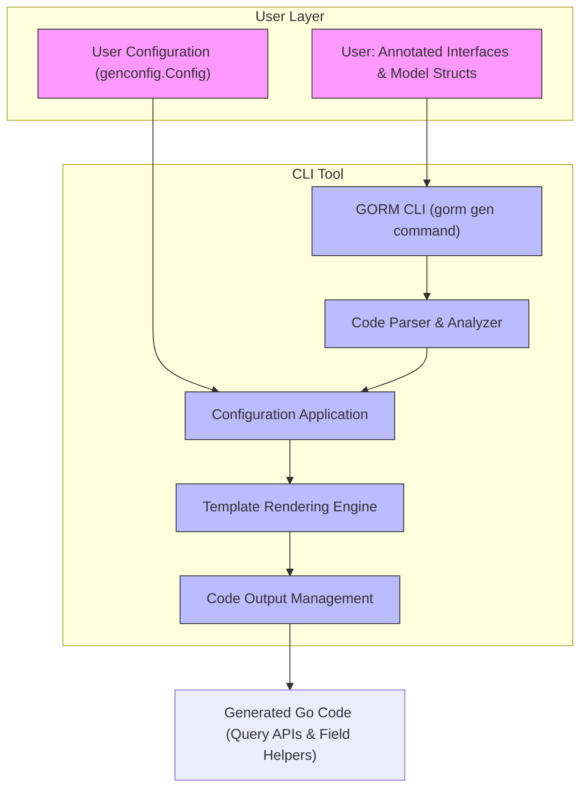

# How GORM CLI Works (Architecture)

## Understanding the Architecture of GORM CLI

GORM CLI orchestrates the transformation of your Go code annotations into powerful, type-safe query APIs and model-driven helpers. This page unveils the core architectural components and workflows that enable this seamless code generation process. By understanding these building blocks and their interactions, you will better appreciate how the CLI automates and simplifies database access layers in your Go projects.

---

## The Big Picture: From User Input to Generated Code

At the heart of GORM CLI’s architecture lies a carefully designed pipeline that takes your annotated Go interfaces and model structs, processes configuration and templates, and outputs fully generated, compile-safe code.

This end-to-end workflow ensures your database operations are both type-checked and maintainable—saving you from runtime surprises and tedious boilerplate.

<Steps>
<Step title="User Inputs">
Users provide annotated Go interfaces containing SQL templates and their corresponding model structs that define the database schema.
</Step>
<Step title="CLI Command Invocation">
The user runs `gorm gen` with flags specifying input files or directories and an output directory. This triggers the code generator.
</Step>
<Step title="Parsing & Analysis">
The generator parses the input files, extracting code interfaces, SQL template comments, and metadata from model structs.
</Step>
<Step title="Configuration Application">
User-level configurations such as inclusion/exclusion filters, type mappings, and output paths (defined via `genconfig.Config`) modify what and how code is generated.
</Step>
<Step title="Template Rendering">
The core templates synthesize query APIs from interfaces and field helpers from models, producing Go code tailored to your schema and queries.
</Step>
<Step title="Code Output">
Generated files are written to the specified output directory, ready to be imported and used in your application.
</Step>
</Steps>

---

## Core Architectural Components

### 1. Input Source

- **Annotated Interfaces**: These Go interfaces contain raw SQL queries embedded as comments using a template DSL. Each method represents a database operation with strong parameter binding.
- **Model Structs**: Go structs annotated with GORM tags describe your data model with field metadata and associations.

Together, they form the source material for code generation.

### 2. Configuration

Users customize generation through `genconfig.Config` declarations. Key configuration options include:

- Inclusion and exclusion lists for interfaces and structs
- Output directory overrides
- Field type mappings (e.g., mapping `sql.NullTime` to specialized field helpers)
- File-level generation scope

Configurations allow fine control over how code is generated, enabling selective and context-aware generation suited for varied project structures.

### 3. Generator Core

Implemented in the CLI’s `gen` command, the generator:

- Scans the inputs with Go parser tools
- Extracts methods and templates
- Resolves model fields and their types
- Applies included/excluded filters
- Infuses configuration mappings
- Invokes template rendering engines

This core logic ensures accurate, robust parsing and generation.

### 4. Template Engine

GORM CLI uses Go’s `text/template` engine layered with helper functions to:

- Convert interface SQL templates into concrete query implementations
- Create rich, fluent field helpers for filters, updates, and association operations
- Insert necessary imports and package declarations

This component encapsulates the rule-driven code generation.

### 5. Output Management

Finally, generated source files are written into the target directory (default `./g`). The output follows idiomatic Go project conventions to integrate smoothly with your existing codebase.

---

## Diagram: GORM CLI Architecture and Workflow



---

## Real-World Workflow Example

Imagine you have a `User` model and interface with embedded SQL templates for common queries. You write your interface in a Go file and your models with associations in another.

1. You run:

```bash
gorm gen -i ./examples -o ./generated
```

2. The CLI reads your inputs and applies any project configurations (e.g., exclude deprecated interfaces).

3. It generates:

- Strongly typed methods matching your interface signatures
- Field helpers such as `generated.User.Name.Eq()` for building fluent queries
- Association operations like `Create()`, `Unlink()`, `Delete()` on related models

4. You import and use the generated API in your app code with full compile-time safety and discoverability.

---

## Practical Tips & Best Practices

- **Annotate interfaces clearly:** Use SQL templates with parameter bindings to express all your queries.
- **Define models accurately:** Include GORM association tags to generate correct field helpers.
- **Leverage config for control:** Use `genconfig.Config` to include or exclude specific interfaces or structs as your project evolves.
- **Organize your input files:** Maintain interfaces and models logically by package and directory to optimize generator scope.
- **Run generation regularly:** Make code generation part of your build or CI pipeline to keep generated code up to date.

---

## Common Pitfalls & Troubleshooting

<AccordionGroup title="Troubleshooting Accelerator">
<Accordion title="Input File or Directory Not Found">
Ensure the `-i` flag points to existing Go interface files or directories. Paths should be relative or absolute with correct casing.
</Accordion>
<Accordion title="Missing Required Flags">
The `input` flag is mandatory. Running `gorm gen` without `-i` will return an error.
</Accordion>
<Accordion title="Configuration Not Applying">
Check your `genconfig.Config` declarations are package level and in the same folder as your source code for automatic detection.
</Accordion>
<Accordion title="Generated Code Fails to Compile">
Verify your model struct annotations and interface SQL templates for correctness, especially parameter types and tags.
</Accordion>
</AccordionGroup>

---

## Summary

GORM CLI’s architecture blends user-provided annotated Go code with a versatile, configurable generation engine to produce fluent, type-safe APIs for data access. Its modular components—from parsing to templating and output management—collaborate to automate and elevate your data layer development, minimizing errors and maximizing productivity.

---

## Next Steps

Start exploring GORM CLI’s usage by visiting these related pages:

- [What is GORM CLI?](../overview/product-intro/what-is-gorm-cli) — Understand the tool’s core value and capabilities.
- [First Code Generation](../../getting-started/first-usage/first-code-generation) — Learn how to run your first generation command.
- [Field Helpers Guide](../../guides/getting-started-workflows/field-helpers-basics) — Dive deeper into using generated field helpers.
- [Associations Guide](../../guides/advanced-patterns-integration/associations-in-depth) — Master complex relationship handling.

For detailed code and CLI command implementation, see the [GitHub Repository](https://github.com/go-gorm/cli).

---

## References

- CLI Command: `gorm gen` defined in `internal/gen/gen.go`
- Core template rendering in `internal/gen/template.go`
- Configuration examples in the package-level `genconfig.Config` declarations


