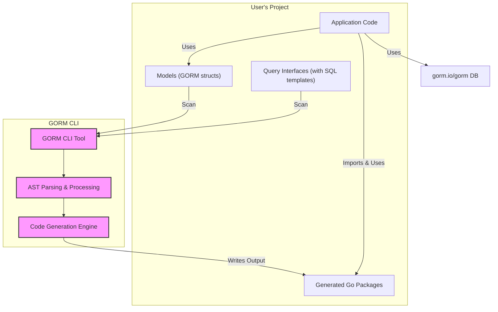

# Integration with GORM and Go

## Seamlessly Bring Generated Code Into Your Go Projects

GORM CLI unlocks the power of type-safe, interface-driven query APIs and model-driven field helpers — directly integrated with your existing Go codebase and `gorm.io/gorm`. This page explains the practical workflow to adopt GORM CLI-generated code, demonstrating how to evolve from writing manual queries toward fluent, safe, and discoverable data access.

---

## Why Integration Matters

Imagine replacing error-prone raw SQL queries and repetitive manual GORM calls with generated APIs that provide static type safety, IDE autocompletion, and consistent SQL templating—all while fully compatible with your existing data models. This integration:

- Boosts developer productivity by reducing boilerplate
- Improves code quality by catching errors at compile time
- Ensures your database queries and updates are consistent and maintainable

This page guides you through that transformation.

---

## How GORM CLI Fits in Your Workflow

At its core, GORM CLI works as a code generator that consumes your Go interfaces with SQL templates and your GORM model structs to output strongly typed, idiomatic Go packages. These packages:

- Provide ready-to-use query functions matching your interface definitions
- Offer field and association helpers generated from your models

You’ll integrate these generated packages in your projects just like any other Go package.

### Typical Workflow

1. **Define your models and query interfaces in Go**

   You write GORM-compatible model structs and interfaces annotated with SQL templates as Go interface comments. This captures your application’s query intentions in code.

   ```go
   // models/user.go
   type User struct {
       ID   uint
       Name string
       Age  int
   }

   // queries/user_queries.go
   type Query[T any] interface {
       // SELECT * FROM @@table WHERE id=@id
       GetByID(id int) (T, error)
   }
   ```

2. **Run GORM CLI to generate code**

   Use the CLI to scan your source directory containing these definitions. It produces Go packages with generated implementations.

   ```bash
   gorm gen -i ./queries -o ./generated
   ```

3. **Import and use generated APIs in your application**

   Replace manual `db` calls or raw SQL with typed, fluent methods from generated packages.

   ```go
   import "yourmodule/generated"

   func GetUser(db *gorm.DB, id int) (*models.User, error) {
       return generated.Query[models.User](db).GetByID(context.Background(), id)
   }
   ```

---

## How Generated Code Works Together With GORM

### Generated Query Interfaces

- Each interface you define for queries is implemented with a concrete struct wrapping `gorm.DB`.
- Method bodies are generated from your SQL templates, using parameter bindings and template directives to form powerful, type-safe queries.
- Context parameters are automatically injected if not declared explicitly.

### Model-Driven Field Helpers

- For each GORM model struct, a Go variable is generated providing typed field helpers.
- These helpers facilitate producing SQL predicates and updates using strongly typed fluent expressions.
- They handle primitive fields like `int` and `string`, as well as complex associations (`has many`, `belongs to`, `many2many`).

---

## User Journey: From Manual to Generated

### Before GORM CLI

Developers write manual queries or GORM calls directly:

```go
// Manual query example
var user User
err := db.Where("id = ?", id).First(&user).Error
```

Manual queries are verbose, prone to typos, and lack static type safety.

### After GORM CLI

Leverage generated APIs:

```go
// Generated query example
user, err := generated.Query[User](db).GetByID(ctx, id)

// Using field helpers for more expressive queries
users, err := gorm.G[User](db).
  Where(generated.User.Age.Gt(18)).
  Find(ctx)
```

This shifts the burden of query correctness to code generation, while your team benefits from autocomplete, code reuse, and consistent SQL.

---

## Practical Tips for Smooth Integration

- **File Placement:** Keep your interface definitions, model structs, and `genconfig.Config` declarations in the same Go package or directory tree. This allows GORM CLI to automatically discover and generate code.

- **Configure Output Paths:** Customize output via `genconfig.Config` to place generated code in dedicated packages accessed by your application.

- **Use Context:** Generated methods add `context.Context` automatically if your interface method does not declare it, keeping your usage idiomatic.

- **Map Custom Field Types:** Use `FieldTypeMap` and `FieldNameMap` in your config to extend generation for specialized types like JSON or nullable fields.

- **Adopt Incrementally:** Start by generating query APIs for a few interfaces, then replace manual queries progressively as you build confidence.

---

## Example: Bringing It All Together

```go
package main

import (
	"context"
	"fmt"
	"gorm.io/driver/sqlite"
	"gorm.io/gorm"

	"yourmodule/generated"
	"yourmodule/models"
)

func main() {
	db, err := gorm.Open(sqlite.Open("test.db"), &gorm.Config{})
	if err != nil {
		panic(err)
	}

	ctx := context.Background()

	// Use generated API instead of manual db calls
	user, err := generated.Query[models.User](db).GetByID(ctx, 123)
	if err != nil {
		fmt.Println("Error fetching user:", err)
		return
	}

	fmt.Println("User fetched:", user)
}
```

This code imports the generated package, calls the generated query method, and obtains the user record with compile-time checked correctness.

---

## Troubleshooting Common Issues

<AccordionGroup title="Common Integration Challenges">
<Accordion title="Generated Code Not Found or Import Errors">
- **Cause:** Generated package was not built or placed in directory not recognized by Go modules.
- **Solution:** Confirm CLI's `-o` output path aligns with your Go module imports. Run `gorm gen` again and rebuild your project.
</Accordion>
<Accordion title="Method Signatures Missing Context Parameter">
- **Cause:** Older-generated code or manual interface lacks `context.Context`.
- **Solution:** Ensure you run the latest GORM CLI and define interfaces without `ctx`: the generator will add it.
</Accordion>
<Accordion title="Field Helpers Not Generated for Custom Types">
- **Cause:** Custom Go types (e.g., JSON, nullable structs) require explicit `FieldTypeMap` or `FieldNameMap` in `genconfig.Config`.
- **Solution:** Add proper mappings to your package's `genconfig.Config`.
</Accordion>
</AccordionGroup>

---

## Summary

Integrating GORM CLI-generated code lets your Go application harness type-safe, fluent, and maintainable database APIs built automatically from your SQL-templated interfaces and GORM models. By following the define → generate → import workflow, your team shifts manual query crafting to a declarative, reliable, and developer-friendly approach aligned perfectly with your existing GORM usage.

---

## Related Resources

- [What is GORM CLI?](./product-intro) — Introduction and core concepts
- [Type-Safe Query APIs](./query-api-overview) — Deep dive into interface-driven queries
- [Model-Driven Field Helpers](./field-helper-overview) — Understanding generated field helpers
- [Configuring Generation](./customization-config) — Customize generation to fit your needs
- [Quickstart: Generate Your First Query API](../../guides/core-getting-started/intro-quickstart) — Start quickly with a practical example
- [Seamless Integration with GORM and Real Applications](../../guides/practices-integration/integration-gorm) — Best practices and examples


---

## Next Steps

1. Define your models & query interfaces following [Defining Models & Query Interfaces](../../getting-started/first-run-usage/defining-models-interfaces).
2. Generate your code with `gorm gen` using [Generating Code](../../getting-started/first-run-usage/generating-code).
3. Import and replace manual queries with the generated APIs as shown here.


---

## Diagram: High-Level Integration Flow



This flow illustrates how your existing Go code interacts with GORM CLI to produce generated packages, which your application then consumes for type-safe, fluent data access integrated with GORM.

---