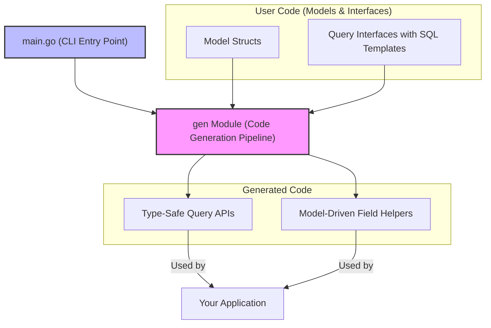

# System Architecture

Understand how GORM CLI transforms your Go code into powerful, type-safe database APIs through a clear, high-level workflow. This page visualizes the core flow from your model and interface definitions, through the generation pipeline, and finally to the output: fluent type-safe query APIs and model-driven field helpers.

## Why This Matters

For any Go developer working with GORM, navigating the generation workflow is critical to confidently build and extend data access layers. This architecture overview connects the dots between your input code and the generated outputs, clarifying how each component fits and interacts.

Whether you're defining query interfaces, customizing models, or understanding how generated code works under the hood, this page provides the foundational insight.

## Core Flow Overview

At the heart of GORM CLI, your Go source files — containing **models** and **query interfaces** annotated with SQL templates — serve as the input. The **GORM CLI command line tool** (`main.go`) acts as your entry point to the code generation pipeline.

### Key Steps:

1. **You write your models and interfaces** with SQL templating comments and GORM struct tags.
2. **The CLI executes the generator module**, parsing the code and interfaces.
3. **The code generator produces two main outputs**:
   - **Type-safe query APIs** based on your interfaces, allowing fluent, compile-time-safe queries.
   - **Model-driven field helpers** based on your structs, enabling easy and safe construction of conditions and updates.

This process ensures your database operations align precisely with your original schema and queries, eliminating manual boilerplate and runtime errors.

## Mermaid Diagram: High-Level System Architecture

## How It All Fits Together

- **User Code**: Your `models` define your data schema with GORM-compatible structs. Your `interfaces` define data access patterns with embedded SQL templates.
- **CLI Entry Point (`main.go`)**: Launches the generation based on your project inputs.
- **Generator Pipeline (`gen` module)**: Parses input code, maps models and interfaces, applies generation templates to produce output code.
- **Output**:
  - *Query APIs* expose methods typed to your data models offering fluent query building.
  - *Field Helpers* provide rich, model-aware predicates and setters for filter and update operations.

## Practical Implications for Users

- Run the CLI with your source paths to instantly receive fully typed query and helper code.
- Understand any errors or generation issues by knowing the pipeline's flow and where parsing or template application happens.
- Customize generation behavior via `genconfig` knowing that configuration is consumed during this pipeline phase.

## Tips for Success

- Keep your models and query interfaces close in the codebase so the generator analyzes them together.
- Use unique, clear query interface names matching patterns recognized by the generator.
- When debugging, verify your `main.go` CLI invocation targets the correct directories.

## Next Steps

After grasping this high-level architecture, proceed to:

- [Defining Models & Query Interfaces](/getting-started/first-run-usage/defining-models-interfaces) — learn how to craft interfaces and models for generation.
- [Generating Code](/getting-started/first-run-usage/generating-code) — step through running the CLI generator.
- [Type-Safe Query APIs](/overview/feature-tour/query-api-overview) — deep dive into using generated APIs.
- [Model-Driven Field Helpers](/overview/feature-tour/field-helper-overview) — master the helpers for filters and updates.

---

By visually mapping your development inputs to generated outputs, this architecture page empowers you to optimize your use of GORM CLI, troubleshoot issues more effectively, and customize your workflow confidently.

---

### Source Code References

- CLI entry point: [`main.go`](https://github.com/go-gorm/cli/blob/main/main.go)
- Code generation core module: [`internal/gen/template.go`](https://github.com/go-gorm/cli/blob/main/internal/gen/template.go)

---