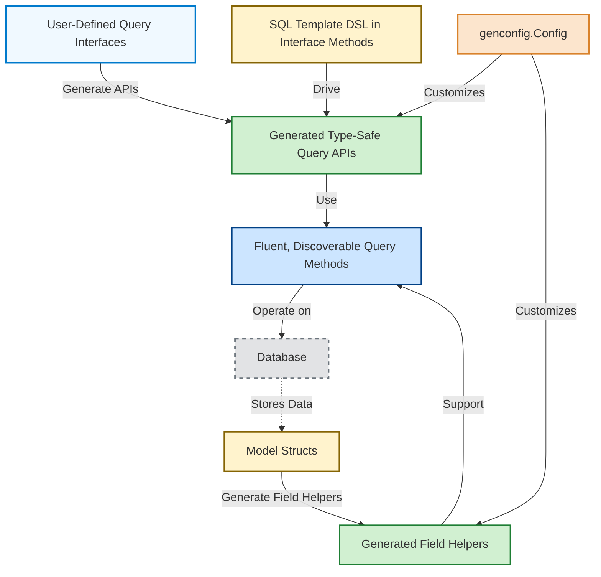

# Core Concepts & Terminology

GORM CLI introduces several foundational concepts and terms that form the backbone of its functionality. Understanding these terms allows you to leverage the tool effectively to generate type-safe, fluent, and maintainable data access code within your Go projects.

---

## Query APIs

### What Are Query APIs?
Query APIs are Go interfaces written by users containing methods annotated with SQL templates that declare data access queries. GORM CLI processes these interfaces to generate concrete, type-safe implementations that expose intuitive and strongly typed query methods.

### Why Use Query APIs?
- Gain compile-time safety for your SQL operations.
- Write queries once with readable templates, then call them as regular Go methods.
- Enjoy fluent query building with automatically generated, discoverable APIs.

### Key Points
- Defining a query interface involves adding methods with comments containing SQL or a template DSL.
- The generator creates implementations that bind parameters, return structured results, and support complex conditional logic.

### Example
```go
// Query interface with SQL templates
type Query[T any] interface {
  // SELECT * FROM @@table WHERE id=@id
  GetByID(id int) (T, error)

  // Filter by name and age
  // where("name=@name AND age=@age")
  FilterByNameAndAge(name string, age int)
}
```

---

## Model-Driven Field Helpers

### What Are Field Helpers?
Model-driven field helpers are strongly typed constructs generated from your model structs that expose filters, setters, and association operations for every field.

### Purpose and Benefit
- Enable expressive, readable query conditions and updates via fluent APIs.
- Reduce boilerplate by abstracting SQL fragment generation.
- Handle basic data fields as well as associations like has-one, has-many, belongs-to, and many-to-many.

### How They Work
- Basic fields generate helpers like `.Eq(value)`, `.Incr(amount)`, or `.Like(pattern)`.
- Associations generate special helpers to create, update, unlink, or delete related records safely and succinctly.

### Example
```go
// Filter users with age > 18
users, err := gorm.G[User](db).
  Where(generated.User.Age.Gt(18)).
  Find(ctx)

// Update user's name
gorm.G[User](db).
  Where(generated.User.ID.Eq(1)).
  Set(generated.User.Name.Set("newname")).
  Update(ctx)
```

---

## Association Operations

### What Are Associations?
Associations represent the relationships between your models, such as "has one," "has many," "belongs to," and "many to many".

### Supported Operations
- **Create**: Create and link an associated record.
- **CreateInBatch**: Batch create/link multiple associated records.
- **Update**: Update associated records that match optional filters.
- **Unlink**: Remove the association link (nullable foreign keys or join table entries) without deleting records.
- **Delete**: Remove associated records or join table entries.

### Semantics by Association Type
| Association Type | Unlink Semantics                 | Delete Semantics                             |
|------------------|--------------------------------|---------------------------------------------|
| belongs to       | Sets parent foreign key to NULL | Deletes associated rows                      |
| has one/many     | Sets child foreign key to NULL  | Deletes child rows                           |
| many-to-many     | Removes join table entries only | Deletes join table entries only, not records |

### Example
```go
// Create a user and one pet
gorm.G[User](db).
  Set(
    generated.User.Name.Set("alice"),
    generated.User.Pets.Create(generated.Pet.Name.Set("fido")),
  ).
  Create(ctx)

// Unlink pets from user
gorm.G[User](db).
  Where(generated.User.ID.Eq(1)).
  Set(generated.User.Pets.Unlink()).
  Update(ctx)
```

---

## Template DSL

### Overview
GORM CLI supports a powerful SQL template domain-specific language (DSL) embedded in Go interface method comments. This lets you write dynamic, conditional, and reusable SQL with Go variables.

### Core DSL Directives
| Directive   | Purpose                           | Example                                      |
|-------------|----------------------------------|----------------------------------------------|
| `@@table`   | Resolves to the model's table name | `SELECT * FROM @@table WHERE id=@id`          |
| `@@column`  | Resolves to a dynamic column name  | `WHERE @@column=@value`                       |
| `@param`    | Binds Go function parameters to SQL | `WHERE name=@user.Name`                       |
| `{{where}}` | Introduce a conditional WHERE clause| `{{where}} age > 18 {{end}}`                  |
| `{{set}}`   | Conditional SET clause for UPDATEs  | `{{set}} name=@name {{end}}`                  |
| `{{if}}`    | Conditional SQL fragment            | `{{if age > 0}} AND age=@age {{end}}`         |
| `{{for}}`   | Iterate over a collection           | `{{for _, t := range tags}} ... {{end}}`      |

### Example
```sql
-- Select users conditionally
SELECT * FROM @@table
{{where}}
  {{if user.Name != ""}} name=@user.Name {{end}}
  {{if user.Age > 0}} AND age=@user.Age {{end}}
{{end}}
```

---

## Generation Config

### What is Generation Config?
`genconfig.Config` is a Go struct you declare at the package level to customize code generation behavior.

### Use Cases
- Specify output paths for generated files.
- Map Go types or tagged fields to custom field helper types.
- Include or exclude specific interfaces or structs.
- Control the granularity of generation (package vs. file level).

### Example
```go
var _ = genconfig.Config{
  OutPath: "examples/output",
  FieldTypeMap: map[any]any{
    sql.NullTime{}: field.Time{},
  },
  FieldNameMap: map[string]any{
    "json": JSON{},
  },
  IncludeInterfaces: []any{"Query*"},
}
```

### How Config Works
- The generator automatically detects `genconfig.Config` in your packages.
- Multiple configs accumulate, allowing hierarchical or specific overrides.
- Filtering by includes/excludes helps focus generation on relevant types.

---

## Summary Diagram



---

## Practical Tips
- **Start simple:** Define basic query interfaces and models, then generate code.
- **Leverage associations:** Use association helpers to write complex relational queries easily.
- **Use template DSL:** Write dynamic SQL with conditions to cover flexible query needs.
- **Configure selectively:** Use `genconfig.Config` to focus generation on parts of your codebase.
- **Validate generated code:** Check generated code to understand available methods and structures.

## Troubleshooting
- Ensure your Go interfaces and model structs are properly defined and exported.
- The generator requires Go 1.18+ due to generics usage.
- Method comments with SQL templates must be syntactically correct; invalid template syntax will cause generation failure.
- If certain interfaces or structs are excluded, verify your `IncludeInterfaces` / `ExcludeStructs` filters.

---

This foundational terminology equips you to navigate GORM CLI’s workflows, empowering you to write safer, clearer, and maintainable database access code effortlessly.