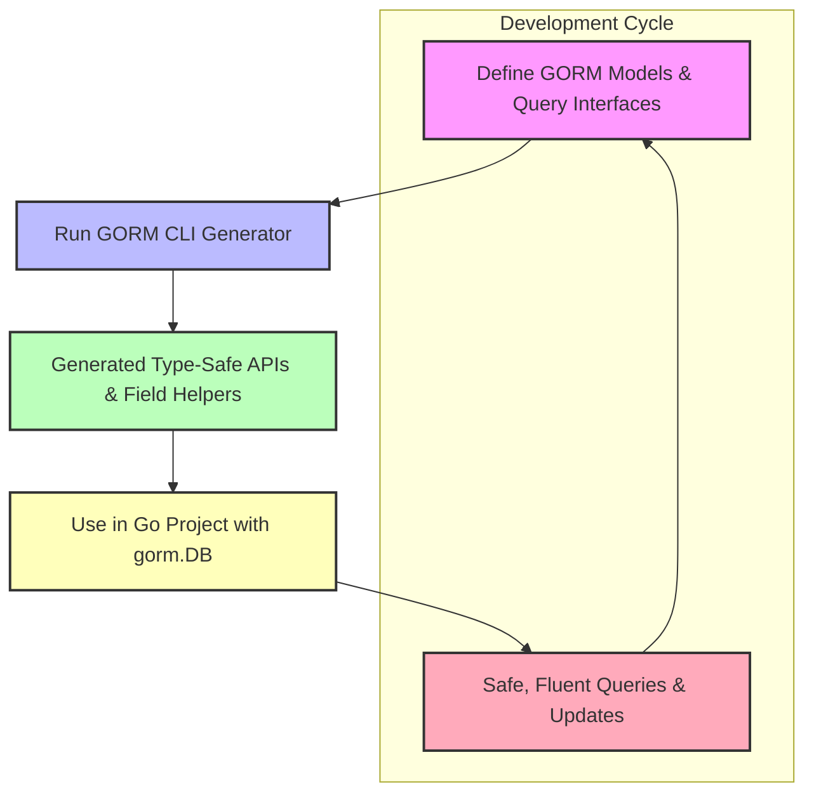

# Integration with GORM and Your Project

## Seamless Integration for Effortless Development

GORM CLI is designed to fit naturally into your existing Go projects that use GORM. This page guides you through how to integrate generated, type-safe query APIs and model-driven field helpers into your workflow, so you can write expressive, safe, and maintainable data access code right alongside your GORM models.

Whether you’re starting fresh or adding GORM CLI to a mature codebase, this page walks you through the standard integration steps—writing interfaces, generating code, and employing the generated APIs in runtime.

---

## What You Will Achieve

- Automatically generate type-safe query interfaces that respect your models
- Use fluent, strongly-typed field helpers for filters, updates, and associations
- Replace raw SQL statements and error-prone string-based queries with compile-time-checked methods
- Integrate generated code seamlessly with existing `gorm.DB` instances


---

## Your Typical Workflow: From Interface to Application

The most common integration flow is straightforward and intuitive, focusing on user intent rather than internal mechanics.

### Step 1: Define Your Models and Query Interfaces

Start by declaring your GORM model structs as you normally do. Alongside, define Go interfaces to represent your query intentions. Annotate interface methods with SQL templates directly in the method's comments.

```go
// models/user.go
package models

import "gorm.io/gorm"

type User struct {
    gorm.Model
    Name string
    Age  int
    Role string
}
```

```go
// queries/query.go
package queries

// Query defines common user queries with SQL templates.
type Query[T any] interface {
  // SELECT * FROM @@table WHERE id=@id
  GetByID(id int) (T, error)

  // SELECT * FROM @@table WHERE @@column=@value
  FilterWithColumn(column string, value string) (T, error)

  // UPDATE @@table
  // {{set}}
  //   {{if user.Name != ""}} name=@user.Name, {{end}}
  //   {{if user.Age > 0}} age=@user.Age, {{end}}
  // {{end}}
  // WHERE id=@id
  UpdateInfo(user T, id int) error
}
```

### Step 2: Run the Generator

Use the CLI to generate the queries and field helpers from your interfaces and models.

```bash
gorm gen -i ./queries -o ./generated
```

This step parses your interfaces and struct definitions, applies your SQL templates, and creates concrete implementations plus strongly typed field helpers.

### Step 3: Import and Use the Generated Code in Your Application

Consume the generated packages alongside GORM's `*gorm.DB` as if they were handcrafted utilities.

```go
package main

import (
  "context"
  "fmt"
  "log"

  "gorm.io/gorm"
  "your_project/generated"
  "your_project/models"
)

func main() {
  db := setupDatabase() // your GORM setup
  ctx := context.Background()

  // Use generated Query interface
  userQuery := generated.Query[models.User](db)

  // Fetch user by ID safely
  user, err := userQuery.GetByID(ctx, 123)
  if err != nil {
    log.Fatalf("Failed to get user: %v", err)
  }
  fmt.Printf("Fetched User: %+v\n", user)

  // Update user info safely
  err = userQuery.UpdateInfo(ctx, models.User{Name: "newname", Age: 30}, 123)
  if err != nil {
    log.Fatalf("Failed to update user: %v", err)
  }
}
```

### Step 4: Use Generated Field Helpers for Advanced Queries and Updates

Beyond simple queries, leverage generated field helpers for conditions and associations—building fluent, compile-time safe expressions.

```go
// Example: Retrieve adults with a specific role
users, err := gorm.G[models.User](db).
    Where(generated.User.Age.Gt(18), generated.User.Role.Eq("admin")).
    Find(ctx)

if err != nil {
    log.Fatal(err)
}

// Example: Create a new user with associated pets
err = gorm.G[models.User](db).
    Set(
      generated.User.Name.Set("Alice"),
      generated.User.Pets.Create(generated.Pet.Name.Set("Fido")),
    ).Create(ctx)
```


---

## Best Practices & Tips

- **Keep your query interfaces close to your model definitions** to maintain cohesiveness.
- Use **the CLI’s `-i` and `-o` flags** to target the right files and output locations reflecting your project structure.
- Leverage **`genconfig.Config`** to tailor generation, including custom field mappings and selective interfaces, for large projects.
- Write **SQL templates expressively** to maximize type safety and generate clear query methods.
- Always **run tests with generated code** to ensure that generated queries meet runtime expectations.

<Note>
If your models include complex associations like many-to-many or polymorphic relations, generated helpers provide safe operations for creating, linking, updating, and unlinking associated records, making these patterns safe and maintainable.
</Note>

---

## Common Integration Scenarios and Troubleshooting

<AccordionGroup title="Common Questions and Solutions">
<Accordion title="What if I update my model structs?">
After changing your models, re-run `gorm gen` to regenerate the associated field helpers and query implementations so your code remains in sync.
</Accordion>
<Accordion title="How do I handle generated code conflicts or existing hand-written code?">
Output the generated code to a dedicated subdirectory (e.g., `generated/`) to keep it separate. Use `.gitignore` judiciously or commit generated files if you want full tracking.
</Accordion>
<Accordion title="Can I use the generated code with existing GORM transactions?">
Yes. Pass your transaction `*gorm.DB` instance to the generated query constructors to execute queries within transactions seamlessly.
</Accordion>
<Accordion title="What happens if templated SQL has errors?">
Compile-time and runtime errors may surface if templates are malformed. Ensure syntax correctness in your interface method comments. Consult the CLI’s verbose output for parsing errors.
</Accordion>
</AccordionGroup>

---

## High-Level Integration Diagram



---

## Next Steps

- Explore [Core Concepts & Terminology](/overview/core-concepts-and-architecture/core-concepts) to deepen your understanding of generated APIs.
- Follow the [Quickstart Workflow](/overview/feature-highlights-and-getting-started/quickstart) for hands-on setup guidance.
- Customize generation with [Generation Config & Overrides](/concepts/configuration-and-extensibility/generation-config-and-overrides) for fine control.


---

Experience the power of compile-time safe queries with native GORM integration by adding GORM CLI to your Go project today.

---

<Check>
By following this integration guide, you will enhance your Go project with safer, clearer, and maintainable data access layers, unlocking the full potential of GORM CLI.
</Check>

---