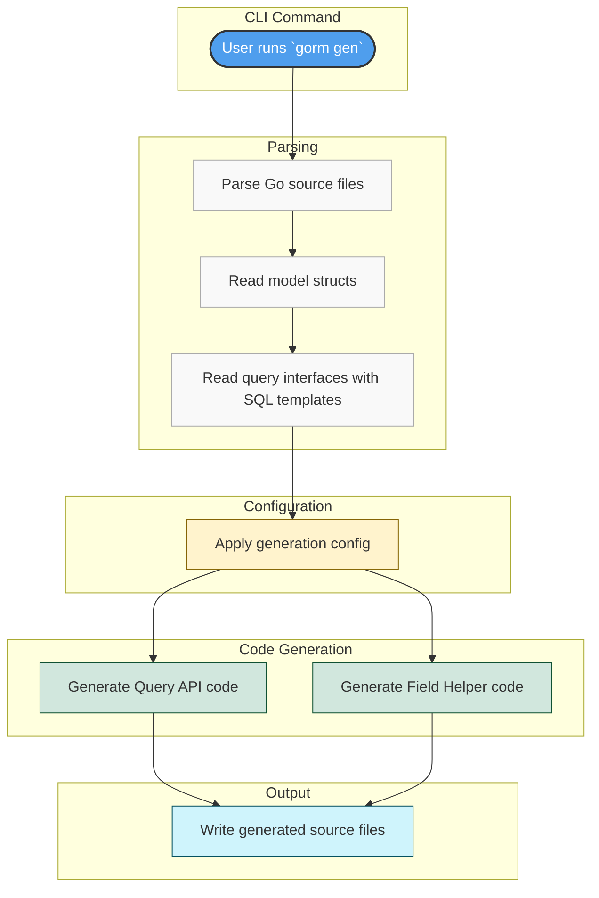

# Architecture Overview

## Discover How GORM CLI Transforms Your Go Code with Type Safety and Fluent APIs

GORM CLI stands at the intersection of your data models and powerful, type-safe query generation. This overview provides a bird’s-eye view that guides you through the journey from defining your Go models and query interfaces to generating ready-to-use, efficient query code—all deeply integrated with the GORM ORM.

### Why This Architecture Matters to You

- **Unlock productivity** with automated code generation that reduces manual errors.
- **Gain confidence** through compile-time safety and discoverable query methods.
- **Write less, do more** using fluent and expressive APIs tailored to your own models.

Whether you're building simple CRUD operations or complex association workflows, understanding this architecture lets you master the flow and make the most of GORM CLI.

---

## How GORM CLI Works: From Your Code to Generated Helpers

At its core, GORM CLI translates your Go source definitions into robust, compile-time safe APIs that integrate seamlessly with your existing GORM-based codebase. The process flows through these essential steps:

1. **Command-line Interaction:**
   - You invoke the CLI tool (typically via `gorm gen`) specifying your source files containing models and query interfaces.

2. **Parsing and Analysis:**
   - The generator parses these Go files, recognizing struct models and interface definitions with embedded SQL templates.
   - It understands your types, struct fields, and the custom SQL query annotations in interface methods.

3. **Configuration Application:**
   - Global or package-level configuration (via `genconfig.Config`) refines what’s included or excluded, custom type mappings, and output paths.

4. **Code Generation:**
   - Two main generators operate:
      - **Query API generator**, which produces type-safe, interface-implemented Go code that fulfills your query contracts.
      - **Field helper generator**, which creates strongly typed field accessors for your models, enabling fluent filtering, updating, and association queries.

5. **Output Artifacts:**
   - The result is Go source files containing fluent APIs with compile-time checks and rich semantics, ready to be imported and used in your application.

---

## Key Components in the Architecture

- **User-Defined Models (`structs`):** Your domain data structures define tables and fields. GORM CLI extracts these to generate precise field helpers respecting your types and tags.

- **Query Interfaces:** Customized Go interfaces contain methods with SQL templates in comments. These define how you want to query, update, or filter.

- **Templates & DSL:** SQL statements use placeholders and directives for dynamic, conditional logic to adapt to input parameters at runtime.

- **Generator Internals:**
  - Parses Go AST to extract interfaces and structs.
  - Applies config rules for inclusion/exclusion and field mapping.
  - Emits strongly-typed Go code implementing interfaces using generics.

- **Generated Code:**
  - Fluent Query APIs producing SQL with parameters safely bound.
  - Field helpers for predicates, setters, and association operations.

---

## Visualizing the Workflow



---

## Real-World Example: From Definition to Use

1. **You write your model and interface:**

```go
// Model definition
package models

type User struct {
    ID    uint
    Name  string
    Age   int
}

// Query interface with SQL template
package queries

type Query[T any] interface {
    // SELECT * FROM @@table WHERE id=@id
    GetByID(id int) (T, error)
}
```

2. **Run the CLI:**

```bash
gorm gen -i ./models -o ./generated
```

3. **Use the generated code:**

```go
user, err := generated.Query[models.User](db).GetByID(ctx, 123)
if err != nil {
    // handle error
}
fmt.Println(user.Name)
```

This encapsulates your database logic clearly, safely, and concisely.

---

## Best Practices and Tips

- **Keep your interfaces focused:** Define clear SQL templates targeting specific queries or updates.
- **Use configurations to scope generation:** Include/exclude interfaces and models thoughtfully to avoid unnecessary code.
- **Leverage template DSL:** Use conditional and iterative SQL constructs to handle dynamic query needs elegantly.
- **Explore association operations:** Generated helpers support complex relational workflows with minimal manual coding.

---

## Troubleshooting Common Scenarios

<AccordionGroup title="Common Challenges and Guidance">
<Accordion title="Missing Generated Files">
Make sure your CLI command includes the correct `-i` (input path) and that source files have properly declared structs and interfaces.
</Accordion>
<Accordion title="Compilation Errors Due to Types">
Review your model field types and `genconfig.Config` for custom type mappings, ensuring compatibility with the generator.
</Accordion>
<Accordion title="Unexpected Query Behavior">
Verify your SQL templates in interface comments use correct placeholders and DSL directives. Also, make sure your structs match database schemas.
</Accordion>
</AccordionGroup>

---

## Next Steps

- Get hands-on with the [Writing Interfaces & Models](https://your-docs-site/getting-started/first-run-generation/configuration-basics) guide to explore code authoring.
- Proceed to [Generating Code](https://your-docs-site/getting-started/first-run-generation/generating-code) for practical CLI commands.
- Dive deeper into [Template-Based SQL](https://your-docs-site/guides/advanced-usage/template-based-sql) for advanced query customization.


---

This architecture overview is your gateway to mastering GORM CLI, turning your Go code into safe, expressive database queries effortlessly.


---

## References

- [What is GORM CLI?](https://your-docs-site/overview/product-intro/what-is-gorm-cli)
- [Value Proposition & Benefits](https://your-docs-site/overview/product-intro/value-proposition)
- [Using Generated APIs](https://your-docs-site/getting-started/first-run-generation/first-usage)
- [Generation Configuration](https://your-docs-site/guides/advanced-usage/generation-configuration)


---