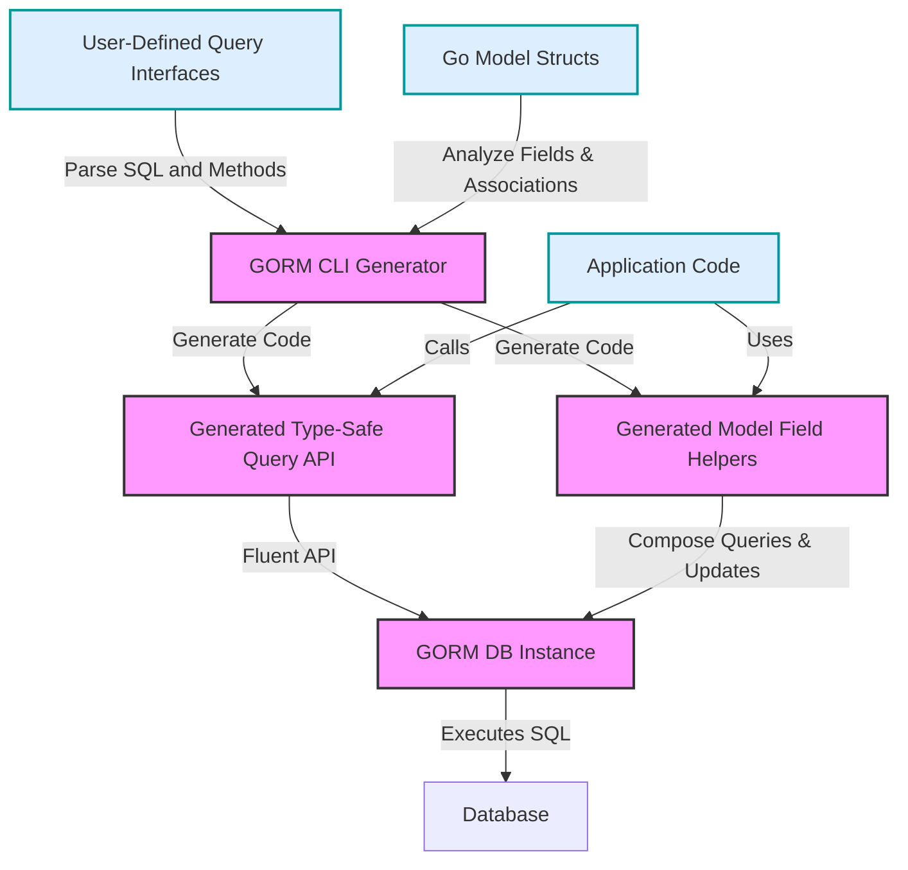

# Core Concepts & Terminology

## Understanding GORM CLI's Essential Terms

Welcome to the foundational guide where we define the core concepts and terminology that empower GORM CLI to transform your Go and GORM development experience. This page unpacks technical terms like *interface-driven queries*, *field helpers*, *associations*, *SQL template DSL*, and *compile-time safety*, revealing how these parts weave together to form a powerful, type-safe code generation workflow.

---

## 1. Interface-Driven Queries

Interface-driven queries are the heart of GORM CLI's code generation. Instead of writing raw SQL scattered throughout your codebase, you define Go interfaces with specially crafted method signatures accompanied by SQL templates in their comments. 

### What Is It?
These interfaces describe SQL queries using a clean, declarative approach. The generator parses these interfaces and automatically produces concrete, type-safe implementations.

### Why It Matters
- **Compile-time safety:** Queries are generated with exact parameter bindings and return types matched to your models, preventing runtime mistakes.
- **Discoverability:** IDE autocompletion lets you find and understand query methods with ease.
- **Fluency:** Generated APIs integrate seamlessly with GORM's `*gorm.DB` interface, preserving composability.


### Example
```go
// Query interface with embedded SQL template comments
type Query[T any] interface {
  // SELECT * FROM @@table WHERE id=@id
  GetByID(id int) (T, error)

  // Conditional filtering
  // {{where}}
  //   {{if name != ""}} name=@name {{end}}
  //   {{if age > 0}} AND age=@age {{end}}
  // {{end}}
  FilterByNameAndAge(name string, age int)
}
```

The generator reads these annotations, producing fully implemented methods that use the correct SQL and bind parameters safely.

---

## 2. Model-Driven Field Helpers

Field helpers are generated model utilities that reflect your Go struct fields in a typesafe and expressive way.

### What They Are
For every model struct, GORM CLI generates helpers representing each field, including basic data types as well as associations (relationships).

### Their Purpose
- **Filters & predicates:** Easily construct WHERE clause conditions with fluent, type-correct methods like `.Eq()`, `.Like()`, `.Between()`, and `.IsNull()`.
- **Updates & expressions:** Build SET clauses for INSERT or UPDATE operations with zero-value support and SQL expression integration.
- **Associations:** Simplify managing relations such as HasMany, BelongsTo, and Many2Many with dedicated create, update, unlink, and delete helpers.

### Example
```go
// Field helpers for User model
// Simple predicates
generated.User.Name.Eq("jinzhu")       // WHERE name = 'jinzhu'
generated.User.Age.Between(18, 65)      // WHERE age BETWEEN 18 AND 65

// Updates
gorm.G[User](db).
  Set(
    generated.User.Name.Set("alice"),
    generated.User.Age.Incr(1),
  ).
  Update(ctx)
```

This approach simplifies query construction and reduces errors from manual string concatenation.

---

## 3. Associations

Associations represent relationships between models, such as HasOne, HasMany, BelongsTo, and Many2Many.

### What They Mean in GORM CLI
GORM CLI generates specialized helpers to manage these relationships safely and declaratively.

### Key Operations
- **Create:** Insert and link related records.
- **Update:** Modify associated records with conditions.
- **Unlink:** Remove the link, e.g., nullify foreign keys or delete join table rows.
- **Delete:** Remove associated records with optional filtering.
- **CreateInBatch:** Efficiently create and link multiple associated records.

### Semantics By Association Type
| Type         | Unlink Behavior              | Delete Behavior                 |
| ------------ | ----------------------------| ------------------------------ |
| Belongs To   | Sets parent FK to NULL       | Deletes associated rows        |
| Has One/Many | Sets child FK to NULL        | Deletes child rows             |
| Many2Many    | Removes join rows only       | Removes join rows only         |

### Real-World Scenario
Imagine creating a user with multiple pets and languages linked in one operation:

```go
gorm.G[User](db).
  Set(
    generated.User.Name.Set("polyglot"),
    generated.User.Pets.CreateInBatch([]models.Pet{{Name: "fido"}, {Name: "rex"}}),
    generated.User.Languages.CreateInBatch([]models.Language{{Code: "EN"}, {Code: "FR"}}),
  ).
  Create(ctx)
```

This single fluent call handles parent creation plus all associations atomically and safely.

---

## 4. SQL Template DSL

GORM CLI employs a specialized SQL Template Domain Specific Language (DSL) embedded within Go interface method comments.

### What Is It?
A concise syntax to express parameter binding, dynamic columns, conditional WHERE or SET clauses, and iteration constructs.

### Key Directives
| Directive   | Description                                  | Example                                                       |
| ----------- | -------------------------------------------- | ------------------------------------------------------------- |
| `@@table`   | Resolves to the model's table name           | `SELECT * FROM @@table WHERE id=@id`                          |
| `@@column`  | Binds a column name dynamically               | `SELECT * FROM @@table WHERE @@column=@value`                 |
| `@param`    | Parameter binding from Go method               | `WHERE name=@user.Name`                                       |
| `{{where}}` | Wraps conditional WHERE blocks                 | `{{where}} age > 18 {{end}}`                                  |
| `{{set}}`   | Wraps conditional SET clauses (UPDATE)         | `{{set}} name=@name {{end}}`                                  |
| `{{if}}`    | Conditional fragments                            | `{{if age > 0}} AND age=@age {{end}}`                         |
| `{{for}}`   | Iteration over collections                       | `{{for _, t := range tags}} ... {{end}}`                      |

### Example
```sql
-- Conditional filtering
SELECT * FROM @@table
{{where}}
  {{if name != ""}} name=@name {{end}}
  {{if age > 0}} AND age=@age {{end}}
{{end}}
```

This dynamic template produces conditional queries depending on parameters passed at runtime.

---

## 5. Compile-Time Safety

Compile-time safety is the primary benefit GORM CLI offers by combining interface-driven, type-safe query APIs and model-driven field helpers.

### Why Compile-Time Safety?
- **Catch errors early:** Mistyped SQL, parameter mismatches, or invalid fields cause compile errors, not runtime panics.
- **Maintain consistency:** Changes to models automatically propagate, keeping query APIs aligned.
- **Simplify refactoring:** Renaming or restructuring your models instantly raises any mismatches in generated code.

### Real Impact
Without GORM CLI, developers write SQL with manual strings and parameters—a source of error prone bugs.

With GORM CLI, your IDE will guide you, and the compiler ensures correctness before code ever runs.

---

## How These Concepts Fit Together

GORM CLI builds on these core concepts in unison:

- You write **interfaces** defining your SQL queries in comments using the **SQL template DSL**.
- By analyzing your Go **model structs**, the tool generates **field helpers** that represent each field and defined **associations**.
- The generator combines these to create **type-safe**, **interface-driven query APIs** plus fluent helpers ensuring **compile-time safety**.
- The resulting code integrates directly with GORM's API, giving you expressive, error-resistant data access.



---

## Practical Tips & Best Practices

- **Define your query interfaces clearly:** Write concise, focused methods per your application's data access requirements.
- **Leverage SQL Template features:** Use conditional `{{if}}`, iteration `{{for}}`, and dynamic binding for flexible queries.
- **Adopt consistent model struct design:** Name fields carefully; use `gen` tags when custom field helpers are needed.
- **Use association helpers to manage relations:** Avoid raw foreign key manipulation; prefer `Create`, `Unlink`, and `Delete` methods for safe association handling.
- **Test generated code usage early:** Integration into your codebase should follow shortly after generation to catch API mismatches.

---

## Troubleshooting Common Issues

<AccordionGroup title="Common Challenges in Core Concepts">
<Accordion title="Missing Compile-Time Errors">
If your generated methods compile but misbehave at runtime, ensure that your interface SQL templates correctly reference existing columns and parameters.
</Accordion>
<Accordion title="Association Methods Not Available">
Confirm your model structs have appropriate GORM tags and associations defined correctly to enable generation of association helpers.
</Accordion>
<Accordion title="Unexpected SQL Behavior from Templates">
Review your SQL templates for correct usage of safety directives such as `@param`, `{{where}}`, and correct conditional syntax.
</Accordion>
<Accordion title="Configuration Ignored by Generator">
If your `genconfig.Config` settings don't take effect, verify that the config literal is declared at package-level and in the files scanned by the generator.
</Accordion>
</AccordionGroup>

---

## Next Steps

Now that you understand these core concepts and terms, explore how they operate in practice:

- Visit [Core Concepts & Architecture > Tool Architecture & Workflow](/overview/core-concepts-architecture/high-level-architecture) for a workflow overview.
- Dive into [Your First Code Generation](/getting-started/your-first-code-generation/defining-models-interfaces) to write your first interfaces and generate code.
- Study real-world [Examples & Use Cases](https://github.com/go-gorm/cli/tree/main/examples) to see these concepts applied.

Embracing these fundamentals unlocks the full potential of GORM CLI for safer, faster, and more maintainable database access.


---

*This page is part of the "Core Concepts & Architecture" section in GORM CLI's documentation. For a comprehensive understanding, complete this section before proceeding to integration or advanced customization topics.*

---

[Back to Documentation Overview](/overview/product-intro-and-value/what-is-gorm-cli)

---

*Generated with precision by the GORM CLI Documentation Team.*
