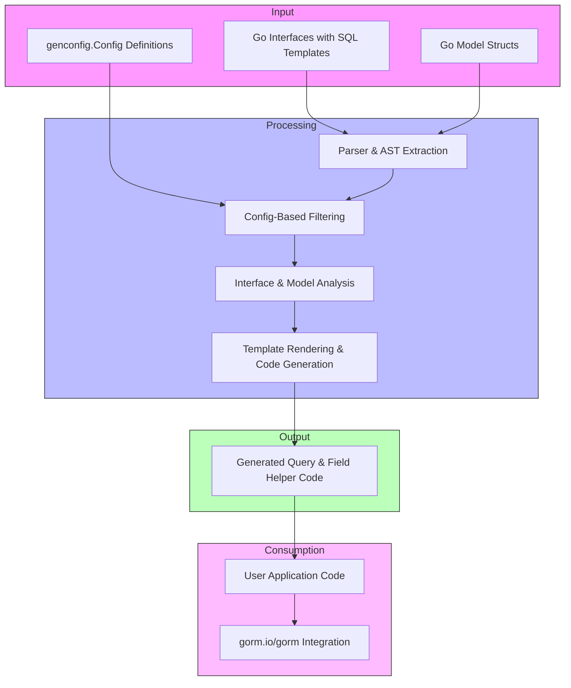

# Tool Architecture & Workflow

Explore how the GORM CLI takes your Go models and interfaces as inputs, and transforms them into powerful, type-safe, fluent code that integrates seamlessly with GORM. This page guides you through the generator’s processing stages, revealing how raw interface definitions and model structs become ready-to-use APIs and helpers.

## Overview

GORM CLI works by processing your source files containing model definitions and interface queries to generate extended, type-safe code tailored for your database workflows. The primary flows are:

- **Input:** Read your Go interface definitions with embedded SQL templates, and your model structs.
- **Code Generation:** Produce concrete implementations for type-safe query APIs and strongly typed field helpers.
- **Consumption:** Use the generated code in your application for expressive, compile-time safe database operations.

This workflow streamlines bridging the gap between raw SQL and Go code while retaining the power and flexibility of GORM.

## How GORM CLI Processes Your Code

### Step 1: Input Processing

- The generator begins by parsing provided file paths or directories.
- It recursively reads Go files to extract:
  - **Interfaces** annotated with SQL template comments describing queries.
  - **Model structs** with fields to create field helper metadata.
- Package-level configurations (`genconfig.Config`) are identified to guide filtering, file output, and field mapping.

### Step 2: Analysis & Filtering

- The tool applies include/exclude rules from configuration to selectively generate code only for matching interfaces and structs.
- It builds internal representations capturing method signatures, field types, and SQL fragments.
- For interfaces, it extracts method-level SQL templates used to generate concrete implementations with appropriate parameters and return types.

### Step 3: Code Generation

- Using internal templates, GORM CLI generates:
  - **Interface implementations**: Methods become concrete functions executing the SQL templates or building query chains.
  - **Field helpers**: Typed wrappers representing model fields, supporting predicates, setters, and association ops.
- The generated code includes safety features, fluent chaining, and compatibility with `gorm.io/gorm` APIs.

### Step 4: Integration & Usage

- The generated code files (by default under `./g`) are ready to be imported and used in your projects.
- They provide fluent APIs such as `generated.Query[User](db).GetByID(ctx, id)` or field-based conditions like `generated.User.Name.Eq("jinzhu")`.


## Generator Workflow Diagram




## Core Components in the Workflow

| Component           | Role                                                                                 |
| ------------------- | ------------------------------------------------------------------------------------ |
| **Interfaces**      | User-defined Go interfaces with method comments containing SQL templates             |
| **Models**          | Go structs defining database schema metadata and fields                             |
| **genconfig.Config**| Optional configuration to control generation behavior                               |
| **Parser/AST Walk** | Reads and parses source files, builds internal AST representations                   |
| **Filter**          | Applies user-configured include/exclude filters for precise code generation scope   |
| **Analyzer**        | Extracts interface methods, SQL queries, and model fields to prepare code templates |
| **Template Generator** | Renders Go source files for query API implementations and field helpers           |
| **Generated Code**  | Resulting Go code files with type-safe APIs and helpers integrated with GORM         |
| **User Application**| Where generated code is imported and utilized, enhancing safety and expressiveness  |


## Field Helper Creation

GORM CLI not only generates query API implementations but also crafts rich field helpers based on your model fields. These helpers improve query expressiveness and type safety.

- **Field helpers for basic types:** e.g., `field.String`, `field.Number[int]`, providing predicates like `.Eq()`, `.Like()`, `.Between()`, etc.
- **Association helpers:** For `hasOne`, `hasMany`, `belongsTo`, and `many2many` relationships, enabling chained association operations such as `.Create()`, `.Update()`, `.Unlink()`, and `.Delete()`.

### Example of Generated Field Helper Code Snippet

```go
var User = struct {
    ID    field.Number[uint]
    Name  field.String
    Age   field.Number[int]
    Pets  field.Slice[Pet]
}{
    ID:   field.Number[uint]{}.WithColumn("id"),
    Name: field.String{}.WithColumn("name"),
    Age:  field.Number[int]{}.WithColumn("age"),
    Pets: field.Slice[Pet]{}.WithName("Pets"),
}
```


## Integration with GORM

The generated outputs leverage `gorm.io/gorm` directly:

- APIs like `generated.Query[User](db)` provide methods to execute type-safe raw SQL-based queries.
- Field helpers enable creating fluent `Where()`, `Set()`, and association operations with compile-time correctness.

This tight integration allows developers to write idiomatic Go database code with enhanced safety and discoverability.


## Practical Example Flow

1. **Define a query interface:**
```go
// UserQuery.go

// SELECT * FROM @@table WHERE id=@id
GetByID(id int) (User, error)
```

2. **Define your model struct with fields and associations:**
```go
// user.go

type User struct {
  ID   uint
  Name string
}
```

3. **Run the generator:**
```bash
gorm gen -i ./examples -o ./generated
```

4. **Use the generated code:**
```go
user, err := generated.Query[User](db).GetByID(ctx, 1)
if err != nil {
  // handle error
}
fmt.Println(user.Name)
```


## Tips for Success

- Organize interfaces and models clearly to leverage filtering via `genconfig.Config`.
- Leverage field helpers to compose readable and safe query predicates.
- Customize generation paths and field mappings via config for large projects.
- Validate generated code with tests to ensure consistency.


## Troubleshooting Common Issues

<AccordionGroup title="Common Generator Workflow Issues">
<Accordion title="Empty Generated Files or Missing Methods">
- Verify your interfaces have SQL template comments.
- Confirm include/exclude filters in `genconfig.Config` aren’t filtering needed types.
</Accordion>
<Accordion title="Models Not Generating Field Helpers">
- Check that model structs are exported and fields are public.
- Ensure the generator is pointed to the correct package or files.
</Accordion>
<Accordion title="SQL Template Errors in Interface Comments">
- Confirm SQL syntax and placeholders match expected template DSL.
- Use escape sequences for `@@table` and parameters.
</Accordion>
</AccordionGroup>


## Next Steps

- Move to [Defining Models & Query Interfaces](/getting-started/your-first-code-generation/defining-models-interfaces) to learn how to prepare your code for generation.
- Explore [Using the Generated APIs in Your Application](/guides/core-workflows/using-generated-apis) for detailed usage scenarios.

---

<Source url="https://github.com/go-gorm/cli" branch="main" paths={[{"path": "internal/gen/generator.go", "range": "1-300"},{"path": "README.md", "range": "1-150"}]} />
