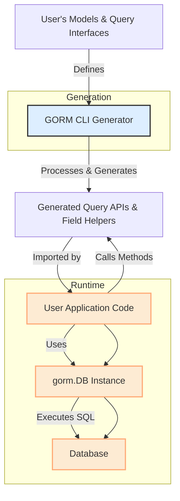

# Integration with GORM & Your Codebase

Integrating GORM CLI into your existing Go projects that use GORM is designed to be seamless, intuitive, and efficient. This page walks you through how the generated code fits into your codebase, how to invoke it effectively, organize output, and extend or customize the integration points to match your workflow.

---

## Why This Matters

For any developer working with GORM in Go, maintaining clean, reliable, and type-safe database access code is critical to both productivity and stability. GORM CLI generates interface-driven query APIs and model-driven field helpers that complement GORM’s ORM capabilities but require a clear understanding of how to integrate and use them within your project structure.

This page helps you unlock the full benefits of GORM CLI by showing how:

- Generated code coexists and interoperates with your current GORM models and DB setup
- Output directories are organized to keep your codebase clean and maintainable
- You call the generated APIs to gain type safety and fluent query building
- You can customize generation paths, field mappings, and extend functionality

---

## How Integration Works: Overview

GORM CLI primarily generates two key assets into your output directory:

1. **Type-safe Query APIs** derived from your Go interfaces annotated with SQL templates.
2. **Model-driven Field Helpers** based on your model structs that support filters, updates, and association operations.

These generated pieces plug directly into your GORM DB instance (`*gorm.DB`) and provide fluent, compile-time safe methods for querying, updating, creating, and managing associations.

### Basic Workflow:

1. **Write your interfaces and models** in the same package or directory.
2. **Run the CLI** specifying the input and output paths.
3. **Use the generated code** in your application by importing the output package.


```go
// Typical usage pattern in your application
user, err := generated.Query[User](db).GetByID(ctx, 123)               // Query API

err := gorm.G[User](db).Where(generated.User.Name.Eq("alice")).Find(ctx) // Fluent field helpers
```


### Output Directory Structure

The generated files maintain your original package structure by default and place output in a configurable directory (`OutPath`), preserving subdirectories as needed. This organization:

- Keeps generated code separate from handwritten code
- Prevents accidental edits to generated files
- Simplifies imports and module management

Example configuration snippet:

```go
var _ = genconfig.Config{
    OutPath: "generated",          // All generated code goes to ./generated/
    IncludeStructs: []any{"User"},
}
```

After generation, you can import your generated models and query APIs clearly from your output module path.

---

## Using the Generated APIs

### Query API Invocation

The CLI generates implementations of your defined interfaces with type-safe method signatures corresponding to your SQL templates.

```go
// Given a DB connection:
db := gorm.Open(...)

// Instantiate query API for the User model
genQuery := generated.Query[User](db)

// Execute a type-safe query
user, err := genQuery.GetByID(ctx, 123)
```

Behind the scenes, these methods build SQL queries with parameter bindings safely applied, returning native Go types.

### Field Helper Usage

Generated model helpers provide expressive methods to build filters, perform updates, and manage associations with compile-time safety and fluent chaining.

```go
// Filter users with age > 18
users, err := gorm.G[User](db).
  Where(generated.User.Age.Gt(18)).
  Find(ctx)

// Create a new user with associated pets
err := gorm.G[User](db).
  Set(
    generated.User.Name.Set("alice"),
    generated.User.Pets.Create(generated.Pet.Name.Set("fido")),
  ).
  Create(ctx)
```

These APIs ensure that your database interactions are both intuitive and type-safe.

---

## Extension and Customization Points

### Configuration via `genconfig.Config`

You can customize how the generator produces code and where by defining a `genconfig.Config` variable in your source package:

- **OutPath**: Change the output directory for generated files.
- **FieldTypeMap / FieldNameMap**: Map custom Go types or struct tags to specific field helper types (useful for JSON, time, or custom serializations).
- **Include / Exclude Patterns**: Control which interfaces and structs are included in the generation process.

Example:

```go
var _ = genconfig.Config{
  OutPath: "generated",
  FieldNameMap: map[string]any{
      "json": JSON{}, // Use custom JSON helper for fields tagged with `gen:"json"`
  },
  IncludeInterfaces: []any{"Query*"},
}
```

This config ensures that only interfaces starting with `Query` are generated and enables JSON field handling.

### Working with Associations

The generated field helpers support creating, updating, unlinking, and deleting related rows through association helpers that mirror your model relationships.

- You can embed association operations inside your `Set()` calls on parent entities.
- Batch creation and filtered unlink/delete operations are supported to handle complex workflows.

Example:

```go
gorm.G[User](db).
  Where(generated.User.ID.Eq(1)).
  Set(
    generated.User.Pets.CreateInBatch([]models.Pet{{Name: "fido"}, {Name: "rex"}}),
  ).
  Update(ctx)
```

This command will batch create and link pets to the user with ID = 1.

---

## Workflow Visualization



This visualization summarizes the flow from user-defined models and interfaces, through generation, and into runtime usage.

---

## Best Practices & Tips

- **Keep your interface and model packages organized.** Place your query interfaces and related models in the same source directory for smooth generation.
- **Use `genconfig.Config` to tailor generation.** Define output paths and field mappings early to avoid surprises in your project layout.
- **Leverage field helpers for safe associations.** Association operations through generated helpers avoid common relational data mistakes.
- **Regularly regenerate after model/interface changes.** This keeps your generated APIs in sync and prevents runtime mismatches.
- **Avoid manual edits to generated files.** Use the generator configuration and source files to control your API surface.

---

## Troubleshooting Common Integration Issues

<AccordionGroup title="Common Integration Issues and Solutions">
<Accordion title="Generated Code Not Found or Not Importable">
Make sure your output directory (`OutPath`) is correctly set and your project imports the generated package path. If you’ve moved files, regenerate the code and update imports accordingly.
</Accordion>
<Accordion title="Build Failures Due to Missing Methods on Generated Types">
Check that your query interfaces have properly defined methods with appropriate return types and that error is the last return type, as required. Review your comments for SQL template syntax errors.
</Accordion>
<Accordion title="Association Operations Do Not Reflect in Database">
Confirm that you are calling `Create(ctx)` or `Update(ctx)` on the generated GORM helper after setting associations. Unlink/Delete operations require filtering conditions to act on related rows.
</Accordion>
</AccordionGroup>

---

## Next Steps

- Review the **[Core Concepts & Terminology](/overview/core-concepts-architecture/core-concepts-terminology)** page to deepen your understanding of the generated code mechanics.
- Explore **[Getting Started with Writing Interfaces & Models](/getting-started/first-run-generation/configuration-basics)** for practical setup instructions.
- Dive into **[Customizing Code Generation](/getting-started/configuration-validation/customizing-generation)** for advanced configuration and extension.

---

Harness the integration strengths of GORM CLI to boost your Go projects with type-safe, fluent query and update capabilities fully aligned with the GORM ecosystem.

---

<span style="font-size: 0.9em; color: #666;">Last Updated: main branch</span>
