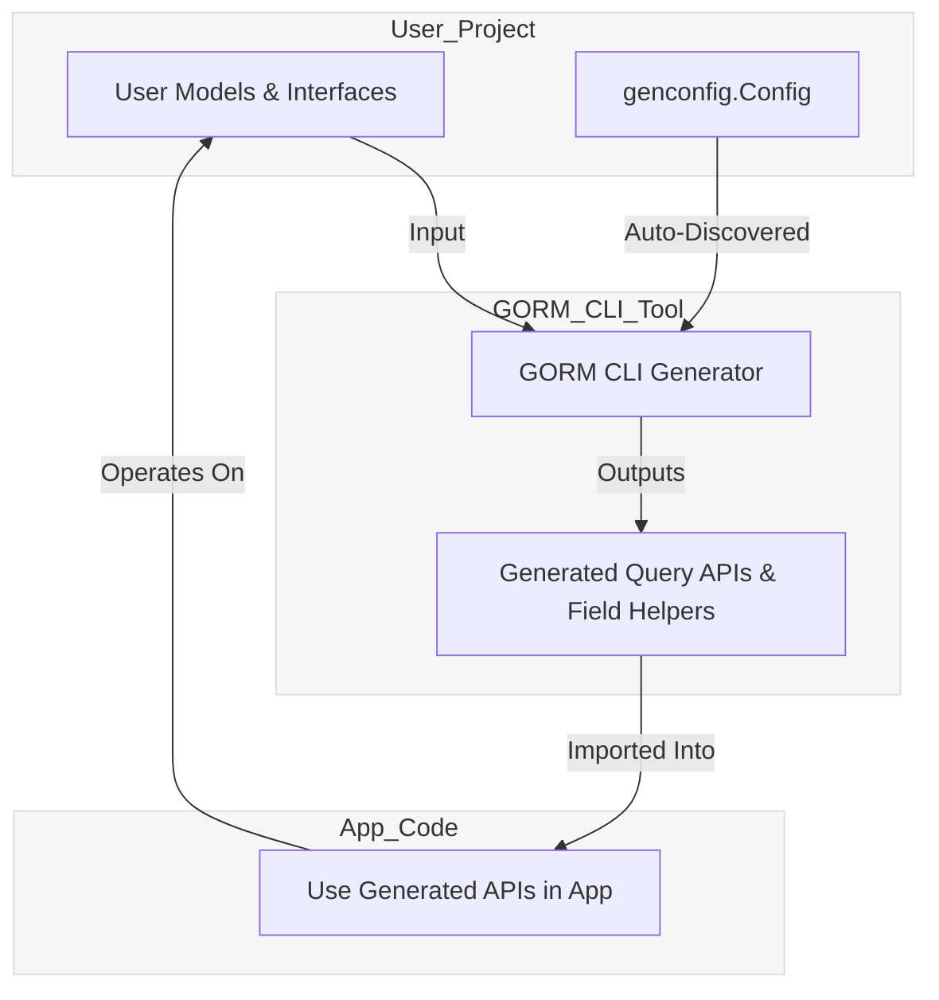

# Integration Points & Extensibility

GORM CLI is designed to seamlessly integrate with your existing GORM projects, extending your development workflow with powerful, type-safe, and idiomatic Go code generation. This page explains how the generated code fits naturally into your project structure, how automatic configuration and discovery make integration effortless, and how you can extend GORM CLI’s capabilities to suit your unique domain needs.

---

## Why Integration and Extensibility Matter

Imagine you’ve invested time defining your Go models and query interfaces. GORM CLI empowers you by automatically generating fluent, type-safe APIs and field helpers that fit directly into your existing GORM workflows—without extra boilerplate or awkward glue code. Understanding where this generated code lives and how it interacts with your original codebase unlocks the real value: faster development and safer queries that blend perfectly with GORM’s idioms.

Extensibility means you aren’t limited by out-of-the-box behavior. You can add custom field helpers, map fields to specialized query types, or introduce external configuration to fine-tune generation—ensuring GORM CLI adapts to your evolving requirements.

---

## How GORM CLI Fits Into Your Project

### Placement of Generated Code

When you run the code generation, the output lands exactly where you specify, typically in a separate directory or package (e.g., `./generated`). This clear separation helps maintain clean organization between handwritten and generated assets.

```bash
gorm gen -i ./examples -o ./generated
```

- **`-i` flag**: Points to the input directory containing your interfaces and models.
- **`-o` flag**: Sets the output directory for the generated code.

The generated code exposes:

- **Type-safe Query APIs** based on your interface definitions
- **Field Helpers** that correspond to your model structs for filters, updates, and associations

You will import this generated package in your application and use the fluent APIs exactly as if you had written them by hand.


### Auto-Discovery of Configuration

Optionally, place a Go variable of type `genconfig.Config` in any package you generate from. GORM CLI discovers and applies this configuration automatically—no extra flags needed.

```go
var _ = genconfig.Config{
    OutPath: "examples/output",
    IncludeInterfaces: []any{"Query*"},
    FieldNameMap: map[string]any{
        "json": JSON{}, // custom JSON field helper
    },
}
```

This mechanism lets you:

- Control output locations per-package
- Select which structs or interfaces get generated
- Customize field helper types (e.g., JSON handling)
- Apply filtering rules for complex monorepos

### Compatibility with Go Generics & GORM Idioms

GORM CLI embraces Go 1.18+ generics fully. This means your generated query APIs are generic over model types, ensuring compile-time type safety and reducing repetitive code.

You invoke the generated APIs by passing your `*gorm.DB` instance and optionally any GORM clause expressions, blending perfectly with existing GORM queries.

Example:

```go
// Using generated query API for User model
u, err := generated.Query[User](db).GetByID(ctx, 123)

// Using field helpers for advanced GORM filtering
users, err := gorm.G[User](db).
    Where(generated.User.Age.Gt(18)).Find(ctx)
```

This eliminates the need to write raw SQL or error-prone string queries and integrates your type-safe code into routine GORM operations.

---

## Extending GORM CLI Capabilities

### Adding Custom Field Helpers

GORM CLI supports defining and applying custom field helpers for advanced data types or specialized behaviors.

For example, a `JSON` field helper can generate different SQL expressions depending on the database dialect (MySQL, SQLite, PostgreSQL) without manual rewrites.

Steps to extend with custom helpers include:

1. Define your custom field helper type implementing expression builders.
2. Map your model field(s) to this helper via `FieldNameMap` or struct tags in `genconfig.Config`.
3. Use the resulting helper in query filters seamlessly.

Example configuration snippet:

```go
var _ = genconfig.Config{
    FieldNameMap: map[string]any{
        "json": JSON{},
    },
}
```

And on the model:

```go
type User struct {
    Profile string `gen:"json"`
}
```

This extensibility provides unmatched flexibility for handling complex DB types.

### Using External Configuration

If your project requires it, GORM CLI’s configuration Discovery respects layered configs. Per-directory or per-package `genconfig.Config` variables can be combined or overridden to match your organizational needs.

You can whitelist or blacklist interfaces or structs by name or by pattern to precisely control generation scope.

Example:

```go
var _ = genconfig.Config{
    IncludeInterfaces: []any{"Query*"}, // Generate only interfaces starting with "Query"
    ExcludeStructs: []any{"*DTO"},      // Skip DTO structs
}
```

This lets large projects avoid generating unused or deprecated code.

### Adapting to Your Project’s Codebase

GORM CLI-generated code does not require rewriting your existing Go types or GORM setups. It works by:

- Reading your original model structs and preserving GORM tags
- Integrating with your contexts and `*gorm.DB` instances
- Introducing no runtime dependencies beyond GORM itself

This means minimal refactoring is needed—simply add generated imports and enjoy type-safe query building immediately.

---

## Practical Tips & Best Practices

- **Keep generated code separate:** Use distinct folders or packages.
- **Leverage configuration auto-discovery:** Place `genconfig.Config` in your source packages for tailored generation.
- **Use Go generics thoughtfully:** Benefit fully from the generic query APIs to reduce casting and errors.
- **Extend with custom field helpers:** For complex types, provide helpers that handle DB nuances.
- **Filter interfaces and structs:** Use include and exclude patterns to keep generation focused and maintainable.

---

## Common Pitfalls & Troubleshooting

<Accordion title="Generated Code Not Found after Running `gorm gen`">If you can’t import or find the generated package:

- Verify your `-o` output path is correct.
- Check if your `genconfig.Config` sets a conflicting `OutPath`.
- Ensure your interface and model packages are correctly referenced in the generation command.
</Accordion>

<Accordion title="Custom Field Helpers Not Applied">If custom helpers aren’t reflected in generated code:

- Confirm field tags and mapping in `FieldNameMap` match exactly.
- Regenerate code after configuration changes.
- Verify your custom helper implements the required interfaces.
</Accordion>

<Accordion title="Generic Functions Seem Complex">If you struggle using the generic query interfaces:

- Remember these APIs are generic over your model type.
- Pass your `*gorm.DB` instance explicitly.
- Use your IDE’s code completion for generated methods.
</Accordion>

---

## Integration Workflow Example

```bash
# 1. Define models and interfaces in your project
# 2. Optional: add genconfig.Config in the same package with custom settings
# 3. Run code generation
gorm gen -i ./pkg/models -o ./pkg/generated

# 4. Use generated APIs in application code
import generated "yourmodule/pkg/generated"

u, err := generated.Query[User](db).GetByID(ctx, 5)
users, err := gorm.G[User](db).
  Where(generated.User.Name.Like("%jinzhu%"), generated.User.Age.Gt(18)).
  Find(ctx)
```

---

## Summary

GORM CLI integrates automatically with your GORM projects by generating code that fits naturally into your existing workflow. Automatic configuration discovery, Go generics support, and the ability to add custom field helpers ensure you can adapt the tool to your specific needs without friction. Understanding these integration points lets you harness the full power of GORM CLI for safer, more expressively typed database access.

---

## Related Documentation

- [What is GORM CLI?](../product-intro-and-value/what-is-gorm-cli)
- [Value Proposition & Key Benefits](../product-intro-and-value/value-proposition)
- [Using the Generated APIs in Your Application](../../guides/core-workflows/using-generated-apis)
- [Customizing Code Generation with genconfig](../../guides/advanced-usage/customizing-generation)
- [Adding and Using Custom Field Helpers (e.g. JSON)](../../guides/advanced-usage/json-field-helpers)

---

For detailed architecture and workflow, see [Tool Architecture & Workflow](/overview/core-concepts-architecture/high-level-architecture).


---

<MermaidDiagram>

</MermaidDiagram>
