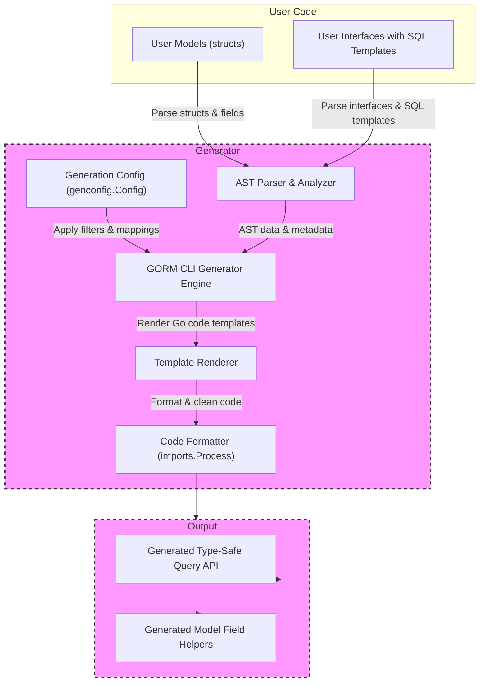

# GORM CLI Architecture

Understanding the architecture of GORM CLI illuminates how your Go code is transformed into robust, type-safe database query APIs and model helpers. This page visually and conceptually breaks down the flow from your initial source models and interfaces, through the generation process, to the final produced code you integrate into your projects.

---

## Overview

GORM CLI serves as a powerful code generation tool that transforms your user-defined Go interfaces and models into fluent, compile-time safe database APIs tailored for GORM. The core idea is simple yet impactful: you write your database models and interface method declarations with SQL templates, and GORM CLI produces strongly typed implementations plus field helpers — giving you confidence, faster development, and less boilerplate.

This architecture diagram captures the relationship between the user’s source code, the internal generator engine, configuration overlays, and the final output artifacts.

---

## Architectural Components & Data Flow

---

### Explanation

- **User Models (structs)**: You define your database model structs following GORM conventions. These include basic fields, associations, and tags for custom processing.

- **User Interfaces with SQL Templates**: You write Go interfaces with methods annotated by SQL or templated SQL comments. These define the shape of queries or updates you want.

- **AST Parser & Analyzer**: The generator first parses your Go source files, building Abstract Syntax Trees (AST) to extract model fields, interface methods, parameters, and embedded SQL templates.

- **Generation Config (genconfig.Config)**: Optional configuration can be declared in your package to override generation paths, apply include/exclude filters, or map custom field types.

- **GORM CLI Generator Engine**: Here the combined info is processed, applying configs, filtering models/interfaces, and preparing the code generation inputs.

- **Template Renderer**: Uses Go text templates to produce Go source code files. This includes:
  - Type-safe query interface implementations
  - Model helper structs for fields and associations

- **Code Formatter**: Runs the generated source through `imports.Process` to format and fix imports for seamless integration.

- **Generated Artifacts**:
  - **Query API**: Provides fluent, type-safe methods reflecting your interfaces, using GORM internals.
  - **Field Helpers**: Strongly typed field helpers for your models simplifying filters, updates, and association handling.

---

## Real-World User Flow

1. **Write your models and interfaces** in normal Go code within your project.
2. **Optionally define a generation config** to customize output location and behavior.
3. **Run the CLI generation command** pointing to your source directory.
4. The **GORM CLI generator parses your files, applies configurations, and generates clean, idiomatic Go code** into your chosen output directory.
5. **Import and use the generated APIs** in your application, enjoying compile-time safety and rich fluent APIs for database operations.

---

## Practical Tips

- **Keep your models and interfaces well-organized and annotated** to maximize generator accuracy.
- **Use generation configs strategically** to filter out deprecated interfaces or selectively generate models.
- **Review generated code** to understand how interfaces map to concrete implementations and field helpers.
- **Leverage field helper methods** to build complex queries without hand-written SQL.
- **Regularly rerun generation after model/interface changes** to keep code in sync.

---

## Troubleshooting Common Issues

<AccordionGroup title="Troubleshooting & Common Pitfalls">
<Accordion title="Empty Generated Output or Missing Methods">
Make sure your interfaces have correctly annotated SQL templates in comments. Methods without return values or with invalid signatures will be rejected.
</Accordion>
<Accordion title="Configuration Not Applying">
Verify your `genconfig.Config` declarations are package-level and correctly structured. The CLI picks up configs from processed files automatically.
</Accordion>
<Accordion title="Generator Skips Files unexpectedly">
Files with the generator's own code-generated header comment are skipped to avoid infinite loops. If you manually edit generated files, they will be skipped on subsequent runs.
</Accordion>
<Accordion title="Import Paths or Packages Incorrect in Generated Code">
Check module structure and Go package paths. The generator resolves package imports via AST and Go tooling, so local module issues may cause mismatches.
</Accordion>
</AccordionGroup>

---

## Next Steps

- For practical usage, visit [Generating Code](https://your_doc_site/getting-started/first-codegen-project/generate-code) to learn how to run the CLI on your project.
- Explore [Using the Generated APIs](https://your_doc_site/getting-started/first-codegen-project/quickstart-usage) to integrate and utilize the output code effectively.
- See [Feature Overview](https://your_doc_site/overview/core-concepts-basics/feature-overview) for an in-depth understanding of core capabilities.

---

The architecture showcased here provides the foundation for mastering GORM CLI — empowering you to build safer, more maintainable, and expressive database code with ease.
