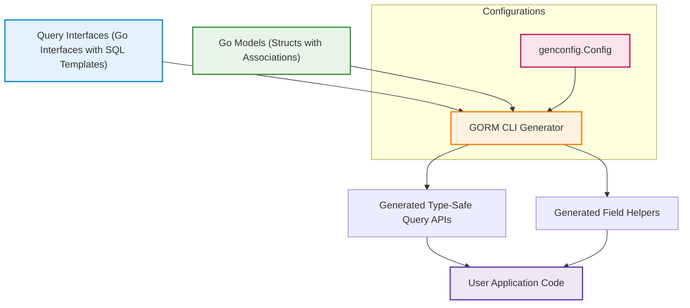

# Core Concepts & Terminology

Understanding the essential concepts behind GORM CLI is key to unlocking its full potential. This page defines the central terms used throughout the documentation and product, explaining each with clear examples and their role within your code and the generation workflow.

---

## Query Interfaces

**Definition:**
Query interfaces are Go interfaces you write to define your custom database queries using method signatures enriched with embedded SQL templates in comments.

**Purpose:**
They serve as the blueprint for GORM CLI to generate type-safe, concrete query APIs that map directly to your database tables and operations.

**How it works:**
- Each method corresponds to a database query or command.
- SQL statements are written in comments using a special templating DSL.
- Parameters and placeholders automatically bind Go method parameters to SQL.

**Example:**
```go
// Query interface with SQL templates
type Query[T any] interface {
  // SELECT * FROM @@table WHERE id=@id
  GetByID(id int) (T, error)

  // UPDATE @@table SET ... WHERE id=@id
  UpdateUser(user User, id int) error
}
```

With this, GORM CLI generates implementations that you use directly to execute queries safely and fluently, e.g., `generated.Query[User](db).GetByID(ctx, 123)`.

---

## SQL Templates

**Definition:**
Embedded comments within your interface methods that contain SQL statements enhanced with a custom templating syntax.

**Core Purpose:**
They allow dynamic, conditional, and reusable SQL generation without writing raw string concatenation or manual SQL, enabling type-safe parameter binding and powerful query customization.

**Key Features of the DSL:**
- `@@table` resolves to the model’s table name.
- `@param` binds Go method parameters.
- `{{where}}`, `{{set}}`, `{{if}}`, and `{{for}}` enable conditional and iterative SQL fragments.
- Dynamic columns and parameters can be specified safely.

**Example:**
```sql
-- Select user by ID
SELECT * FROM @@table WHERE id=@id

-- Conditional update
UPDATE @@table
{{set}}
  {{if user.Name != ""}} name=@user.Name, {{end}}
  {{if user.Age > 0}} age=@user.Age {{end}}
{{end}}
WHERE id=@id
```

This approach streamlines complex query logic baked directly into your interfaces.

---

## Field Helpers

**Definition:**
Generated strongly typed helpers for your model’s fields that simplify building filters, updates, and associations.

**Purpose:**
They provide fluent, discoverable methods like `.Eq()`, `.Like()`, `.Set()` that correspond to SQL operations.

**How they work:**
- Generated from your Go model structs.
- Typed per field (int, string, time, bool, JSON, and more).
- Support predicates and update setters.
- Handle association types (has one, has many, belongs to, many-to-many).

**Example:**
```go
// Filter for age equal to 18
generated.User.Age.Eq(18)

// Set name field for update
generated.User.Name.Set("Alice")

// Association operation: create and link a related pet
generated.User.Pets.Create(generated.Pet.Name.Set("Fido"))
```

Field helpers reduce boilerplate and prevent errors in SQL condition construction.

---

## Associations

**Definition:**
Relationships between models representing typical database foreign key relations (one-to-many, many-to-many, polymorphic, etc.) expressed in Go structs.

**Purpose:**
GORM CLI interprets associations in your model and generates specialized helpers for creating, updating, unlinking, and deleting related data safely and fluently.

**Supported Types:**
- **Belongs to:** Parent references (e.g., User belongs to Company)
- **Has one / Has many:** Child references (e.g., User has many Pets)
- **Many-to-many:** Connections via join tables (e.g., User speaks many Languages)
- **Polymorphic:** Support for flexible owner types

**Common Operations:**
- `Create()`: Create and link associated records
- `Update()`: Update linked records
- `Unlink()`: Remove links without deleting
- `Delete()`: Delete associated records
- `CreateInBatch()`: Batch create and link

**Example:**
```go
// Create user with pet
gorm.G[User](db).
  Set(
    generated.User.Name.Set("Alice"),
    generated.User.Pets.Create(generated.Pet.Name.Set("Fido")),
  ).Create(ctx)

// Unlink pets from user
gorm.G[User](db).
  Where(generated.User.ID.Eq(1)).
  Set(generated.User.Pets.Unlink()).
  Update(ctx)
```

These helpers enforce referential integrity and simplify working with complex data relations.

---

## Generation Configuration

**Definition:**
A package-level Go struct (`genconfig.Config`) that configures how GORM CLI generates code for interfaces and models within a package.

**Core Uses:**
- Override output directory (`OutPath`)
- Map Go types or named struct tags to custom field helpers
- Include or exclude specific interfaces or structs by pattern
- Control granularity with file-level or package-level application

**Example:**
```go
var _ = genconfig.Config{
  OutPath: "examples/output",
  FieldTypeMap: map[any]any{
    sql.NullTime{}: field.Time{},
  },
  FieldNameMap: map[string]any{
    "json": JSON{}, // custom JSON field helper
  },
  IncludeInterfaces: []any{"Query*"},
}
```

Configuration optimizes generation to your project’s structure and style, maximizing productivity and customization.

---

## Summary Diagram of Core Concepts



---

## Practical Tips and Best Practices

- **Start with clear interfaces:** Define your query needs with concise methods and embed SQL templates thoughtfully.
- **Leverage the DSL:** Use conditional and iterative template directives to keep queries flexible yet safe.
- **Model associations carefully:** Explicitly define your relationships so generated helpers can fully support CRUD on associations.
- **Use configuration wisely:** Tailor generation paths and type mappings to match your project conventions.
- **Test generated code:** Verify generated methods match expected SQL and behave correctly.

---

## Common Pitfalls

- Forgetting to include an error return in query interface methods that run SQL with results.
- Misusing SQL template directives leading to malformed queries—validate templates incrementally.
- Overlooking configuration settings causing unexpected exclusion of interfaces or structs.
- Assuming generated association helpers work without correctly defining GORM relationships.

Refer to the [Troubleshooting and Common Pitfalls guide](/guides/real-world-patterns/troubleshooting-common-issues) for more details.

---

## Next Steps

To apply these concepts:

1. Define your Go interfaces with embedded SQL templates.
2. Annotate your Go models and define associations.
3. Optionally create a generation config for customization.
4. Run the GORM CLI generator to produce your APIs and helpers.
5. Integrate generated code into your application workflows.

Explore [Generating Your First Code](/getting-started/first-codegen-project/generate-code) and [Using the Generated APIs](/getting-started/first-codegen-project/quickstart-usage) to start your hands-on journey.

---

For comprehensive background, also review [What is GORM CLI?](/overview/getting-started-intro/what-is-gorm-cli) and [Features at a Glance](/overview/core-concepts-basics/feature-overview).


---

# References
- [Query Interfaces explained](examples/query.go)
- [genconfig.Config Struct Usage](README.md#generation-config-optional)
- [Examples with Models and Associations](examples/models/user.go)
