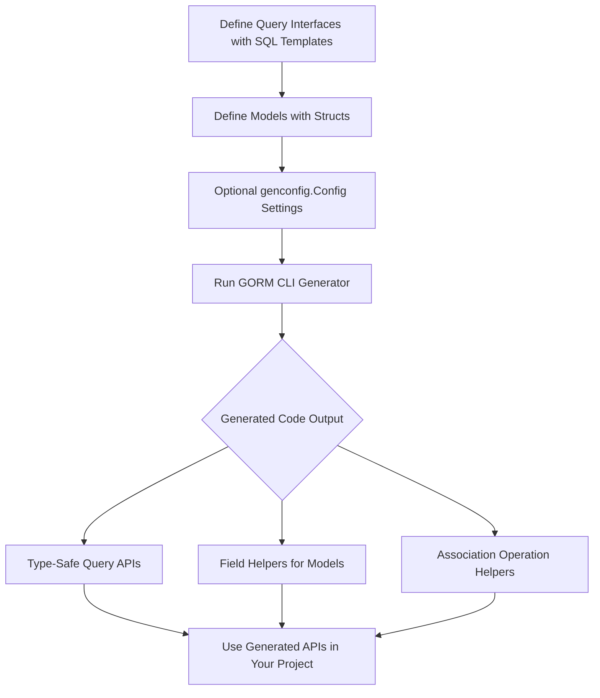

# Features at a Glance

Discover how GORM CLI elevates your Go and GORM development workflow by generating powerful, type-safe query APIs, flexible field helpers, and robust association operations — all designed to streamline database interactions and enhance code safety.

---

## Unlocking the Power of GORM CLI Features

GORM CLI transforms your annotated Go interfaces and models into fluent, compile-time safe database APIs. This page summarizes its major features, outlining how each element directly benefits your development process and empowers you to write robust, maintainable database code efficiently.

### What This Page Covers

- Generation of type-safe query APIs from interfaces with embedded SQL templates
- Model-driven field helpers for filtering, updates, ordering, and handling associations
- Support for comprehensive association operations
- Flexible generation configuration via `genconfig.Config`
- Template-based query generation with dynamic and conditional SQL

---

## Type-Safe Query APIs from Interfaces

At the heart of GORM CLI is its ability to generate **type-safe query interfaces** from your Go interface definitions annotated with SQL templates. Instead of manually crafting raw SQL or error-prone string queries, you define methods with SQL in comments, and GORM CLI generates strongly typed implementations.

- **Benefit:** Your database queries become part of your Go type system, catching errors at compile time.
- **Example Use Case:** Define a `GetByID` method to fetch a record by its primary key with an annotated SQL comment:

```go
// SELECT * FROM @@table WHERE id=@id
GetByID(id int) (T, error)
```

- The CLI generates the corresponding method, ensuring parameters and return types are safe and intuitive to use.

This reduces boilerplate, accelerates query development, and integrates smoothly with your existing GORM workflows.

---

## Model-Driven Field Helpers: Fluent & Discoverable

From your model structs, GORM CLI creates **field helpers** for all basic fields and associations. These helpers generate strong types for:

- Filters (e.g., equality, range, pattern matching)
- Default values and update setters
- Ordering clauses

**Example:** For a `User` model with fields like `ID`, `Name`, and `Age`, the generator produces:

```go
generated.User.ID.Eq(1)           // id = 1
generated.User.Name.Like("%jinzhu%") // name LIKE '%jinzhu%'
generated.User.Age.Between(18, 65)    // age BETWEEN 18 AND 65
```

These helpers ensure your filter and update code is **fluent, type-safe, and self-documenting**, reducing guesswork and runtime errors.

---

## Comprehensive Association Operations

Handling associations can be complex — GORM CLI simplifies it by generating **association helpers** tied to your models, supporting common operations with compile-time safety:

- **Create:** Insert and link associated records in one operation
- **CreateInBatch:** Batch create and link slices of records
- **Update:** Update associated records matching specific conditions
- **Unlink:** Remove association links without deleting records
- **Delete:** Remove associated records or join table rows

### Semantics vary by association type:
- **Belongs To:** Unlink clears the foreign key; Delete removes associated records
- **Has One / Has Many:** Unlink clears child foreign keys; Delete removes child rows
- **Many2Many:** Unlink/Delete remove join table rows only

### Real-world example:
```go
gorm.G[User](db).
  Set(
    generated.User.Name.Set("alice"),
    generated.User.Pets.Create(generated.Pet.Name.Set("fido")),
  ).
  Create(ctx)
```
Creates a new `User` and simultaneously creates and associates a `Pet` named "fido."

This feature dramatically reduces the complexity of working with related data.

---

## Configurable Generation via `genconfig.Config`

The generator behavior is customizable with an optional **per-package configuration struct** called `genconfig.Config`. Declaring this in your source code enables:

- Overriding output paths (`OutPath`)
- Mapping Go types to specialized field helper types (e.g., `sql.NullTime` to `field.Time`)
- Mapping custom struct tags to helper types (e.g., `gen:"json"` for JSON fields)
- Whitelisting or blacklisting specific interfaces or structs
- File-level scoping for granular control

**Example:**
```go
var _ = genconfig.Config{
    OutPath: "examples/output",
    FieldTypeMap: map[any]any{
        sql.NullTime{}: field.Time{},
    },
    FieldNameMap: map[string]any{
        "json": JSON{},
    },
}
```
Using this setup, your generated code can reflect nuanced project needs, ensure correct field handling, and keep your codebase aligned.

---

## Template-Based Query Generation

GORM CLI employs a flexible **SQL template DSL** within interface method comments, allowing you to write rich, conditional, and dynamic SQL that binds directly to Go parameters.

Key directives include:

| Directive   | Purpose                           | Example                                  |
| ----------- | -------------------------------- | ---------------------------------------- |
| `@@table`   | Resolves to the model's table name | `SELECT * FROM @@table WHERE id=@id`     |
| `@@column`  | Dynamic column binding            | `@@column=@value`                        |
| `@param`    | Bind Go parameters safely         | `WHERE name=@user.Name`                  |
| `{{where}}` | Conditional WHERE clause          | `{{where}} age > 18 {{end}}`             |
| `{{set}}`   | Conditional SET clause for UPDATE | `{{set}} name=@name {{end}}`             |
| `{{if}}`    | Conditional SQL fragments         | `{{if age > 0}} AND age=@age {{end}}`    |
| `{{for}}`   | Iteration over collections        | `{{for _, t := range tags}} ... {{end}}` |

Example method:
```go
// UPDATE @@table
// {{set}}
//   {{if user.Name != ""}} name=@user.Name, {{end}}
//   {{if user.Age > 0}} age=@user.Age, {{end}}
//   {{if user.Age >= 18}} is_adult=1 {{else}} is_adult=0 {{end}}
// {{end}}
// WHERE id=@id
UpdateUser(user User, id int) error
```

This approach enables:
- Complex dynamic queries without string concatenation errors
- Parametrized queries that prevent SQL injection
- Separation of query logic in interface definitions

---

## Why These Features Matter

### Benefits & Outcomes
- **Compile-Time Safety:** Avoid common runtime errors by catching query mismatches early
- **Less Boilerplate:** Write succinct model/interface code, delegate repetitive code generation
- **Improved Productivity:** Focus on business logic, let GORM CLI handle query and helper code generation
- **Maintainability:** Generated APIs are discoverable and consistent across your project
- **Integration:** Works seamlessly with `gorm.io/gorm` DB instances and context handling

### Common Scenarios
- Backend API developers needing safe, extensible database access layers
- Teams enforcing consistent database code standards
- Projects requiring complex queries with dynamic filtering
- Applications handling rich associations between entities

### Before & After With GORM CLI
| Without GORM CLI                                             | With GORM CLI                                              |
| ----------------------------------------------------------- | ---------------------------------------------------------- |
| Hand-written raw SQL prone to injection or errors           | Type-safe generated query APIs with parameter binding      |
| Manual association handling with error-prone updates        | Fluent, composable association helpers and batch linking   |
| Boilerplate filter and update code scattered across codebase| Centralized, auto-generated field helpers improve clarity  |

---

## Getting Started Preview

Embarking on using GORM CLI's powerful features involves:

1. Defining your **query interfaces** and **models** with optional SQL templates
2. Optionally configuring generator behavior with `genconfig.Config`
3. Running the CLI to generate your code
4. Using generated APIs directly in your database operations

For a detailed step-by-step guide, visit [Generating Code](/getting-started/first-codegen-project/generate-code) and [Using Generated APIs](/getting-started/first-codegen-project/quickstart-usage).

---

This feature overview equips you with a clear understanding of the powerful building blocks you’ll use to supercharge your GORM projects. Each feature is designed to reduce friction, prevent bugs, and save development time.

Embrace GORM CLI to bring compile-time safety, dynamic templates, and a fluent API to your Go database layer.

---

## Related Documentation & Next Steps

- [What is GORM CLI?](/overview/getting-started-intro/what-is-gorm-cli) — Introduction to the product
- [Core Concepts & Terminology](/overview/core-concepts-basics/core-terminology) — Deep dive into key concepts
- [GORM CLI Architecture](/overview/core-concepts-basics/architecture-diagram) — Understand the internals and data flow
- [Getting Started Guides](/getting-started) — Setup, installation, and first code generation

<Tip>
To maximize your success, start by defining simple query interfaces and your models, run the generator, then gradually explore association operations and complex templates.
</Tip>

---

## Summary Diagram: Feature Workflow



This flow lays out your journey from writing interfaces to using fully generated, type-safe database access code.

---

# End of Features at a Glance

---

For any questions or troubleshooting, see the [Troubleshooting Common Setup Issues](/getting-started/troubleshooting-configuration/cli-troubleshooting) guide and browse the example folder in the [GORM CLI GitHub Repository](https://github.com/go-gorm/cli).
