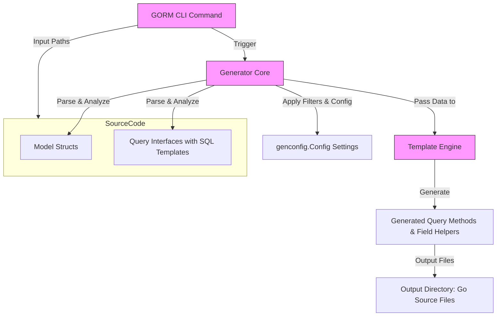

# Architecture Overview

## Visualizing the GORM CLI Generation Pipeline

Understanding how GORM CLI transforms your Go source code into powerful, type-safe query APIs and model-driven helpers is key to mastering its use and troubleshooting effectively. This Architecture Overview page provides a clear, concise visualization of the entire generation workflow, illustrating each major component and their interactions.

---

### 1. The Generation Workflow at a Glance

At its core, the GORM CLI generation pipeline accepts your **Go source code**, including:

- Model struct definitions representing your database entities
- Interface definitions with embedded SQL templates describing your queries

It then applies transformation logic via the **CLI command and internal parser**, all orchestrated by powerful **templates**, to produce the final output: type-safe, generated code with query methods and field helpers.

### 2. Key Pipeline Components and Roles

- **CLI (Command Line Interface)**
  - Entry point accepting user input, such as directories/packages containing models and query interfaces.
  - Parses flags for input sources and output destinations.
  - Initiates the generator process.

- **Source Models and Query Interfaces**
  - Your application’s Go struct types define the database model schema.
  - Interfaces annotated with SQL templates describe the query logic with placeholders and templating.

- **Generator Core**
  - Walks through your source code using Go's AST parsing.
  - Extracts relevant structs, interfaces, and method metadata.
  - Applies inclusion/exclusion filters defined via `genconfig.Config` for fine control.

- **Template Engine**
  - Processes parsed metadata to produce source code files.
  - Generates both the fluent query APIs and the field helpers.
  - Ensures output is formatted and ready for compilation.

- **Generated Code Output**
  - Organized into directories/files respecting package structure.
  - Provides type-safe, discoverable APIs enhancing developer experience.

---

### 3. What This Architecture Means for You

- **Seamless Integration**: Use your existing models and interfaces directly, with optional configuration to include or exclude specific parts.
- **Customizable Generation**: Through `genconfig.Config`, tailor what gets generated and how field types are mapped.
- **Clear Source-to-Output Mapping**: You know exactly how your input affects generated code.
- **Robust Error Detection and Formatting**: The pipeline includes parsing validation and formatting for reliable code generation.

---

### 4. Practical Benefits Handled by This Architecture

- **Type Safety**: By generating concrete implementations from interfaces, you reduce runtime errors.
- **Discoverability and Autocompletion**: Generated field helpers and query methods enable IDE-assisted development.
- **Reduced Boilerplate**: Automates repetitive data-access code and association operations.
- **Maintainable Codebase**: Changes in source models or SQL templates propagate cleanly via regeneration.

---

### 5. Tips for Effective Use

- Always organize your models and query interfaces clearly in packages or directories.
- Use `genconfig.Config` to control the output if your project grows large or you want to exclude deprecated components.
- Review generated files regularly to align them with evolving business requirements.
- Explore the corresponding documentation pages on core concepts and configuration for deeper insight.

---

### 6. Next Steps

To deepen your understanding and effectively use this architecture, proceed to:

- [How GORM CLI Works](https://your-docs-url/overview/core-concepts/how-gorm-cli-works): Detailed walkthrough of the parsing and generation internals.
- [Generation Configuration](https://your-docs-url/concepts/generation-configuration/genconfig-overview): Fine-tuning generation behavior.
- [Key Features at a Glance](https://your-docs-url/overview/features-overview/feature-highlights): Explore core capabilities enabled by this architecture.

---

## Related Resources

- [GORM CLI README on GitHub](https://github.com/go-gorm/cli) — Official repository with examples and source code.
- [Template DSL and SQL Templating](https://your-docs-url/concepts/core-architecture/template-dsl-concepts) — Learn how to write expressive SQL templates.

---

By internalizing this architecture, you gain clarity on how your Go code transforms into the powerful, fluent, and type-safe data access layer that GORM CLI effortlessly generates.

Unlock the full power of your GORM projects with a precise understanding of this generation pipeline.

---

<Info>
For detailed code examples and configuration options, refer to the [Quickstart Guide](https://your-docs-url/getting-started/core-workflow-quickstart/prepare-models-interfaces) and [Configuration Troubleshooting](https://your-docs-url/getting-started/configuration-troubleshooting/basic-configuration).
</Info>
