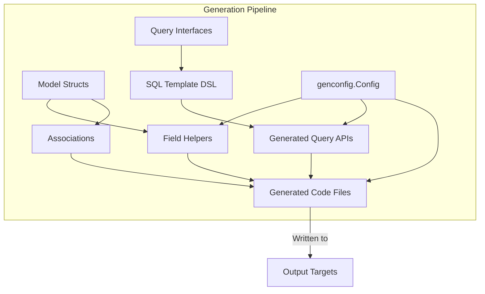

# Terminology & Building Blocks

Master the essential domain concepts including Query APIs, field helpers, associations, SQL template DSL, configuration objects, and output targets. This glossary is designed to empower you to confidently read and understand the documentation, decode error messages, and configure generation options effectively.

---

## Introduction

Understanding GORM CLI requires familiarity with several core building blocks that underpin its code generation capabilities. This page walks you through these foundational concepts, explaining the terminology and how the pieces fit together, so you can fully leverage GORM CLI’s power and flexibility.

Each concept is explained in terms of its user intent — what it means for you as a developer and how it factors into your workflow.

---

## Core Terminology & Concepts

### Query APIs

At the heart of GORM CLI is the generation of **interface-driven, type-safe query APIs**. These are Go interface methods annotated with SQL templates that the tool transforms into concrete implementations.

- **What you write:** Go interfaces with method signatures and SQL template comments.
- **What you get:** Compiled, type-safe, discoverable query methods that you call in your code for CRUD operations and complex queries.

Example:
```go
// Query interface with SQL template comments
 type Query[T any] interface {
   // SELECT * FROM @@table WHERE id=@id
   GetByID(id int) (T, error)
 }
```

This enables:
- Compile-time safety — no mismatch between your interface and database code.
- Easy maintenance — update SQL templates without rewriting logic.
- Fluent, developer-friendly APIs tailored to your domain model.

### Field Helpers

GORM CLI generates **field helpers** from your model structs. These helpers represent your model fields as typed predicates and setters for querying and updating.

- They encapsulate common SQL expressions (e.g., `Eq`, `Like`, `Between`, `IsNull`).
- Support complex operations such as incrementing, setting expressions, and handling zero values safely.
- Support special types (e.g., time, JSON) via configuration.

Example:
```go
generated.User.Name.Eq("Alice")   // WHERE name = 'Alice'
generated.User.Age.Between(18, 65)  // WHERE age BETWEEN 18 AND 65
```

This yields:
- Intuitive code that reflects your data model.
- Reduced boilerplate when composing queries and updates.

### Associations

GORM CLI explicitly supports your **model associations**, generated based on GORM’s structural conventions such as `has one`, `has many`, `belongs to`, and `many2many`.

Association helpers let you perform operations like:
- **Create**: Insert related rows and link them.
- **Update**: Update related rows with condition filters.
- **Unlink**: Remove association links without deleting data.
- **Delete**: Remove associated rows (with constraints).
- **CreateInBatch**: Batch create and associate multiple related records.

Example operations:
```go
// Create user with one pet
gorm.G[User](db).
  Set(
    generated.User.Name.Set("alice"),
    generated.User.Pets.Create(generated.Pet.Name.Set("fido")),
  ).
  Create(ctx)

// Unlink (clear FK) all pets for user ID=1
gorm.G[User](db).
  Where(generated.User.ID.Eq(1)).
  Set(generated.User.Pets.Unlink()).
  Update(ctx)
```

---

### SQL Template DSL

GORM CLI depends on a **SQL template domain-specific language (DSL)** inside interface method comments to describe queries dynamically.

Key DSL directives and binding rules enable readable, maintainable SQL snippets that adapt to parameters:

| Directive   | Description                      | Example                                     |
| ----------- | -------------------------------- | ------------------------------------------- |
| `@@table`   | Auto-resolves to model table name | `SELECT * FROM @@table WHERE id=@id`        |
| `@@column`  | Dynamic column reference         | `WHERE @@column=@value`                      |
| `@param`    | Bind Go method parameters        | `WHERE name=@user.Name`                      |
| `{{where}}` | Wraps conditional WHERE clauses  | `{{where}} age > 18 {{end}}`                |
| `{{set}}`   | Wraps conditional SET clauses    | `{{set}} name=@name {{end}}`                 |
| `{{if}}`    | Conditional SQL fragments         | `{{if age > 0}} AND age=@age {{end}}`       |
| `{{for}}`   | Iterates over slices/arrays       | `{{for _, t := range tags}} ... {{end}}`    |

Example template:
```sql
SELECT * FROM @@table
{{where}}
  {{if @user.ID > 0}}
    WHERE id=@user.ID
  {{else if @user.Name != ""}}
    WHERE name=@user.Name
  {{end}}
{{end}}
```

This DSL:
- Automatically binds parameters safely.
- Allows flexible, dynamic SQL without string concatenation.
- Enables strong typing at compile time.

### Configuration Objects (`genconfig.Config`)

Control how code is generated via **configuration objects** defined in Go packages. This optional setup adjusts output paths, field type mapping, interface selections, exclusions, and more.

Typical config fields:
- `OutPath`: Directory for generated output.
- `FieldTypeMap`: Map Go types to field helper types.
- `FieldNameMap`: Map struct tag placeholders (e.g., `gen:"json"`) to custom helpers.
- `IncludeInterfaces`/`ExcludeInterfaces`: Filter which query interfaces to generate.
- `IncludeStructs`/`ExcludeStructs`: Filter which model structs to generate.
- `FileLevel`: Determines if config applies per file or package.

Example config snippet:
```go
var _ = genconfig.Config{
  OutPath: "examples/output",
  FieldNameMap: map[string]any{
    "json": JSON{},
  },
  IncludeInterfaces: []any{"Query*"},
}
```

This empowers:
- Tailored generation for large projects.
- Custom field handling.
- Control over granularity and scope of code generation.

### Output Targets

The **output targets** are the destination files and packages where GORM CLI writes generated code.

- Determined by `OutPath` and input source folder structure.
- Maintain directory structure for clarity and modularity.
- Output includes query API implementations and field helper definitions matching your models and interfaces.

---

## Practical Example Walkthrough

Imagine your project has a User model with multiple associations (accounts, pets, languages), query interfaces with SQL templates, and a configuration specifying JSON field helpers.

- Write your `User` struct with fields and tags (see `examples/models/user.go`).
- Write `Query` interfaces with SQL templates (see `examples/query.go`).
- Configure generation options in `genconfig.Config` (see `examples/query.go`).
- Run `gorm gen -i ./examples -o ./generated`.

You receive:
- Type-safe API methods reflecting your SQL templates.
- Field helpers for filtering and updating basic fields and associations.
- Association helpers enabling create, update, unlink, and delete operations.

This flow saves time, reduces errors, and enhances code clarity.

---

## Tips & Best Practices

- **Name your interfaces and query methods clearly.** This improves generated method readability.
- **Annotate special fields (e.g., JSON columns) with appropriate struct tags** and map them via `FieldNameMap` in configs.
- **Use SQL template DSL directives consistently.** This ensures safe, maintainable queries.
- **Define configs at package-level for large projects, file-level for fine control.**
- **Manage associations carefully, applying unlink/delete semantics with proper conditions** to avoid unexpected data loss.

---

## Troubleshooting Common Terms

- **_@@table not resolving?_** Verify your model struct is recognized and named correctly.
- **_Field helper type mapping not applying?_** Check `FieldTypeMap` and field tags in your config.
- **_Association operation returns error?_** Inspect filter conditions and ensure FK relationships match your models.
- **_Generated code missing methods?_** Review interface inclusion/exclusion filters in `genconfig.Config`.

---

## Visualizing the Building Blocks



This diagram maps how your inputs flow through GORM CLI’s components, resulting in generated code tailored to your project needs.

---

## Next Steps

Now that you have mastered the core terminology and building blocks, proceed to explore these next topics:

- **[System Architecture & Data Flow](overview/core-concepts/system-architecture)** to understand the generation process at a high level.
- **[Building Template-Based Query APIs](guides/core-workflows/template-based-queries)** for advanced SQL template DSL usage.
- **[Managing Associations in Generated Code](guides/core-workflows/associations-in-depth)** to handle complex relational data.
- **[Customizing Generation with genconfig](guides/advanced-usage/customizing-generation)** to fine-tune outputs.

These will deepen your mastery of GORM CLI and empower you to unlock the full potential of type-safe, fluent code generation.

---