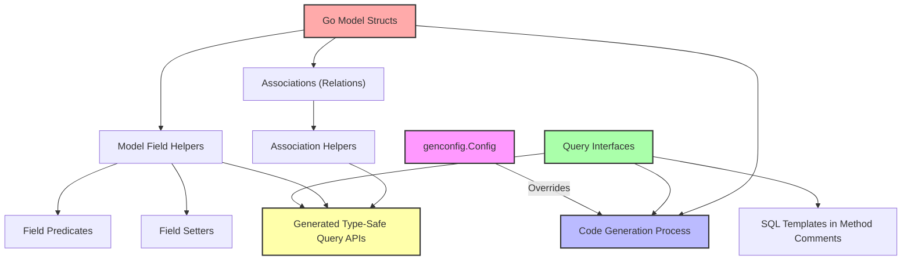

# Core Terminology & Concepts

Welcome to the foundational glossary of GORM CLI's key language and constructs. This page establishes the essential vocabulary you’ll encounter as you explore the documentation and use the tool. Understanding these terms empowers you to quickly orient yourself and confidently interact with GORM CLI’s powerful code generation capabilities.

---

## Defining the Language: What You Need to Know

GORM CLI’s documentation and generated APIs revolve around a specific set of concepts that translate your Go source code into type-safe database interactions. Here, we clarify these central notions, so you can focus on what the tool enables you to achieve.

### Query Interfaces

At the heart of GORM CLI’s workflow lies the **query interface** — a Go interface with methods annotated by SQL templates using a simple, expressive DSL. These interfaces define your data access intent in a clean, type-safe manner.

- **What it is:** A Go interface where each method includes SQL templates (via method comments) to express queries, filters, or updates.
- **Why it matters:** From your interface, GORM CLI generates concrete implementations with compile-time type checking and fluent APIs, reducing runtime errors.

**Example:**
```go
// SELECT * FROM @@table WHERE id=@id
GetByID(id int) (T, error)

// SELECT * FROM @@table WHERE @@column=@value
FilterWithColumn(column string, value string) (T, error)
```

### SQL Templates

These are the snippets of SQL mixed with lightweight control directives embedded in method comments. They serve as the blueprint for the generated query or update logic.

- **Placeholders:** `@@table` and `@@column` dynamically resolve to the model’s table and column names.
- **Parameter binding:** `@param` binds Go function params directly to SQL.
- **Control directives:** `{{where}}`, `{{set}}`, `{{if}}`, and `{{for}}` enable conditional and iterative templating.

**Practical Insight:**
SQL templates let you declare your data retrieval and mutation logic declaratively, eliminating verbose and error-prone manual query building.

### Model Field Helpers

For every model struct field, GORM CLI generates a corresponding **field helper** — a type-safe representation that makes constructing predicates and setters straightforward.

- **Core concept:** Strongly typed helpers (e.g., `generated.User.Name`, `generated.User.Age`) with chainable methods like `.Eq()`, `.Like()`, `.Between()`, and `.Set()`.
- **Why use them:** They provide discoverability through your editor/IDE and prevent mistakes by checking types and SQL expression validity at compile time.

**Example:**
```go
generated.User.Name.Eq("alice")   // WHERE name = 'alice'
generated.User.Age.Between(18, 65) // WHERE age BETWEEN 18 AND 65
```

### Associations

GORM CLI also covers relational data through **association helpers** that represent model relationships such as has one, has many, belongs to, and many-to-many.

- **Helper types:** `field.Struct[T]` for single models and `field.Slice[T]` for collections.
- **Operations:** Create, Update, Unlink (remove link), Delete, and CreateInBatch, all with compile-time safety.

**Real-world example:**
```go
gorm.G[User](db).
  Set(
    generated.User.Pets.Create(generated.Pet.Name.Set("fido")),
  ).
  Create(ctx)
```
Creates a new `User` with an associated pet named “fido”.

### Predicates

Predicates are the building blocks for WHERE clauses. Generated predicates enable fluent expression of filters over fields.

- **Examples:**
  - `.Eq(value)` for equality
  - `.Like(pattern)` for pattern matching
  - `.Between(low, high)` for ranges
  - `.IsNull()` / `.IsNotNull()` for null checks

### Setters

Setters help you define data updates safely and clearly.

- Use `.Set(value)` to assign a new field value.
- Operations like `.Incr(n)` increment numeric fields.
- Expressions can be defined for advanced updates (e.g., SQL expressions).

### GenConfig

`genconfig.Config` allows you to customize code generation. It controls:

- Output paths
- Inclusion/exclusion of interfaces or structs
- Mapping Go native types or struct tags to generated field helper types
- Whether configs are applied per file or whole directory subtree

**Sample config snippet:**
```go
var _ = genconfig.Config{
  OutPath: "examples/output",
  FieldTypeMap: map[any]any{
    sql.NullTime{}: field.Time{},
  },
  IncludeInterfaces: []any{"Query*"},
}
```

This gives you fine-grained control over what is generated and how fields are interpreted.

---

## Why These Terms Matter

Understanding this lexicon equips you to:

- **Interpret generated code naturally:** Knowing what ‘Query Interfaces’ and ‘Field Helpers’ represent help you grasp the shape and purpose of the generated APIs.
- **Write effective templates:** Mastering SQL templating syntax and predicates empowers concise yet powerful query definitions.
- **Customize generation confidently:** GenConfig lets you tailor behavior to project specifics, avoiding surprises.
- **Navigate the docs smoothly:** When exploring guides, quickstarts, or advanced patterns, this shared terminology ensures consistency.

---

## How This Fits in the GORM CLI Documentation

This page is part of the Core Concepts & Architecture section. It builds the foundational knowledge necessary for understanding how GORM CLI interprets your source code and delivers the resulting typed query helpers and APIs.

- For practical examples, see guides like [Working with Model-Driven Field Helpers](https://yourdocsite/concepts/data-models-fields/field-helper-architecture) or [Template-Based Queries](https://yourdocsite/guides/advanced-patterns/template-based-queries).
- To learn generation workflows, visit [How GORM CLI Works](https://yourdocsite/overview/core-concepts/how-gorm-cli-works).
- For configuration deep dives, see [Generation Configuration](https://yourdocsite/concepts/generation-configuration/genconfig-overview).

---

## Summary of Key Terms

| Term               | Description                                                                    | Example / Usage                      |
| ------------------ | ------------------------------------------------------------------------------ | ---------------------------------- |
| Query Interfaces   | Go interfaces with SQL templated methods defining query/update operations       | `GetByID(id int) (T, error)`       |
| SQL Templates      | Inline SQL with placeholders and control directives within interface method comments | `SELECT * FROM @@table WHERE id=@id` |
| Model Field Helpers| Generated typed structs and methods for fields enabling predicates and setters  | `User.Name.Eq("alice")`           |
| Associations       | Relation helpers for has one/many, belongs to, many2many with safe operations   | `User.Pets.Create(...)`             |
| Predicates         | Methods to build WHERE conditions fluently                                    | `.Like()`, `.Between()`, `.IsNull()`|
| Setters            | Methods to define field update operations                                     | `.Set()`, `.Incr()`, `.SetExpr()`  |
| GenConfig          | Configuration struct to customize code generation                              | `OutPath`, `IncludeInterfaces`     |

---

## Tips for Success

- **Master SQL templating directives:** Exploit `{{where}}` and `{{set}}` blocks for clean conditional queries.
- **Use generated field helpers everywhere:** Avoid raw strings to prevent SQL injection and bugs.
- **Leverage genconfig to scope generation:** include/exclude interfaces/structs to keep outputs manageable.
- **Understand association semantics:** Different association types behave uniquely for Unlink/Delete operations.

---

## Troubleshooting Common Confusions

<AccordionGroup title="Common Questions about Core Concepts">
<Accordion title="What’s the difference between Query Interfaces and Model Field Helpers?">
Query Interfaces define your queries and updates via methods with embedded SQL templates; the generator creates concrete implementations. Field Helpers are generated helpers tied to your model structs, enabling safe predicates and setters for fields.
</Accordion>
<Accordion title="Can I customize which interfaces or models are generated?">
Yes. Use `genconfig.Config` to include or exclude specific interfaces and structs by name patterns or type literals. You can also map Go native types or tags to custom field helper types.
</Accordion>
<Accordion title="How do associations relate to models and queries?">
Associations are fields on your models representing relationships. GORM CLI generates helpers for these enabling you to perform create, update, unlink, and delete operations safely with type checks.
</Accordion>
<Accordion title="What if my SQL template has complex conditional logic?">
You can use `{{if}}`, `{{for}}`, `{{where}}`, and `{{set}}` blocks within your comments to dynamically generate portions of SQL depending on parameter values. This keeps your queries concise and adaptable.
</Accordion>
</AccordionGroup>

---

## Next Steps

- Dive into the practical side with [Quickstart: Generate Type-Safe APIs](https://yourdocsite/guides/core-workflows/quickstart-generate).
- Explore deeper in [Template-Based Queries](https://yourdocsite/guides/advanced-patterns/template-based-queries) to write complex SQL logic.
- Customize your generation with [Generation Configuration](https://yourdocsite/concepts/generation-configuration/genconfig-overview).

---

*Ready to move from concepts to code? Head to the [Getting Started Quickstart](https://yourdocsite/getting-started/core-workflow-quickstart/prepare-models-interfaces) to see how to define models and query interfaces.*

---

## Reference

- [GORM CLI GitHub Repository](https://github.com/go-gorm/cli)
- See examples at `/examples/query.go` and `/examples/models/user.go` in the repo

---

## Diagram: How Terms Relate Conceptually



This illustrates the fundamental relationships between your inputs (interfaces, models, configs) and generated outputs.

---

# End of Core Terminology & Concepts

---