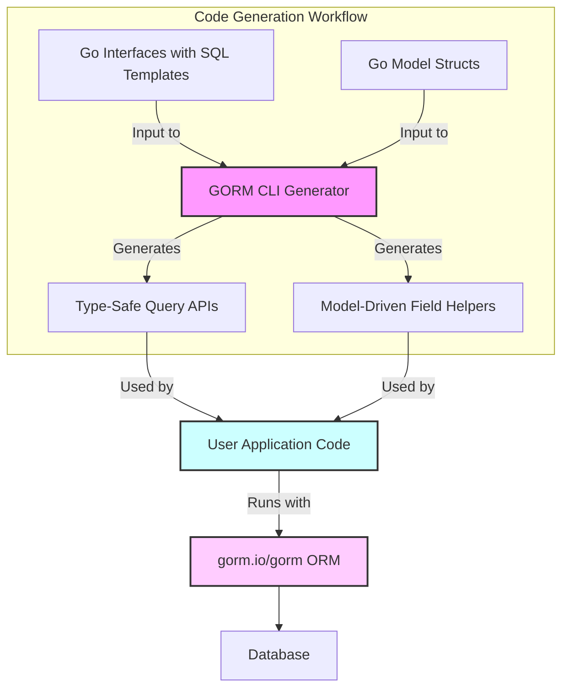

# Typical Use Cases & Integration Patterns

GORM CLI is designed to empower Go backend teams by automating the generation of type-safe data access layers that seamlessly integrate with the `gorm.io/gorm` ORM framework. This page outlines the most common deployment scenarios and integration patterns observed in real projects, illustrating how teams leverage GORM CLI to accelerate development, adopt migrations, refactor safely, and maintain clean integration with existing GORM workflows.

---

## Why Teams Adopt GORM CLI

Across diverse teams, GORM CLI proves essential for:

- **Rapid Prototyping of Data Access Layers:** Quickly scaffold query APIs and field helpers to validate ideas without sacrificing type safety or backend reliability.
- **Incremental Adoption in Legacy or Migration Projects:** Generate strongly typed query interfaces from existing models and interfaces, enabling gradual, safe refactors.
- **Safe Refactoring & API Evolution:** Confidently modify queries and models backed by compile-time checks, avoiding runtime SQL errors.
- **Seamless Interoperation with `gorm.io/gorm`:** Generated APIs conform to GORM idioms and interfaces, allowing smooth adoption without disrupting current ORM-based codebases.

These patterns are supported directly by GORM CLI’s dual-generation strategy — interface-driven query APIs and model-driven field helpers — delivering both flexibility and safety.

---

## Common Use Cases

### 1. Rapid Prototyping & Development Iteration

Teams often start a project by defining Go interfaces with SQL templates to represent query intentions and data manipulation logic. By running GORM CLI, they instantly generate full, type-safe query implementations and strongly typed field helpers reflecting their database schema.

This setup allows developers to:

- Write concise, intention-focused Go interfaces instead of boilerplate SQL handling.
- Test queries early via generated code that emphasizes correctness and discoverability.
- Modify query signatures and model definitions with immediate feedback from compile errors.

Example Workflow:

```bash
# Define query interfaces and models (e.g., ./examples/query.go and ./examples/models/user.go)
gorm gen -i ./examples -o ./generated
```

Access generated query methods with fluent syntax:

```go
u, err := generated.Query[User](db).GetByID(ctx, 123)
```

### 2. Migration & Incremental Adoption

In legacy projects or during database migrations, it’s risky and costly to rewrite all data access code at once. GORM CLI enables a gentle migration by generating typed query APIs from existing interfaces and models without altering runtime behavior.

This lets teams:

- Introduce new query templates capturing intended logic.
- Leverage generated strong types to minimize runtime errors before full migration.
- Gradually replace raw SQL or untyped queries with generated APIs.

### 3. Safe Refactoring and API Evolution

When modifying queries, adding new filters, or evolving database schemas, teams require confidence that changes do not break production code.

GORM CLI aids this by:

- Enforcing compile-time validation of query signatures and field helper usages.
- Providing discoverable APIs that make it clear which fields and filters are available.
- Reducing manual SQL updating and associated debugging time.

### 4. Seamless Use with `gorm.io/gorm`

The generated query APIs and field helpers perfectly integrate with GORM’s ORM mechanisms, preserving:

- Support for GORM’s context and query chaining styles.
- Compatibility with GORM association operations using generated helpers.
- Smooth invocation patterns for filters, updates, creations, and batch operations.

Example snippet showcasing integration:

```go
// Simple filter usage
users, err := gorm.G[User](db).Where(generated.User.Age.Gt(18)).Find(ctx)

// Association create and update
err := gorm.G[User](db).
    Set(
      generated.User.Name.Set("alice"),
      generated.User.Pets.Create(generated.Pet.Name.Set("fido")),
    ).
    Create(ctx)
```

---

## Supported Integration Patterns

### Interface-Driven Query API Generation

Define Go generic interfaces with SQL templates embedded in comments. GORM CLI interprets these comments as precise templates supporting dynamic binding and conditional logic.

This pattern supports:

- Queries with parameterized filters binding method arguments into SQL safely.
- Updates and deletes with conditional setting clauses.
- Returning concrete typed results or chaining queries with fluent methods.

### Model-Driven Field Helper Generation

From your model structs, GORM CLI automatically generates field helpers enabling:

- Compile-time safe predicates for filtering.
- Typed setters for updates and creations, supporting zero values and expressions.
- Association helpers for operations such as Create, Update, Unlink, Delete, and CreateInBatch.

### Configurable Generation via genconfig

By declaring a `genconfig.Config` in the package, teams can customize:

- Output directory, inclusion or exclusion of specific interfaces and structs.
- Custom mappings of Go types or struct tags to particular field helper behaviors.

This flexibility allows tailoring the generated code for complex or evolving project needs without changing the generator itself.

---

## Practical Example: Migration Integration

A team wanting to migrate an older data access layer might:

1. Declare interfaces mirroring existing query methods with SQL templates.
2. Run GORM CLI to generate typesafe implementations alongside their legacy code.
3. Adjust their application code to invoke generated queries where safe and convenient.
4. Incrementally refactor raw SQL to templated queries over time.

This strategy minimizes risk and accelerates migration without disrupting stability.

---

## Troubleshooting & Best Practices

- **Keep Interfaces & Models Synchronized:** Ensure your query interfaces and model definitions are consistent to avoid generation mismatches.
- **Use genconfig to Control Generation Scope:** Prevent accidental generation of deprecated or irrelevant interfaces using include/exclude filters.
- **Leverage Generated Association Helpers:** Avoid manual SQL for related data operations by using associations with Create/Update/Unlink/Delete semantics.
- **Validate Generated Outputs Quickly:** Use quick integration tests early to confirm generated queries behave as expected.

---

## Visual Overview of GORM CLI Integration Flow



---

## Next Steps

To implement these integration patterns:

- Explore the [Getting Started Guides](/getting-started/) to setup and generate your first code.
- Review [Managing Associations in Generated Code](/guides/core-workflows/associations-in-depth) for advanced relation handling.
- Customize your generation with [genconfig Concepts](/gorm-cli-concepts/extensibility-integration/genconfig-concepts) for tailored workflows.


