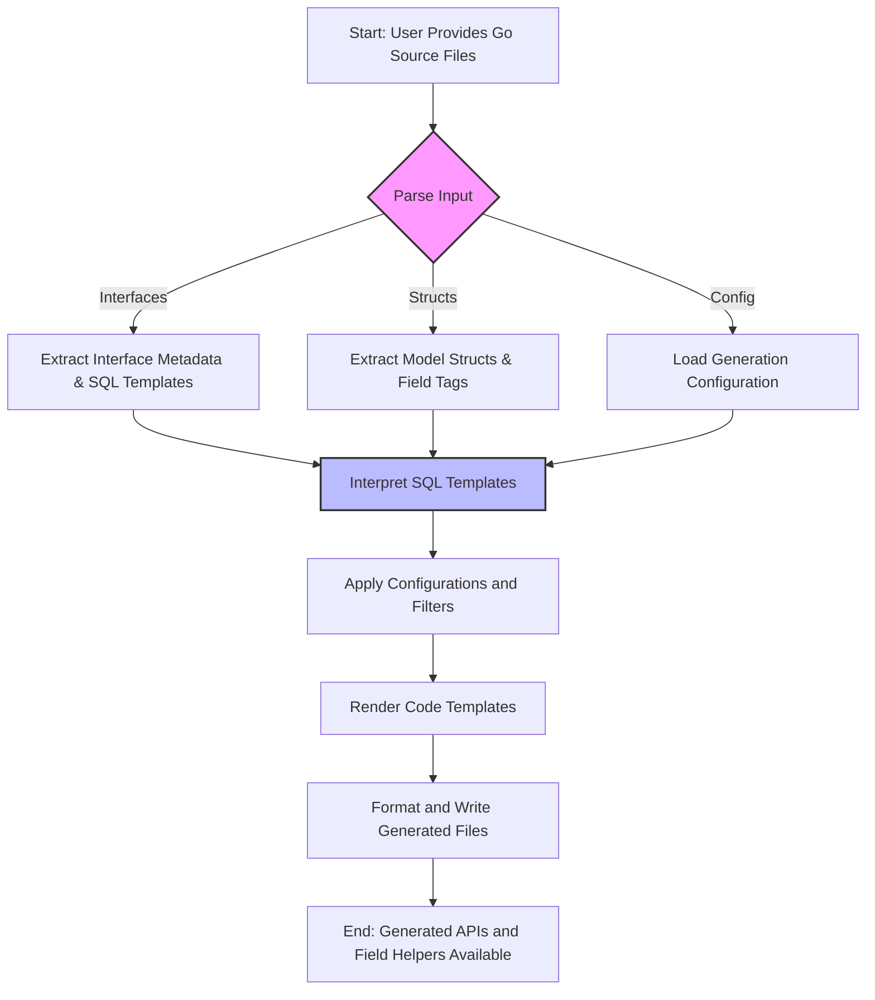

# How GORM CLI Works

Understanding the internal workflow of the GORM CLI generator unlocks a clear view of how your source Go code transforms into powerful, type-safe, and fluent database access APIs. This page walks you through the end-to-end process the generator follows — from parsing Go query interfaces and your model structs, to interpreting embedded SQL templates, and finally producing the generated code you use in your projects.

---

## Why This Matters

As a developer working with GORM, you want assurance that your database queries are robust, type-safe, and easy to maintain. GORM CLI bridges the gap by automating the generation of idiomatic Go APIs tailored exactly to your models and query definitions — eliminating boilerplate and minimizing runtime errors.

By understanding the generator's workflow, you gain insight into:

- How your source code relates to the generated artifacts
- What aspects of your Go code influence the generated query APIs and field helpers
- How SQL templates embedded in your interfaces translate into executable queries

This knowledge empowers you to write better input, debug generation issues more effectively, and customize previews as needed.

---

## The Generation Workflow: Step-by-Step

GORM CLI’s core workflow can be summarized in three main stages:

### 1. Parsing Input: Interfaces and Models

- **Input Sources:** The generator takes one or more Go source files or directories containing your query interface definitions and model struct declarations.

- **Go AST Parsing:** It uses Go's Abstract Syntax Tree (AST) parser to read and analyze your code. This process identifies key elements:
  - **Query Interfaces:** Interfaces with method signatures and SQL template comments.
  - **Model Structs:** Struct definitions representing your database models.
  - **Configuration Objects:** Optional `genconfig.Config` variables that influence generation rules.

This parsing gathers metadata such as method names, parameter lists, return types, field names, tags, and embedded interfaces.

> For example, your interface method comment might include an SQL template like:
>
> ```go
> // SELECT * FROM @@table WHERE id=@id
> GetByID(id int) (T, error)
> ```


### 2. Interpreting SQL Templates

- The generator extracts raw SQL and templated directives embedded in interface method comments.
- SQL placeholders like `@@table`, `@param`, `{{where}}`, and `{{set}}` are parsed and prepared for runtime binding in Go.
- Conditional logic and iteration in templates (`{{if}}`, `{{for}}`) transform into Go code logic within the generated methods.

This step ensures that your written SQL templates map to strongly typed queries, incorporating parameters from your method signatures in a type-safe manner.

### 3. Code Generation: Producing APIs and Helpers

- Based on the parsed data, the generator invokes templates to output:
  - **Type-safe Query APIs:** Concrete Go implementations for each interface method, seamlessly chaining GORM operations.
  - **Model Field Helpers:** Struct-based field and association helpers for constructing filters, updates, and relations fluently.

- Configuration from your `genconfig.Config` is merged, applying package-specific overrides such as output paths, field type mapping, and interface inclusions/exclusions.

- The generator writes the resulting files into your project structure, formatting Go code and organizing imports.

Successful generation produces discoverable, fluent APIs directly matching your initial interface and model definitions, ready for immediate use.

---

## How Source Code Maps to Generated Code

| Source Code Component               | Generated Artifact                               | User Benefit                                             |
|-----------------------------------|-------------------------------------------------|----------------------------------------------------------|
| Go Query Interface Methods        | Concrete implementations with typed parameters  | Compile-time safety and easy query method calls          |
| SQL Comments with Templating      | Embedded SQL translated into Go query builders  | Safe, composable SQL with dynamic parameter binding      |
| Model Struct Fields and Tags      | Field helper structs with typed column helpers  | Fluent API for filters, updates, and associations        |
| `genconfig.Config` options        | Generation filters and customization             | Tailored generation fitting project structure and style  |


## Practical Example Workflow

Imagine you have this Go interface:

```go
// UserQueries defines queries for User model
// with embedded SQL templates

type UserQueries[T any] interface {
  // SELECT * FROM @@table WHERE id=@id
  GetByID(id int) (T, error)

  // UPDATE @@table
  // {{set}}
  //   {{if user.Name != ""}} name=@user.Name, {{end}}
  // {{end}}
  // WHERE id=@id
  UpdateName(user User, id int) error
}
```

**Workflow:**

- The CLI parses this interface and its methods.
- The `GetByID` method’s SQL template becomes a method fetching by ID with fully typed parameters.
- The `UpdateName` method template containing `{{set}}` conditional logic is parsed and the generated method includes conditional update logic based on `user.Name`.
- The generator writes Go files with implementations that use GORM `DB` methods and field helpers corresponding to your `User` struct.

You receive ready-to-use, error-checked query methods that directly correspond to your interface.

---

## Tips and Best Practices

- **Define Clear Interfaces:** Keep your SQL template comments tight and well-formed to avoid generation errors.
- **Leverage Configuration:** Use `genconfig.Config` to customize field mapping or include/exclude specific interfaces or models.
- **Keep Models and Interfaces Close:** Place your interface and model structs in the same package or directory for consistent generation.
- **Review Generated Code:** Familiarize yourself with the generated files to understand API capabilities and validate correctness.
- **Handle Associations Carefully:** Generated helpers support complex relationship operations; use them to avoid manual foreign key manipulation.

---

## Common Pitfalls and Troubleshooting

<AccordionGroup title="Common Issues and How to Resolve">
<Accordion title="Missing Return Types or Incorrect Return Values">
Ensure every interface method that corresponds to a finishing SQL operation returns at least an error (or error with data). For chainable query methods, the return is an interface.

Failure to do so causes generator panics.
</Accordion>
<Accordion title="SQL Template Parsing Errors">
Verify SQL comments are syntactically valid and placeholders are correctly named.

Misplaced `{{end}}` or unsupported expressions cause generation failures.
</Accordion>
<Accordion title="Configuration Not Applied As Expected">
Confirm that `genconfig.Config` is declared at the package level and correctly references interfaces/models.

Patterns in `IncludeInterfaces` and `ExcludeInterfaces` are matched precisely; wildcards must be exact.
</Accordion>
</AccordionGroup>

---

## Relationship to Other Documentation

This page is part of the **Core Concepts & Architecture** group and acts as a bridge between introductory materials such as [What is GORM CLI?](/overview/product-intro/what-is-gorm-cli) and detailed setup or usage guides like [Defining Models and Query Interfaces](/getting-started/core-workflow-quickstart/prepare-models-interfaces).

For advanced insights on SQL templating syntax and customization, consult:
- [Template DSL and SQL Templating](/concepts/core-architecture/template-dsl-concepts)
- [Generation Configuration](/concepts/generation-configuration/genconfig-overview)

---

## Visualizing the Workflow



---

## Next Steps

Ready to apply this knowledge?

- Dive into [Defining Models and Query Interfaces](/getting-started/core-workflow-quickstart/prepare-models-interfaces) to learn how to write valid inputs for the generator.
- Explore [Generating Type-Safe APIs and Helpers](/getting-started/core-workflow-quickstart/generate-api) to run your first generation.
- Review [Troubleshooting Common Issues](/getting-started/configuration-troubleshooting/troubleshooting-common-issues) if you encounter problems.


---

For the latest source and examples, visit the [GORM CLI GitHub repository](https://github.com/go-gorm/cli).

---

<Info>
Understanding the generation workflow clarifies how your input Go code relates directly to the safe, efficient APIs you consume–empowering better designs and confident use of GORM CLI.
</Info>
