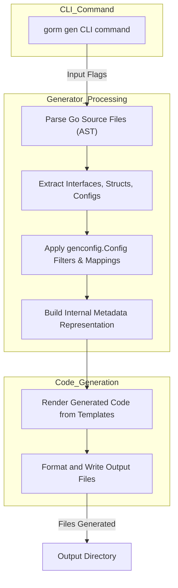

# System Architecture Overview

Explore the inner workings of GORM CLI’s architecture to understand how your Go interfaces and models transform into powerful, type-safe query APIs and model-driven helpers. This page guides you through the core components involved in code generation, the flow from CLI invocation to generated output, and how configurations and models interact seamlessly with the generation engine.

---

## Why This Matters

When using GORM CLI, you want to generate reliable, maintainable, and fluent code effortlessly from your raw Go types and annotated SQL interfaces. Understanding the system architecture helps you:

- Gain confidence in the generation process
- Customize or troubleshoot your generation workflow
- Appreciate how GORM CLI structures your inputs and outputs under the hood

---

## At a Glance: What Happens When You Run `gorm gen`

When you run the CLI command to generate code, GORM CLI orchestrates several stages:

1. **Entry via CLI**: The `gorm gen` command kicks off processing with specified input paths and output directory.
2. **Source Code Parsing**: The Generator reads your Go source files, extracting interfaces, structs, methods, and SQL template annotations.
3. **Configuration Application**: Your package-level `genconfig.Config` settings filter which interfaces, structs, and fields to include or exclude and map Go types to field helpers.
4. **Intermediate Representation**: Each Go file is represented internally with rich metadata capturing interfaces, methods, structs, fields, and configs.
5. **Template Rendering**: The generator renders Go source code from templates using the processed metadata.
6. **Code Formatting and Output**: Resulting code is formatted and written to your specified output directory, preserving package structure.

This flow guarantees that your input remains the source of truth, while the generated code reflects your intent with full type safety and fluent APIs.

---

## Core Components Explained

### CLI Entry Point

- **Command Invocation**: The CLI is implemented using [Cobra](https://github.com/spf13/cobra), offering the `gen` subcommand which takes `--input` and `--output` flags.
- **Input Validation**: Ensures the specified source path exists.
- **Generator Instance Creation**: A `Generator` struct manages the entire parsing and generation lifecycle.

### Generator

- **File Processing**: Walks over input files or directories, parsing each Go source file.
- **Go AST Parsing**: Leverages Go's `parser` package to build abstract syntax trees (ASTs) of your Go source.
- **AST Traversal and Extraction**: Extracts relevant metadata:
  - Imported packages
  - Configurations (`genconfig.Config`)
  - Interfaces with methods and SQL templates
  - Structs with fields and tags

### Configurations

- **Config Discovery**: Any package-level `genconfig.Config` composite literal is automatically recognized and applied.
- **Filters and Mappings**: 
  - Interface and struct inclusion/exclusion filters
  - Field-type mappings to customize helper generation
  - File-level or package-wide application

### Internal Metadata Model

- **File Metadata**: Tracks package name, import statements, included interfaces and structs.
- **Interface Metadata**: Captures interface method signatures, parsed SQL templates, parameter and result types.
- **Struct Metadata**: Holds individual fields, database column names, Go types, and applied tags.

### Template-Based Code Generation

- Uses embedded templates to generate:
  - **Fluent type-safe query interfaces and implementations** based on your SQL-annotated methods
  - **Model-driven field helpers** for each struct field with type-safety and database column awareness

- The templates produce idiomatic Go code, ready to use in your applications.

---

## GORM CLI Architecture Diagram



This diagram visualizes the modular flow from command invocation through parsing, metadata extraction, configuration filtering, and code generation, culminating in output files ready for use.

---

## How Models, Interfaces, and Config Work Together

To understand what drives the output, consider these relationships:

- **Your Go Interfaces** define query methods annotated with SQL templates. The parser pulls these and their input/output parameter types.
- **Your Go Structs (Models)** define the domain entities with fields and tags.
- **Configurations (`genconfig.Config`)** customize the mapping of types and tags to helper fields and refine inclusions/exclusions.

Together, these allow the generator to create:

- Fluent, type-safe query APIs for your interfaces
- Comprehensive field helpers for your models

---

## Practical Example of Code Flow

Suppose you run:

```bash
gorm gen -i ./examples -o ./generated
```

- The generator parses all Go files in `./examples`.
- Detects interfaces like `Query[T]` with annotated SQL in comments.
- Detects structs like `User` with fields and `gen:"json"` tags.
- Applies any `genconfig.Config` found within those files (e.g., mapping JSON fields to special helpers).
- Generates code in `./generated` mirroring packages, including:
  - `Query[T]` interface implementations with methods like `GetByID` or `FilterWithTime`.
  - `User` model field helpers like `User.Name` or `User.Profile` with JSON-aware predicates.

Result? You get compiled, ready-to-use Go source files that enable safer, cleaner, and more productive GORM usage.

---

## Tips and Best Practices

- Always place `genconfig.Config` definitions within the package you want to influence for predictable filtering.
- Keep your annotated SQL templates concise, leveraging `{{where}}` and `{{set}}` blocks for dynamic queries.
- Maintain clean model struct tags to ensure proper mapping of fields to helpers.
- Use distinct input and output directories with the CLI flags to avoid overwriting source files.

---

## Troubleshooting Common Architecture-Level Issues

<AccordionGroup title="Troubleshooting Common Generator Issues">
<Accordion title="Input Path Not Found or Invalid">
Verify that the path passed via `--input` points to existing Go source files or directories.
Check for typos or missing directories.
</Accordion>
<Accordion title="Missing Generated Files">
Ensure your `genconfig.Config.OutPath` or CLI `--output` flag is set correctly and writable.
Verify you have included interfaces and structs for generation (filtering might exclude everything).
</Accordion>
<Accordion title="Parsing Errors on Source Files">
Review your Go source for syntax errors or unsupported constructs.
The parser strictly requires valid Go code.
</Accordion>
<Accordion title="Code Formatting or Write Errors">
Check directory permissions where output files are generated.
Make sure your environment supports `goimports` and `gofmt` commands used for formatting.
</Accordion>
</AccordionGroup>

---

## What’s Next?

Now that you understand the system architecture, you’re ready to:

- Deep dive into [Configuring Code Generation](https://gorm.io/cli/docs/getting-started/configuring-generation) to customize your output
- Learn about [Core Concepts & Terminology](https://gorm.io/cli/docs/overview/core-overview/core-terminology) for terminology and workflows
- Start with [Getting Started Guides](https://gorm.io/cli/docs/getting-started) to generate your first APIs

---

This overview equips you with a solid foundation of GORM CLI’s inner mechanisms, setting the stage for expert usage and customization.

---

_For additional details or advanced customization, visit the related sections in the documentation._


---