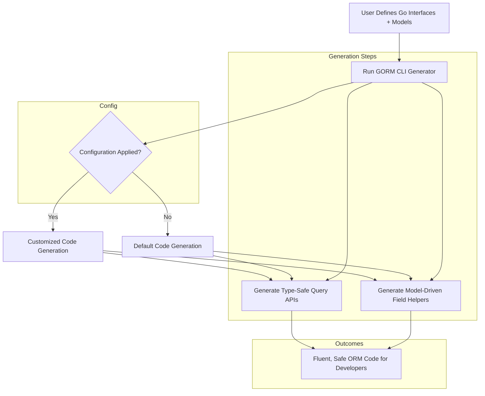

# Quick Feature Overview

Explore GORM CLI’s essential capabilities at a glance, empowering you to generate type-safe query APIs and model-driven helpers that streamline your GORM development. This page offers a concise summary of key features including type-safe query generation, field helpers, association management, and powerful configuration options — all linked to where they fit into your development workflow.

---

## Type-Safe Query Generation

At GORM CLI’s core is the ability to turn your Go interfaces annotated with SQL templates into fully typed, fluent query APIs. This feature ensures your database interactions are checked at compile time, reducing runtime errors and increasing developer confidence.

- **Write SQL templates in Go interface comments** with familiar SQL plus powerful templating DSL.
- **Generate concrete query interface implementations** that seamlessly integrate with GORM’s DB methods.
- **Context auto-injection and parameter binding** enable clean, safe API signatures without boilerplate.

### Real-World Scenario
You define a `Query[T any]` interface with methods annotated by SQL snippets. After generation, you get fully typed methods such as `GetByID(id int) (T, error)` that encapsulate your SQL logic with Go’s type safety, ready for immediate use.

```go
// Example interface snippet
// SELECT * FROM @@table WHERE id=@id
GetByID(id int) (T, error)
```

## Model-Driven Field Helper Logic

GORM CLI analyzes your model structs, generating combinable field helpers that encapsulate common query predicates, setters, and expressions tailored to each field’s data type.

- **Supports all basic field types**: strings, numbers, booleans, time, byte slices, and named types implementing database interfaces.
- **Advanced type mappings** based on struct tags and custom `gen:"name"` annotations enable extending field behaviors.
- **Convenient helpers for filtering and updating**: e.g., `.Eq()`, `.Like()`, `.Set()`, `.Incr()`.

### Practical Example
For a `User` model with an `Age int` field, you use `generated.User.Age.Gt(18)` to build expressive predicates. Updates become fluent:

```go
gorm.G[User](db).
  Where(generated.User.Name.Eq("alice")).
  Set(
    generated.User.Age.Incr(1),
    generated.User.IsAdult.Set(true),
  ).
  Update(ctx)
```

## Association Operations

Efficiently managing related data is vital. GORM CLI generates *association helpers* that embody common ORM operations with compile-time guarantees.

- **Support for has one, has many, belongs to, many-to-many relationships, including polymorphic associations.**
- **Operations include**: `Create`, `CreateInBatch`, `Update`, `Unlink`, and `Delete`, all accessible as methods on generated helpers linked to your associations.
- **Conditional operation support**: filter associated entities before applying unlink or delete.

### Usage Example
Create and link related records in a single fluent call:

```go
gorm.G[User](db).
  Set(
    generated.User.Name.Set("alice"),
    generated.User.Pets.Create(generated.Pet.Name.Set("fido")),
  ).
  Create(ctx)
```
Unlink or delete associations with optional filters:

```go
gorm.G[User](db).
  Where(generated.User.ID.Eq(1)).
  Set(generated.User.Pets.Where(generated.Pet.Name.Eq("old")).Delete()).
  Update(ctx)
```

## Configuration Options

GORM CLI provides flexible generation configuration through package-level `genconfig.Config` values that customize output behavior.

- **Control generated output path (`OutPath`) and granularity (`FileLevel`).**
- **Include or exclude specific interfaces or structs** using patterns or concrete types.
- **Custom field mappings**: override default helper types for named fields or Go types.
- **Seamless integration**: configs are discovered automatically during generation.

### Config Snippet Example

```go
var _ = genconfig.Config{
  OutPath: "examples/output",
  FieldTypeMap: map[any]any{
    sql.NullTime{}: field.Time{},
  },
  FieldNameMap: map[string]any{
    "json": JSON{},
  },
  IncludeInterfaces: []any{"Query*"},
  IncludeStructs: []any{"User", "Account*"},
}
```

---

## Summary Diagram of Feature Flow



---

## Why This Feature Overview Matters

This page bridges your understanding of GORM CLI’s powerful building blocks by summarizing its core generation capabilities. Whether you are writing custom query interfaces, modeling complex relationships, or configuring generation to fit your project needs, these features form the foundation of safe, maintainable, and expressive database-driven applications.

Start here to see what’s possible, then explore the detailed sections on architecture, configuration, and usage patterns.

---

## Next Steps

- Explore [System Architecture Overview](/overview/core-overview/architecture-system-overview) to understand the internal flow behind these features.
- Learn about GORM CLI’s [Core Terminology](/overview/core-overview/core-terminology) to get familiar with key concepts.
- Dive into [Generating Type-Safe Query APIs](/guides/getting-started/generate-type-safe-apis) and [Building Model-Driven Field Helpers](/guides/getting-started/model-driven-field-helpers) for practical guidance.

<Tip>
Remember, this overview is a snapshot. For a deep dive and hands-on examples, follow the linked guides and concepts pages to unlock the full potential of GORM CLI.
</Tip>
