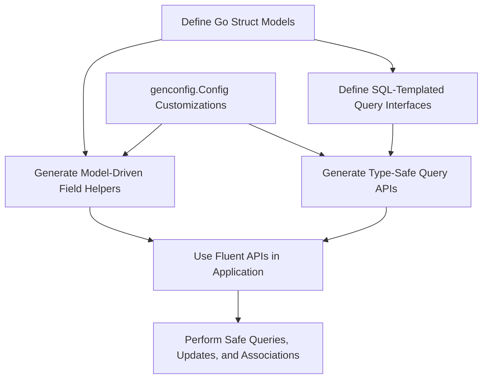

# Feature Overview

Unlock the full potential of GORM CLI with a rich set of features designed to streamline your data access layer in Go projects. This overview spotlights the core capabilities that make GORM CLI the go-to solution for generating type-safe query APIs and powerful model-driven field helpers, enhancing both developer productivity and code reliability.

---

## Type-Safe Query API Generation

At the heart of GORM CLI lies a robust engine that lets you define Go interfaces with embedded SQL templates to generate strongly typed, compile-time safe query APIs.

- **Interface-Driven**: Write intuitive Go interfaces using SQL template annotations in comments.
- **Automatic Generation**: Interfaces transform into concrete, type-safe implementations automatically.
- **SQL Templates**: Use a flexible, embedded SQL templating DSL that supports dynamic conditions, iteration, and binding without sacrificing type safety.
- **Context Support**: Methods automatically accept `context.Context`, integrating seamlessly with Go’s concurrency model.

This approach ensures your queries are discoverable, maintainable, and error-free before runtime.

## Model-Driven Field Helpers

GORM CLI analyzes your Go struct models to produce fluent, strongly typed field helpers for filters, updates, and ordering.

- **Basic Fields and Types**: Automatically supports common Go types such as integers, strings, bools, time.Time, and nullable types.
- **Custom Type Mapping**: Configure custom mappings to handle special fields like JSON with your own helper implementations.
- **Fluent API**: Chain predicates and setters to compose expressive and safe queries or updates.
- **Association Awareness**: Recognizes relations and exposes helpers for associated records.

This system empowers you to build conditionals and updates with clear intent and strong type validation.

## Advanced Association Handling

Managing relational data is simplified with first-class association helpers that model your database relationships directly in code.

- **Supported Relations**: Handles belongs-to, has-one, has-many, and many-to-many associations.
- **Operations Supported**:
  - **Create/CreateInBatch**: Create parent and related entities atomically.
  - **Update**: Modify associated records selectively.
  - **Unlink**: Remove relation links without deleting data.
  - **Delete**: Remove associated entities safely.

- **Conditional Operations**: Apply filters on associations to control which linked rows are affected.

By expressing associations through generated helpers, your code remains consistent with your domain model and reduces boilerplate.

## Flexible and Powerful Configuration

Tailor the generation process to your project’s needs with a comprehensive configuration system.

- **OutPath Configuration**: Define output directories on a per-package or file level.
- **Include/Exclude Filters**: Select which interfaces and structs to include or exclude via shell-style patterns or explicit literals.
- **Field Type and Name Mapping**: Map arbitrary Go types or tagged fields to custom field helpers.
- **File-Level vs Package-Level**: Control whether configs apply globally or per individual file.

This configurability ensures smooth integration in large or complex codebases.

## Template DSL with Rich Expressions

The embedded DSL introduces powerful directives for dynamic SQL generation:

- `@@table` and `@@column` placeholders dynamically resolve tables and columns.
- `@param` binds Go method parameters safely.
- `{{where}}`, `{{set}}`, `{{if}}`, and `{{for}}` provide conditional and iterative SQL generation.

Example snippet:

```sql
SELECT * FROM @@table
{{where}}
  {{if user.Name != ""}} name=@user.Name {{end}}
  {{if user.Age > 0}} AND age=@user.Age {{end}}
{{end}}
```

This DSL lets you express complex queries succinctly, while preventing SQL injection and runtime errors.

---

## How These Features Work Together

1. **Define Your Models and Interfaces:** Model your data with Go structs and declare interfaces containing SQL-templated methods.
2. **Configure Generation:** Optionally customize code generation using `genconfig.Config` to map types, filter which code generates, and determine output locations.
3. **Generate Code:** Use the CLI tool to parse your code and generate fully typed query APIs and field helpers.
4. **Use Fluent APIs:** Call generated methods for type-safe queries, condition building, updates, and association management.

This seamless flow reduces manual coding and runtime bugs, enabling a developer experience that combines efficiency and confidence.

---

## Real-World Examples

- **Query API:**
  ```go
  // Retrieve user by ID with type safety
  user, err := generated.Query[User](db).GetByID(ctx, 123)
  if err != nil {
      // Handle error
  }
  ```

- **Filter with Field Helpers:**
  ```go
  db.Where(generated.User.Age.Between(18, 65)).Find(ctx, &users)
  ```

- **Association Operation:**
  ```go
  gorm.G[User](db).
    Set(
      generated.User.Name.Set("alice"),
      generated.User.Pets.Create(generated.Pet.Name.Set("fido")),
    ).
    Create(ctx)
  ```

- **Custom JSON Field Helper:**
  ```go
  // Query users with specific JSON profile flag
  gorm.G[User](db).
    Where(generated.User.Profile.Equal("$.vip", true)).
    Take(ctx)
  ```

---

## Diagram: Feature Integration Overview



---

## Best Practices & Tips

- Leverage interface-driven query methods for cleaner, reusable data access logic.
- Use field helpers to construct predicates and setters rather than raw strings to avoid injection and errors.
- For complex relations, utilize association helpers fully to keep operations consistent and maintainable.
- Employ configuration files to control generation scope and support special field types.
- Keep your SQL templates readable by using the DSL directives for conditional and iterative SQL construction.

---

## Troubleshooting Common Issues

<AccordionGroup title="Common Issues & Solutions">
<Accordion title="No Generated Code Appears">
- Ensure you specify the correct input directory or file with `-i` flag.
- Verify that your interfaces and structs match configured include/exclude patterns.
- Confirm your Go interfaces contain properly formatted SQL template comments.
</Accordion>
<Accordion title="SQL Template Rendering Errors">
- Check your SQL template syntax carefully, especially conditional blocks.
- Make sure parameter names in SQL comments correspond exactly to method parameters.
- Validate no conflicting or unsupported DSL directives.
</Accordion>
<Accordion title="Type Mismatches or Missing Fields in Helpers">
- Confirm model structs export fields properly.
- Use field mapping in `genconfig.Config` for custom types.
- Rebuild generated code after any model changes.
</Accordion>
</AccordionGroup>

---

## Next Steps

- Explore the [Quickstart Workflow](#/overview/feature-highlights-and-getting-started/quickstart) to start generating your first code.
- Deep dive into [Interface-Driven Queries](#/concepts/architecture-and-core-concepts/interface-driven-queries) for advanced usage.
- Learn about [Model-Driven Field Helpers](#/concepts/architecture-and-core-concepts/model-driven-field-helpers) to fully leverage generated predicates and setters.
- Customize generation with [Generation Config & Overrides](#/guides/advanced-patterns/customizing-generation).

Unlock your productivity with GORM CLI’s feature-rich ecosystem today.

---

_For a comprehensive introduction to GORM CLI features, visit the [Product Overview](/overview/introduction-and-value/product-overview) and [Key Benefits & Use Cases](/overview/introduction-and-value/value-proposition)._


