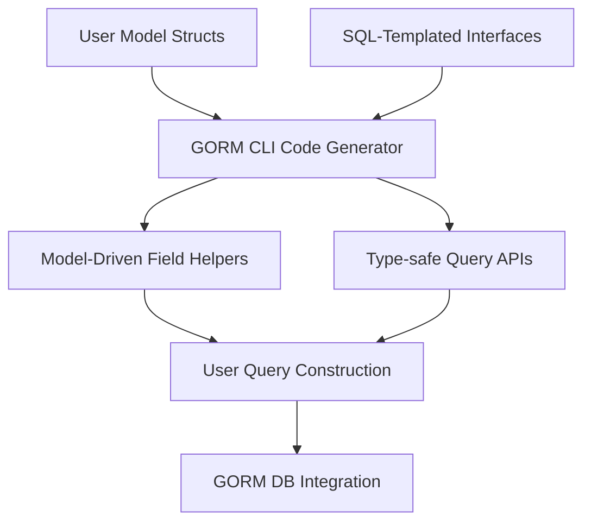

# Features at a Glance

Explore the essential capabilities of GORM CLI, your go-to tool for generating type-safe, model-driven query APIs integrated with GORM. This page presents all major features—from query generation and field helpers to associations, SQL template DSL, and configuration overrides—in a concise, example-rich summary to help you grasp what you can achieve and how.

---

## Unlock Powerful Query Generation

GORM CLI transforms your Go interfaces annotated with SQL templates into fully functional, compile-time safe query APIs.

- **Interface‑driven Generation:** Define method signatures with embedded SQL comments and receive concrete implementations that enforce type safety.
- **Fluent Usage Patterns:** Generated methods integrate seamlessly with GORM's existing query builder for intuitive chaining and querying.

**Example:**
```go
// Interface example
// SELECT * FROM @@table WHERE id=@id
GetByID(id int) (User, error)

// Generated usage
user, err := generated.Query[User](db).GetByID(ctx, 123)
```

This eliminates runtime SQL mistakes and empowers you with IDE-assisted code navigation and refactoring confidence.

---

## Model-Driven Field Helpers for Filtering and Updating

Say goodbye to brittle SQL string concatenations by using generated field helpers derived directly from your Go model structs.

- **Strongly Typed Predicates and Setters:** Each model field gains helper methods like `Eq()`, `Like()`, `Between()`, and `Set()` for safe query construction and updates.
- **Support for Basic and Complex Types:** Works with primitives, nullable types, time, and custom types.

**Example:**
```go
// Filter by age between 18 and 65
users, err := gorm.G[User](db).Where(generated.User.Age.Between(18, 65)).Find(ctx)

// Update a user's name and increment age by 1
gorm.G[User](db).Where(generated.User.Name.Eq("alice")).Set(
  generated.User.Name.Set("jinzhu"),
  generated.User.Age.Incr(1),
).Update(ctx)
```

These helpers boost productivity and prevent common errors caused by manual SQL string crafting.

---

## Robust Association Handling

Manage associations effortlessly with dedicated helpers that cater to all common GORM relationships:

- **Has One, Has Many, Belongs To, Many2Many:** Generate helpers with compile-time safety for creating, updating, unlinking, and deleting related records.
- **Batch Operations:** Create or link multiple associated records efficiently with batch methods.
- **Conditional Operations:** Filter associated records before unlinking or deleting for precise control.

**Example:**
```go
// Create user with a pet and associate them
gorm.G[User](db).
  Set(
    generated.User.Name.Set("alice"),
    generated.User.Pets.Create(generated.Pet.Name.Set("fido")),
  ).Create(ctx)

// Unlink a pet by name
gorm.G[User](db).
  Where(generated.User.ID.Eq(1)).
  Set(generated.User.Pets.Where(generated.Pet.Name.Eq("fido")).Unlink()).Update(ctx)
```

This simplifies complex relational logic into clear, composable operations reducing boilerplate code.

---

## Flexible Template-Based SQL DSL

Write expressive SQL templates right in your interface comments, leveraging a simple DSL for dynamic queries.

- **Placeholders and Directives:** Handle table/column substitutions (`@@table`, `@@column`), parameter bindings (`@param`), and conditional blocks (`{{if}}`, `{{where}}`, `{{set}}`).
- **Iterative & Conditional Logic:** Loop over collections and conditionally include SQL fragments for advanced dynamic queries.

**Example SQL Template:**
```go
// SELECT * FROM @@table
// {{where}}
//   {{if name != ""}} name=@name {{end}}
//   {{if age > 0}} AND age=@age {{end}}
// {{end}}
SearchUsers(name string, age int) ([]User, error)
```

This lets you keep raw SQL expressiveness while preserving type safety and maintainability.

---

## Configurable Overrides via genconfig.Config

Fine-tune code generation to fit your project’s needs by defining a package-level `genconfig.Config`:

- **Custom Output Paths:** Direct generated code to tailored locations.
- **Field Type and Name Mappings:** Specify how Go types or struct tags map to custom field helpers (e.g., JSON, Time).
- **Include/Exclude Filters:** Whitelist or blacklist interfaces and structs to control what gets generated.
- **File-Level or Package-Level Scopes:** Apply configs granularly per file or broadly across packages.

**Example:**
```go
var _ = genconfig.Config{
  OutPath: "examples/output",
  FieldNameMap: map[string]any{
    "json": JSON{}, // map `gen:"json"` tagged fields to JSON helper
  },
  IncludeInterfaces: []any{"Query*"},
}
```

This empowers you with deep customization without touching generator internals.

---

## How These Features Work Together



With GORM CLI, your models and query interfaces feed into a code generator that outputs field helpers and query APIs seamlessly usable within GORM, empowering your app with safer and richer query capabilities.

---

## Summary

This page presented a concise yet comprehensive overview of GORM CLI’s core feature set:

- **Query API Generation:** Type-safe, interface-driven code from annotated methods
- **Field Helpers:** Strongly typed predicates and setters for all model fields
- **Associations:** Intuitive, safe operations on related records
- **Template DSL:** Dynamic, conditional SQL inside interface comments
- **Configurable Generation:** Flexible overrides with genconfig.Config

Each section included actionable examples highlighting how these features boost developer productivity and app safety.


---

## Next Steps

To deep dive into any feature or start using GORM CLI, explore:

- [Quickstart Workflow](../getting-started/quickstart-workflow) to get up and running fast
- [Defining Query Interfaces & SQL Templates](../../guides/core-workflows/query-apis-and-templates) for detailed interface authoring
- [Using Generated Field Helpers](../../guides/core-workflows/using-generated-field-helpers) for filter and update operations
- [Working with Associations](../../guides/core-workflows/associations-best-practices) for safe relational data handling
- [Configuring Generation](../../guides/advanced-usage/configuring-generation) to tailor outputs

Harness the power of GORM CLI’s feature-rich ecosystem to write safer, clearer, and more maintainable database access code in Go.