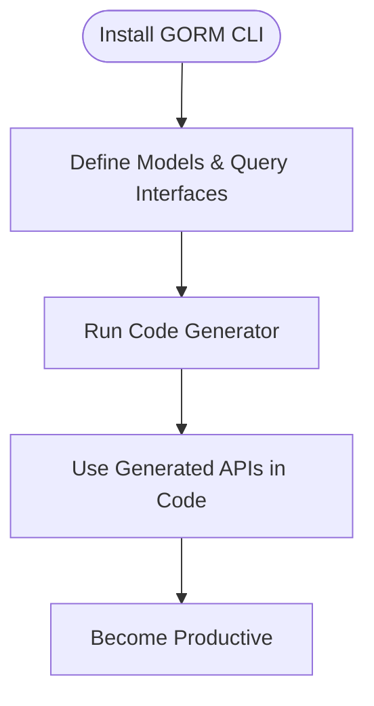

# Quickstart Glimpse

Explore the minimal journey to get productive with GORM CLI — from installing the tool to generating your first code and using the generated APIs in your Go projects. This page serves as an inviting entry point to deeper how-to guides available in the documentation.

---

## Getting Started: The Essentials

### 1. Install the GORM CLI Tool

Begin by installing the CLI, which requires Go 1.18+ (generics support):

```bash
 go install gorm.io/cli/gorm@latest
```

This command installs the `gorm` executable for generating your type-safe query APIs and field helpers from your Go interfaces and model definitions.

### 2. Define Your Models and Query Interfaces

Write your GORM models as usual, alongside interfaces that declare the query methods with embedded SQL templates in comments. These interfaces are the foundation for generating query APIs.

Example:

```go
// examples/models/user.go
package models

type User struct {
  ID   uint
  Name string
  Age  int
}
```

```go
// examples/query.go
package examples

type Query[T any] interface {
  // SELECT * FROM @@table WHERE id=@id
  GetByID(id int) (T, error)

  // where("name=@name AND age=@age")
  FilterByNameAndAge(name string, age int)
}
```

> Notice how the SQL templates integrate seamlessly in the interface comments – these become the source for generated type-safe methods.

### 3. Run the Code Generator

Generate your query APIs and field helpers by pointing the CLI to the directory holding your Go interfaces and models.

```bash
gorm gen -i ./examples -o ./generated
```

- `-i` specifies the input directory
- `-o` specifies the output directory for generated code

The tool processes your interfaces and structs, producing strong, compile-time safe APIs in the output folder.

### 4. Use the Generated APIs in Your Code

Once generated, you can immediately consume the APIs for querying your database with confidence and ease.

Example usage:

```go
// SELECT * FROM users WHERE id=?
user, err := generated.Query[models.User](db).GetByID(ctx, 123)

// SELECT * FROM users WHERE name=@name AND age=@age
users, err := generated.Query[models.User](db).FilterByNameAndAge(ctx, "jinzhu", 25).Find(ctx)
```

This API abstracts away manual SQL with fluent, type-safe interfaces backed by your models.

---

## Why This Quickstart Works

- **Minimal Setup:** The CLI tool installs easily with Go tooling and requires no additional dependencies.
- **Interface-Driven:** Your existing Go knowledge suffices to define queries — no new query language required.
- **Type Safety:** Generated APIs offer compile-time checks and reduce runtime query errors.
- **Seamless Integration:** Works natively with GORM's standard `*gorm.DB` and context usage.

---

## Practical Tips & Best Practices

- **Organize Interfaces and Models Together:** Placing your query interfaces and model definitions in the same package or directory simplifies generation.
- **Leverage Template DSL:** Use the SQL template directives like `@@table`, `@param`, and `{{where}}` in your interfaces for dynamic, safe SQL.
- **Configure Output Paths:** Customize generation output in a package-level `genconfig.Config` to fit your project structure.
- **Validate Generated Code:** Check the output after generation and adapt your interfaces incrementally for complex queries.

---

## Next Steps: Level Up Your Workflow

After mastering this quickstart, proceed to detailed guides that expand your capabilities:

- [Preparing Models & Query Interfaces](//getting-started/first-codegen-workflow/prepare-models-interfaces) explains how to write robust model and interface code.
- [Running the Code Generator](//getting-started/first-codegen-workflow/generate-code) dives into command usages and customization.
- [Using the Generated APIs](//getting-started/first-codegen-workflow/using-generated-code) covers query execution patterns and advanced scenarios.
- [Basic Configuration Options](//getting-started/first-codegen-workflow/basic-configuration-options) for tailoring generation behavior.

---

## Summary Diagram: Quickstart User Flow



---

With these key steps, you have everything needed to embark on a productive coding journey leveraging the power of GORM CLI.

---

## Additional Resources

- [Feature Overview](/overview/feature-highlights/feature-overview): Explore the broad capabilities of GORM CLI.
- [What is GORM CLI?](/overview/product-intro-core-concepts/what-is-gorm-cli): Understand fundamental concepts.
- [Integration & Workflow](/overview/architecture-and-integrations/integration-workflow): Learn how it fits with GORM and your projects.


---

<Check>
Ensure you have Go 1.18+ installed, and your project has valid GORM models and interfaces to maximize the CLI’s benefits.
</Check>

<Info>
You can always run `gorm --help` to view available commands and options.
</Info>

---

# End of Quickstart Glimpse
