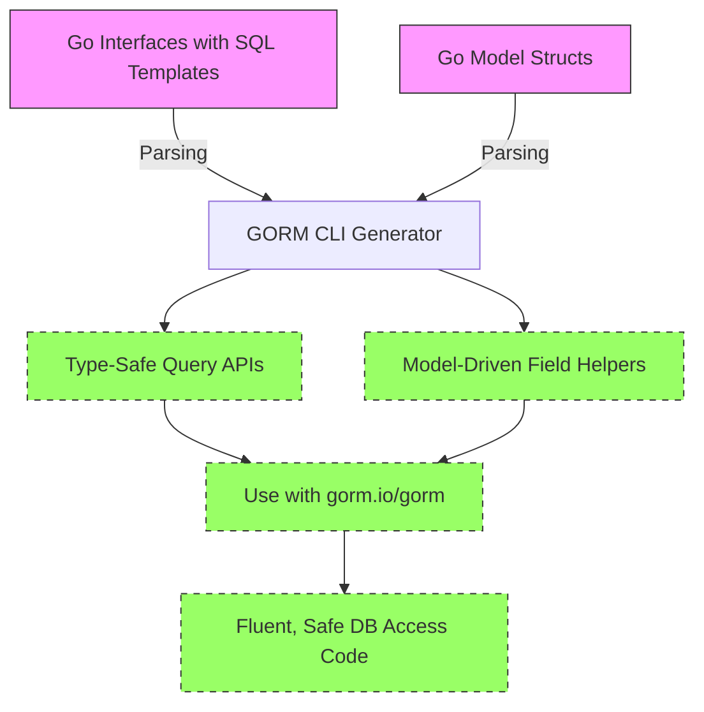

# Feature Highlights

Unlock the full potential of your Go and GORM projects with GORM CLI's powerful and streamlined code generation capabilities. This page distills the core functionalities of GORM CLI into accessible insights that showcase how its two main generators—type-safe query APIs and model-driven field helpers—work together to dramatically improve developer experience, productivity, and code quality.

---

## Introducing GORM CLI's Two Main Generators

GORM CLI harnesses the power of Go generics and source-based code generation to deliver two complementary outputs that form the backbone of safer and more efficient data access:

- **Type-Safe Query APIs**  
  Transform your handwritten Go interfaces annotated with SQL templates into robust, type-safe methods. These interfaces let you declare your queries declaratively, while GORM CLI generates implementations that prevent SQL errors and enforce compile-time safety.

- **Model-Driven Field Helpers**  
  Automatically generate strongly typed fields and association helpers from your Go model structs. These helpers simplify the creation of filters, updates, and association operations with compile-time checks, eliminating guesswork in query building.

Together, these generators empower you to write clear, expressive database code that scales in complexity without sacrificing maintainability or correctness.

---

## Key Features That Transform Your Workflow

### 1. Association Operations with Compile-Time Safety

Handle complex relationships effortlessly.  
GORM CLI generates helpers to create, update, unlink, delete, and batch-create associations such as:

- `has one`
- `has many`
- `belongs to`
- `many2many` (including polymorphic associations)

With these fluent helpers, you can perform sophisticated nested operations safely, *e.g.,* creating a user with multiple associated pets or updating a user's linked languages in batch—all while the compiler guarantees correctness.

### 2. Configurable Code Generation

Customize exactly what code you generate using the `genconfig.Config` struct in your Go packages. Control features include:

- Output path for generated files
- Inclusion or exclusion of specific interfaces and structs (whitelist/blacklist by name or pattern)
- File-level vs package-level generation scope
- Field type and name mapping for custom types (e.g., JSON, `sql.NullTime`)

This fine-grained configuration fits a wide range of project needs, from large multi-module repositories to quick prototypes.

### 3. Seamless Integration with GORM

Generated code is designed to integrate smoothly with the popular `gorm.io/gorm` framework:

- Use generated query interfaces directly with your existing GORM database instances
- Employ field helpers for fluent filtering, ordering, and updating
- Leverage association helpers as part of GORM's `Create` and `Update` workflows

This eliminates disruption to your existing stack and accelerates adoption.

---

## Relieving Common Developer Pain Points

| Traditional Challenges                                   | How GORM CLI Addresses Them                                       |
| --------------------------------------------------------- | ---------------------------------------------------------------- |
| Writing error-prone SQL queries scattered in code         | Interfaces with SQL templates generate safe, tested methods      |
| Manually handling complex model associations               | Association helpers for create, update, unlink and delete        |
| Boilerplate over filters and query predicates              | Model-driven field helpers with fluent DSL                       |
| Difficulty tracking and mapping custom types               | Configurable type mappings and field naming                      |
| Poor compile-time validation of dynamic queries            | Type-safe APIs and binding via code generation                   |

By focusing on these pain points, GORM CLI not only speeds development but ensures your data access layer remains robust as your application grows.

---

## Real-World Scenario: Simplifying Multi-Model Updates

Imagine you have a `User` model with a `Pets` association. To create a new user and assign multiple pets, a typical manual approach requires separate inserts and foreign key management—a tedious and error-prone task.

With GORM CLI, your code can fluently:

```go
gorm.G[User](db).
  Set(
    generated.User.Name.Set("alice"),
    generated.User.Pets.CreateInBatch([]models.Pet{{Name: "fido"}, {Name: "rex"}}),
  ).
  Create(ctx)
```

This one expression generates all necessary SQL with correct association handling, guarded by compile-time types. Behind the scenes, GORM CLI has generated the precise helpers for you, avoiding boilerplate and runtime surprises.

---

## Summary of Core Benefits

- **Safe and expressive query APIs**: Eliminate runtime errors with compile-time-verified SQL interfaces.
- **Rich field helpers**: Fluent, discoverable APIs for filters, updates, and conditions.
- **Robust association management**: Handle relational data with granular control.
- **Flexible generation configs**: Tailor outputs to your application's structure and style.
- **Smooth GORM integration**: Extend your existing ORM without friction.

---

## Developer Tips and Best Practices

- Start by defining clean query interfaces with clear SQL templates to generate your core APIs.
- Use `genconfig.Config` early in your package to prune unnecessary code and map custom types.
- Exploit association helpers to keep your data model code DRY and maintainable.
- Validate generated code with your IDE’s type checking—problems surface early before runtime.
- Regularly update your generation process alongside model changes for consistent safety.

---

## Next Steps

Ready to experience these features hands-on? Proceed to the [Quickstart & Basic Workflow](/overview/feature-overview-workflows/quickstart-workflow) page for step-by-step instructions on writing your first interface, generating code, and integrating the results.

You may also want to explore [Working with Associations](/guides/advanced-patterns/associations) to master complex relational scenarios, or the [Custom Generation Config & JSON Mapping](/guides/advanced-patterns/customization) guide to tailor generation to specialized needs.

---

### Diagram: How GORM CLI Generates Your APIs



---

## Troubleshooting Common Feature Issues

<AccordionGroup title="Common Pitfalls and Solutions">
<Accordion title="Generated Code Missing Interfaces or Structs">
Check your package-level `genconfig.Config` for unintentional exclusions or whitelisting filters. Ensure your interface and struct names match patterns and are exported.
</Accordion>
<Accordion title="Association Helpers Not Generated for Certain Fields">
Verify that your model's association tags and types conform to GORM's association conventions. Unsupported or custom association types may require adjustments or extensions.
</Accordion>
<Accordion title="Compilation Errors in Generated Methods">
Review your interface SQL templates for syntax errors. The generator expects valid SQL with proper placeholders; malformed templates will cause generation failures.
</Accordion>
<Accordion title="Field Type Mappings Not Applying"
>
Ensure your `FieldTypeMap` and `FieldNameMap` are correctly configured and that target types match by exact name or pattern.
</Accordion>
</AccordionGroup>

---

For more detailed guidance on configuring the generator and leveraging these features, visit [Configuration & Troubleshooting](/getting-started/configuration-troubleshooting/configuring-generator) and explore examples in the `examples/` directory in the project repository.


---

> *Empower your Go projects with GORM CLI's feature-rich generation to write safer, cleaner, and more maintainable database interaction code. Harness modern Go generics and code generation to leave boilerplate and errors behind.*


---

*This documentation page aligns with the overall [Feature Overview & User Workflows] section and complements the foundational understanding found in [Core Concepts & Terminology] and the [Architectural Overview].*


---

## Source

<Source url="https://github.com/go-gorm/cli" paths={[{"path": "internal/gen/generator.go", "range": "1-300"},{"path": "README.md", "range": "0-200"}]} />
