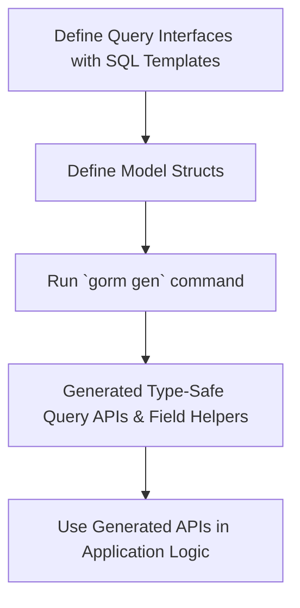

# Quickstart & Basic Workflow

Welcome to the essential first step in mastering GORM CLI. This guide walks you through a clear, step-by-step journey—starting from writing your Go interfaces and model structs, to running the CLI generator, and finally leveraging the generated code seamlessly in your application logic. You'll learn the minimal setup required to get running quickly, along with practical examples illustrating the core workflow.

---

## Why This Guide Matters

Most Go developers face repetitive boilerplate when accessing databases or worry about runtime errors from unsafe queries. GORM CLI solves this by generating type-safe, fluent query APIs and field helpers directly from your codebase. This guide shows you exactly how to start realizing these benefits in your projects with minimal overhead.

---

## Step 1: Define Query Interfaces and Models

GORM CLI revolves around two source inputs in your Go code:

- **Query interfaces** annotated with SQL templates
- **Model structs** representing your database tables

Writing these clearly and idiomatically is the foundation of generating safe, efficient database code.

### Example Query Interface

```go
// Define database queries as Go generic interfaces with SQL template comments
// Place in the same package or folder as your models

type Query[T any] interface {
  // SELECT * FROM @@table WHERE id=@id
  GetByID(id int) (T, error)

  // Dynamic column filter
  // SELECT * FROM @@table WHERE @@column=@value
  FilterWithColumn(column string, value string) (T, error)

  // Conditional example to filter by user fields
  // SELECT * FROM users
  //   {{if user.ID > 0}}
  //       WHERE id=@user.ID
  //   {{else if user.Name != ""}}
  //       WHERE name=@user.Name
  //   {{end}}
  QueryWith(user User) (T, error)

  // Update example using conditional SET clause
  // UPDATE @@table
  //  {{set}}
  //    {{if user.Name != ""}} name=@user.Name, {{end}}
  //    {{if user.Age > 0}} age=@user.Age, {{end}}
  //    {{if user.Age >= 18}} is_adult=1 {{else}} is_adult=0 {{end}}
  //  {{end}}
  // WHERE id=@id
  UpdateInfo(user User, id int) error
}
```

### Example Model Struct

```go
// Basic User model struct defining fields for generation
// GORM CLI generates field helpers supporting filters, updates, and associations

type User struct {
  ID   uint
  Name string
  Age  int
  // Additional fields ...
}
```

---

## Step 2: Generate Code Using GORM CLI

With your interfaces and models in place, run the CLI generator to produce type-safe query implementations and field helpers:

```bash
gorm gen -i ./examples -o ./generated
```

- `-i ./examples` specifies the input package or folder containing your interface and model files.
- `-o ./generated` specifies the output directory for the generated code.

This generation step translates your annotated Go code into discoverable, autocompleted APIs.

<Tip>
If you don’t specify config or flags, defaults are used (`./g` as output, etc.). You can also provide package-level `genconfig.Config` to customize generation.
</Tip>

---

## Step 3: Use the Generated APIs in Application Logic

Once generated, your fluent type-safe APIs are ready for integration with your codebase and GORM:

### Simple Select with Generated Query API

```go
// Use generated query implementation for type-safe SELECT
u, err := generated.Query[User](db).GetByID(ctx, 123)
if err != nil {
  // Handle error
}
```

### Using Model-Driven Field Helpers with GORM

```go
// Query users with age greater than 18 using generated field helpers
users, err := gorm.G[User](db).
  Where(generated.User.Age.Gt(18)).
  Find(ctx)
if err != nil {
  // Handle error
}
```

### Updating with Fluent Setters

```go
err := gorm.G[User](db).
  Where(generated.User.Name.Eq("alice")).
  Set(
    generated.User.Name.Set("jinzhu"),
    generated.User.Age.Incr(1),
  ).
  Update(ctx)
if err != nil {
  // Handle error
}
```

### Creating with Associated Entities

```go
// Create a user and associated pets atomically
err := gorm.G[User](db).
  Set(
    generated.User.Name.Set("alice"),
    generated.User.Pets.Create(generated.Pet.Name.Set("fido")),
  ).
  Create(ctx)
if err != nil {
  // Handle error
}
```

---

## Minimal Requirements and Setup

- **Go Version:** 1.18 or above for generics support
- **Dependencies:** Your project must use GORM (https://gorm.io) as ORM
- **Project Structure:** Interfaces with SQL templates and models should be in the same Go package/folder
- **CLI Installation:**

```bash
go install gorm.io/cli/gorm@latest
```

This installs the `gorm` CLI command used to run `gorm gen` for code generation.

---

## Practical Tips & Best Practices

- **Write Clear SQL Templates:** Keep your interface method comments clean with structured template directives (`@@table`, `@param`, `{{where}}`, `{{set}}`) to harness full template power.
- **Group Models and Interfaces:** To avoid import path issues, keep your query interfaces and related model structs together.
- **Leverage Generated Helpers:** Use generated fields instead of raw strings for filter conditions to catch SQL errors at compile time.
- **Customize Generation:** For advanced needs, use `genconfig.Config` in your packages to define output paths, type mappings, and inclusion/exclusion filters.
- **Test Generated Code:** Your generated code is idiomatic Go. Include it in your tests and projects for immediate feedback.

---

## Common Pitfalls and Troubleshooting

<AccordionGroup title="Common Issues in Quickstart">
<Accordion title="Missing or Incorrect Input Path">
Ensure the `-i` flag points to the correct directory or Go file where your interfaces and models reside.
</Accordion>
<Accordion title="Go Version Compatibility">
Verify that you're running Go 1.18+ as generics are essential for the generated code.
</Accordion>
<Accordion title="Build Failures After Generation">
Check that all referenced types in your interfaces and models are accessible within the package and imported properly.
Use `genconfig.Config` to map special types if necessary.
</Accordion>
<Accordion title="Runtime SQL Errors Despite Compilation">
Review your SQL templates for correctness, especially dynamic placeholders and conditional blocks.
Test queries individually with raw SQL to isolate.
</Accordion>
</AccordionGroup>

---

## Summary Diagram of Basic Workflow



---

## Next Steps

- Explore deeper customization with the [Configuration & JSON Field Mapping guide](https://gorm.io/cli/guides/advanced-patterns/customization)
- Learn about managing associations with the generated helper APIs in the [Working with Associations](https://gorm.io/cli/guides/advanced-patterns/associations) page
- Understand core concepts underpinning GORM CLI in the [Core Concepts & Terminology](https://gorm.io/cli/overview/architecture-core-concepts/core-concepts-terminology) page
- Follow up with detailed example scenarios in [Example Use Cases](https://gorm.io/cli/overview/feature-overview-workflows/real-world-examples)

---

Happy coding with safer, faster, and cleaner database access powered by GORM CLI!
