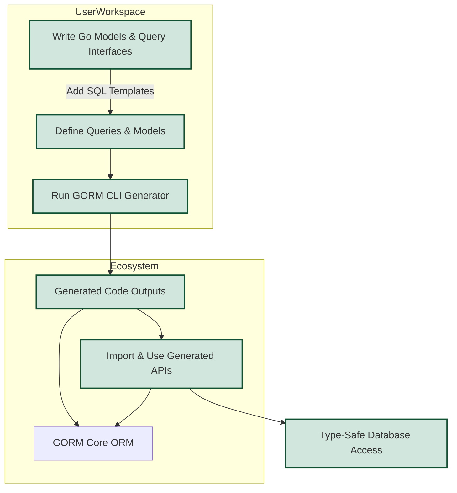

# Integration & Ecosystem Fit

## Unlock Seamless Integration with GORM and Your Go Project

GORM CLI is designed as a natural extension to your existing GORM-based Go applications. It fits smoothly into the Go 1.18+ ecosystem, preserving idiomatic workflows while adding powerful, type-safe query APIs and model helpers. This page explains how GORM CLI integrates directly with GORM itself and your Go codebase, ensuring your development experience stays familiar but significantly enhanced.

---

## Why This Matters

When working with GORM for database access, developers often face challenges ensuring safety, discoverability, and maintainability of queries and updates. GORM CLI addresses these pain points by generating code that works as first-class citizens within your existing code structure. It complements GORM without disrupting project organization or learning curves.

You will learn:

- How the generated code plugs into your project structure
- The compatibility requirements ensuring smooth adoption
- Ways to customize and extend generation output to meet project-specific needs

---

## GORM CLI in Your Project: What to Expect

### Compatible with Modern Go

GORM CLI requires Go version 1.18 or higher to leverage Go’s powerful generics capabilities. This enables the generation of elegant, type-safe APIs that reduce runtime errors and increase developer confidence.

### Generated Code Coexists Natively

Generated files from GORM CLI integrate directly within your packages, alongside your models and business logic. This placement means:

- You can import generated packages easily with standard Go import paths
- IDE features like auto-completion, refactoring, and documentation work naturally
- Tests can target generated methods without additional wrappers


### Example: Using Generated Query APIs

```go
// Import your generated package
import "your_project/generated"

// Use generated type-safe query on User model
user, err := generated.Query[User](db).GetByID(ctx, 123)
if err != nil {
    // handle error
}
```


### Extending and Configuring Generator Output

GORM CLI offers flexible configuration through package-level variables to tailor code generation to your project’s style and needs:

- **Selective Generation:** Include or exclude specific interfaces and structs via `IncludeInterfaces`, `ExcludeStructs`, etc.
- **Custom Field Helper Mappings:** Override or provide custom field helper types for your own struct fields.
- **Output Path Customization:** Organize generated code output in your preferred directory layout.

By declaring a `genconfig.Config` variable in the package where your models and queries reside, the code generator automatically picks up these customizations for context-aware generation.

### Example: Custom Generation Config

```go
package examples

import "gorm.io/cli/gorm/genconfig"

var _ = genconfig.Config{
  OutPath: "examples/generated", // Override default output location
  IncludeInterfaces: []any{"Query*"}, // Only generate interfaces starting with "Query"
  FieldNameMap: map[string]any{
    "json": JSON{}, // Use custom JSON helper for fields tagged as `json`
  },
}
```

---

## Integration Workflow: From Source to Generated Code



This workflow highlights how your source code and SQL templates lead to generated artifacts consumed seamlessly within your GORM-powered app.

---

## Practical Tips for Smooth Integration

- **Place Configurations Close To Your Models:** Keep `genconfig.Config` declarations in the same package as your model structs for automatic discovery.
- **Use Clear Naming Conventions:** Align interface and struct names to control included code via whitelist or blacklist patterns.
- **Keep Generated Code Separate:** Designate a dedicated directory (like `/generated`) for generated files to simplify version control and tooling.
- **Leverage Template SQL DSL:** Harness the template syntax in your interface comments to write flexible queries that will compile into type-safe Go code.
- **Review Generated Code Regularly:** Use your IDE’s navigation to inspect generated files and ensure they meet expectations.

---

## Common Scenarios and How Integration Helps

| Scenario                                   | Benefit of GORM CLI Integration                            |
|--------------------------------------------|-----------------------------------------------------------|
| Migrating legacy SQL query code to typed API | Faster refactoring with compile-time validations          |
| Extending models with custom JSON fields   | Customized helpers enable easy querying and updating      |
| Managing associations across complex schemas | Association helpers simplify read/write operations        |
| Scaling team development                    | Discoverable APIs reduce onboarding time                  |

---

## Troubleshooting Integration Issues

<AccordionGroup title="Common Integration Issues and Solutions">
<Accordion title="Generated Code Not Found by IDE">
Check that generation output is placed within your module and properly imported in your Go files. Running `go mod tidy` and restarting your editor often resolves import indexing issues.
</Accordion>
<Accordion title="Go Version Compatibility Errors">
Ensure your environment uses Go 1.18 or newer to support generics. Use `go version` to verify.
</Accordion>
<Accordion title="Generation Does Not Respect Config Settings">
Confirm that your `genconfig.Config` is declared in the appropriate package and the generator is rerun. Only configuration files in the input directories affect generation.
</Accordion>
</AccordionGroup>

---

## Next Steps

You are now equipped with an understanding of how GORM CLI integrates with your Go projects and GORM itself. To move forward:

- Explore the [Basic Configuration Guide](/getting-started/configuration-first-usage/basic-configuration) to set up your first generation config.
- Visit [Your First Code Generation](/getting-started/configuration-first-usage/first-generation-run) for a practical hands-on walk-through.
- Learn to [Use Generated APIs](/guides/core-workflows/using-generated-apis) to unlock type-safe query and update power.

Together, these resources will help embed GORM CLI deeply and productively into your development workflow.

---

## Related Documentation

- [What is GORM CLI?](overview/product-intro/value-proposition)
- [System Architecture Overview](overview/architecture-core-concepts/system-architecture)
- [Generation Configuration & Overrides](concepts/customization-scalability/generation-configuration)
- [Writing Template-Based Queries](guides/best-practices-patterns/template-based-queries)

---

## Summary
Integration & Ecosystem Fit describes how GORM CLI's generated code blends seamlessly with GORM and your Go project structure. It covers Go version requirements, placement of generated code, configuration methods, usage flow, and troubleshooting tips. This page prepares you to integrate GORM CLI confidently, enabling safer, maintainable, and discoverable database access.
