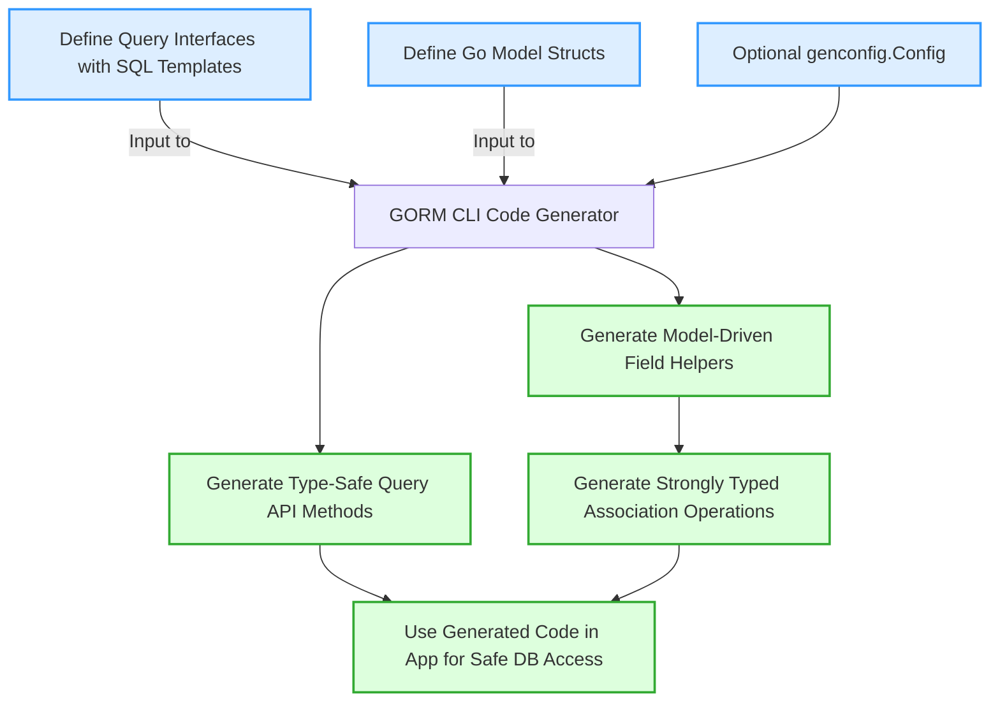

# Feature Summary

Welcome to the concise Feature Summary for **GORM CLI** — your go-to page for a headline overview of the powerful capabilities that make database coding safer, expressive, and remarkably efficient.

---

## Why GORM CLI’s Features Matter to You

As a Go developer working with GORM, you want to write database queries that are not only easy to understand and maintain but also robust enough to catch errors early—at compile time. GORM CLI empowers you to achieve this by generating type-safe query APIs and smart field helpers that integrate seamlessly with your models.

This page distills the essence of GORM CLI’s top features, demonstrating how they blend flexible SQL templating, model-driven code generation, and precise association handling into a unified, developer-friendly experience.

---

## Core Features at a Glance

### 1. Type-Safe Queries from Interfaces

Define your query logic using Go interfaces with SQL templates embedded in method comments. GORM CLI reads these and generates concrete, type-safe API methods with:

- **Automatic parameter binding:** Map Go method parameters directly to SQL placeholders like `@param` and `@@table`.
- **Complete type checking:** Catch mismatches at compile time, reducing runtime SQL errors.
- **Flexible SQL templating directives:** Use the DSL (`{{where}}`, `{{set}}`, `{{if}}`, `{{for}}`) for dynamic, conditional query parts.

#### Example:
```go
// Query interface method with templated SQL
// SELECT * FROM @@table WHERE id=@id
GetByID(id int) (T, error)
```

This pattern lets you write declarative query interfaces while GORM CLI generates the heavy lifting for integration and execution.

---

### 2. Model-Driven Field Helpers

From your Go model structs, GORM CLI generates field helper objects that streamline building filters, updates, ordering, and associations with strong typing:

- Handles **basic fields** (strings, ints, floats, bools, times, bytes).
- Supports **custom types** through configurable mappings.
- Produces **fluent API helpers** for predicates like `.Eq()`, `.Like()`, `.Between()`, `.IsNull()`.

#### Example usage:
```go
// Filter users where age is between 18 and 65
gorm.G[User](db).
  Where(generated.User.Age.Between(18, 65)).
  Find(ctx)
```

This makes your query building fluent, safe, and expressive.

---

### 3. Strongly Typed Association Handling

Manage model relationships with confidence using generated helpers that understand your association types: has one, has many, belongs to, and many-to-many. Supported operations:

- `Create` / `CreateInBatch` — Insert and link related records in one call.
- `Update` — Modify associated records with optional filtering.
- `Unlink` — Remove associations without deleting data by clearing foreign keys or deleting join rows.
- `Delete` — Delete associated records, respecting the association semantics.

#### Example:
```go
// Create a user with one pet linked
gorm.G[User](db).
  Set(
    generated.User.Name.Set("alice"),
    generated.User.Pets.Create(generated.Pet.Name.Set("fido")),
  ).
  Create(ctx)
```

This feature transforms complex relational data operations into comprehensible, type-safe calls.

---

### 4. Flexible Configuration via genconfig.Config

Tailor generation behavior with package-level configuration, enabling you to:

- **Change output paths** (`OutPath`) for generated code.
- **Filter interfaces and structs** to include or exclude by patterns or explicit names.
- **Map custom Go types to specialized field helpers**, for example, mapping `sql.NullTime{}` to a `field.Time{}` helper.
- **Apply granular file-level settings or broader package-wide rules.**

This boost adaptability and lets you align generated code to your project’s coding standards and architecture.

---

### 5. Powerful SQL Templating DSL

Write descriptive, conditional SQL inside your query interface methods with:

- Dynamic table and column resolution (`@@table`, `@@column`).
- Parameter binding with `@param` syntax.
- Conditional blocks for complex filters using `{{where}}`, `{{set}}`, `{{if}}`, and loops with `{{for}}`.

This unlocks rich query logic without losing the benefits of typed code generation.

#### Template example snippet:
```sql
SELECT * FROM @@table
{{where}}
  {{if name != ""}} name=@name {{end}}
  {{if age > 0}} AND age=@age {{end}}
{{end}}
```

---

## Real-World User Flow

1. **Define your Interfaces:** Write Go interfaces declaring methods annotated with readable SQL templates.
2. **Design your Models:** Structure Go structs according to your database schema.
3. **Configure Generation (Optional):** Use `genconfig.Config` to customize.
4. **Run `gorm gen`:** Generate type-safe APIs and field helpers automatically.
5. **Code with Confidence:** Use generated methods and helpers in your application — compile-time safety ensures correctness.

This flow replaces error-prone, manual SQL building with compile-safe, expressive code.

---

## Practical Tips & Best Practices

- **Always annotate your query interface methods** with SQL templates for GORM CLI to generate complete APIs.
- **Use configuration to filter unwanted interfaces or structs** to keep generated code focused and optimal.
- **Leverage association helpers for relational writes** to simplify otherwise complex foreign key operations.
- **Adopt the SQL templating DSL to cover conditional logic** instead of raw string concatenation.

### Common Pitfalls

- Forgetting to return an `error` as the final method result in query interface methods.
- Omitting configuration when needing custom type mappings.
- Assuming generated code includes interfaces or structs excluded by default filters.

---

## Summary

By combining these headline features — type-safe query generation, model-based field helpers, robust association operations, flexible configuration, and expressive SQL templating — GORM CLI transforms your database coding into a safe, maintainable, and productive experience.

Harness these abilities now to reduce runtime errors, eliminate boilerplate, and write cleaner, self-documenting code.


---

## See Also

- [What is GORM CLI?](../introduction-core-value/what-is-gorm-cli) — Conceptual intro to GORM CLI
- [Value Proposition & Key Benefits](../introduction-core-value/value-proposition-benefits) — Why GORM CLI matters
- [How It Works: Quick Start](../feature-quickstart/how-it-works-quickstart) — Getting started workflow
- [Managing Associations and Relationships](../../guides/advanced-usage-patterns/working-with-associations) — Deep dive on associations
- [Template-Based SQL Queries](../../guides/advanced-usage-patterns/template-queries) — Using GORM CLI’s templating DSL

---

## Getting Started Preview

To experience this feature set first-hand, start by defining a query interface and your models, then generate your code with the CLI:

```bash
gorm gen -i ./your_models_and_queries -o ./generated
```

Leveraging the generated interfaces and helpers will immediately boost your development workflow.

---

## Additional Resources

For configuration customization, see the [Generation Config](../../concepts/extensibility-integration/generation-config) page.

For troubleshooting and integration tips, visit [Integration with GORM & Your Codebase](../concepts-architecture-flow/integration-points).


---

<CardGroup cols={3}>
<Card title="Type-Safe Query APIs">
Write Go interfaces with SQL templates to generate safe, fluent query methods.
</Card>
<Card title="Field Helpers from Models">
Automatic, strongly-typed helpers make building filters and updates a breeze.
</Card>
<Card title="Associations Operations">
Create, update, unlink, and delete related data using clean, typed code.
</Card>
</CardGroup>


---

<AccordionGroup title="Feature Summary FAQ">
<Accordion title="How does GORM CLI ensure compile-time safety?">
GORM CLI parses your Go interfaces and model structs to generate APIs with concrete types for both parameters and results. This eliminates mismatches between SQL and Go code, preventing common runtime errors.
</Accordion>
<Accordion title="Can I customize the generated code output location?">
Yes. By defining a `genconfig.Config` in your package, you can set the `OutPath` as well as control inclusion/exclusion rules for interfaces and structs.
</Accordion>
<Accordion title="What if I have custom Go types in my models?">
Use `FieldTypeMap` or `FieldNameMap` in `genconfig.Config` to link your custom Go types to appropriate field helpers, ensuring they generate correctly.
</Accordion>
<Accordion title="Do I need to write raw SQL manually?">
You write SQL templates mostly in comments on your interface methods. GORM CLI generates the implementations, combining static and dynamic parts. This approach balances flexibility with type safety.
</Accordion>
</AccordionGroup>


---

## Diagram: How Key Features Work Together




---

For full documentation, explore the [Feature Summary on the website](https://gorm.io/docs/gorm_cli.html#Feature-Summary).

---