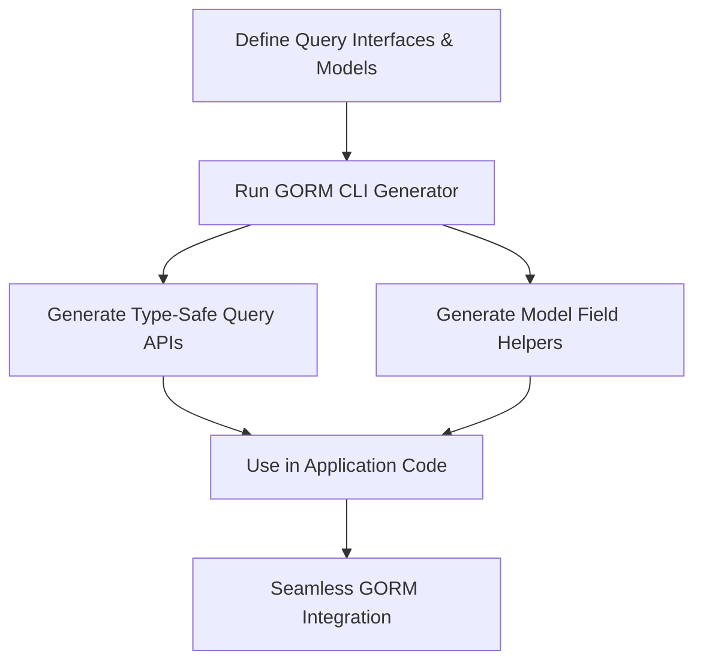

# Major Features at a Glance

Discover the most powerful, productivity-boosting features of GORM CLI that transform how you write and maintain database access code in Go. This page highlights key capabilities such as type-safe query APIs, model-driven field helpers, versatile association operations, flexible generation configuration, and seamless integration with GORM’s ecosystem — all designed to make your development faster, safer, and more expressive.

---

## Why This Matters

Imagine writing database queries and updates with full compile-time checking of parameters and results, eliminating entire classes of bugs before you run your code. Picture generating fluent, discoverable helpers for your model fields and associations automatically, so your code is clean and intention-revealing. GORM CLI delivers precisely that advantage by turning your Go interfaces and structs into rigorous, type-safe APIs.

This page summarizes these main features, offering you a quick orientation to what GORM CLI brings to your tooling.

---

## Feature Highlights

### 1. Type-Safe Query APIs from Interfaces

- **What it is:** Write Go interfaces with SQL templates in comments, describing your desired queries.
- **What you get:** Automatically generated methods with concrete implementations that are fully typed and safe to use.
- **Why it helps:** No more crafting raw SQL strings manually or forgetting parameter bindings; compile errors catch mistakes early.

### 2. Model-Driven Field Helpers

- **What it is:** From your model structs, GORM CLI generates helpers for each field and association.
- **What you get:** Fluent, strongly-typed constructs to create filters, updates, sorting, and more.
- **Why it helps:** Simplifies complex queries by making filters and updates discoverable and expressive.

### 3. Comprehensive Association Operations

- **What it is:** Support for creating, updating, linking, unlinking, deleting, and batch creating associations.
- **What you get:** Intuitive methods like `.Create()`, `.Update()`, `.Unlink()`, `.Delete()`, and `.CreateInBatch()` specific to the association type (has one, has many, belongs to, many-to-many).
- **Why it helps:** Empowers you to manage associated data with clear semantics and compile-time safety.

### 4. Flexible Generation Configuration

- **What it is:** Customize generation using the `genconfig.Config` struct in your packages.
- **What you get:** Control output paths, selective inclusion or exclusion of interfaces and structs, and custom field type mappings.
- **Why it helps:** Adapt the generation process precisely to your project's structure and coding standards.

### 5. Seamless GORM Integration

- **What it is:** Generated code fits naturally with the GORM idiomatic patterns and APIs.
- **What you get:** Utilize the generated queries and helpers alongside GORM’s models, queries, and transactions.
- **Why it helps:** Smooth adoption with no disruption to existing workflows or duplication of effort.

---

## Real-World Example: Getting Started Quickly

```go
// Define a model
 type User struct {
   ID   uint
   Name string
   Age  int
 }

// Define a query interface with SQL templates
 type Query[T any] interface {
   // SELECT * FROM @@table WHERE id=@id
   GetByID(id int) (T, error)

   // where("name=@name AND age=@age")
   FilterByNameAndAge(name string, age int)
 }

// Generate code
 // gorm gen -i ./examples -o ./generated

// Use generated API
 u, err := generated.Query[User](db).GetByID(ctx, 123)
 users, err := gorm.G[User](db).Where(generated.User.Age.Gt(18)).Find(ctx)
```

---

## Practical Tips & Best Practices

- **Use Interface Naming Patterns:** Use intuitive names for query interfaces to keep generated APIs clear and maintainable.
- **Leverage Configuration:** Use `genconfig.Config` to include only relevant types and customize field mappings (e.g., JSON fields).
- **Explore Association Helpers:** Use generated association helpers early; they prevent errors in complex relationship management.
- **Write SQL Templates Thoughtfully:** Make use of GORM CLI’s powerful template DSL (`@@table`, `{{where}}`, `{{set}}`, etc.) to write clean, composable queries.
- **Keep Models and Interfaces Cohesive:** Place query interfaces and models in the same or well-structured packages for easier generation.

---

## Common Pitfalls to Avoid

<Warning>
- Avoid missing error returns in query interface methods; generated methods require errors for proper handling.
- Don’t mix incompatible generation rules in the same configuration; keep configurations consistent for predictability.
- Avoid excessive exclusion or inclusion filters that unintentionally omit important models or interfaces.
- Remember to run generation commands after any model or interface changes to keep generated code up to date.
</Warning>

---

## How This Fits Into Your Workflow

This page serves as a quick orientation, complementing the detailed workflows and conceptual documentation:

- Start with [What is GORM CLI?](../product-intro-and-value/what-is-gorm-cli) to understand foundational purpose.
- Dive into [Tool Architecture & Workflow](../core-concepts-architecture/high-level-architecture) for technical context.
- Learn how to customize generation with [Customizing Code Generation with genconfig](../../guides/advanced-usage/customizing-generation).
- Explore association details in [Handling Associations with Helpers](../../guides/core-workflows/association-guides).

---

## Visual Overview



---

## Next Steps

- Explore [Supported Workflows & Scenarios](../feature-quickview/supported-workflows) to see where GORM CLI shines.
- Begin your first project with [Defining Models & Query Interfaces](../../getting-started/your-first-code-generation/defining-models-interfaces).
- Get hands-on with [Quickstart: Generating Type-Safe APIs](../../guides/core-workflows/quickstart-generating-type-safe-apis).

---

Harness these major features to boost your productivity, safety, and code clarity when working with Go and GORM.

---