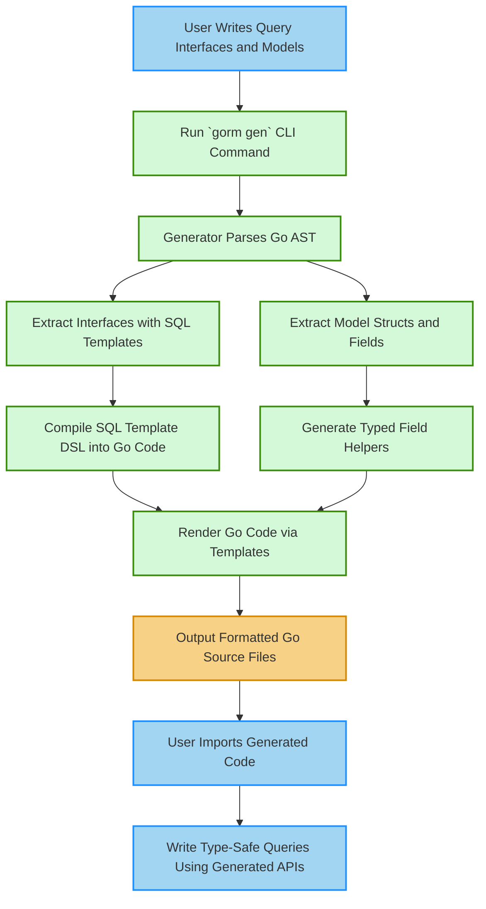

# How Code Generation Works

Discover the detailed workflow behind GORM CLI’s powerful code generation mechanism that transforms your Go interfaces and model structs into type-safe, fluent Go code. This guide uncovers the step-by-step process users follow — from preparing query interfaces and models, running the generation command, to understanding the pattern of the generated output — so you can fully leverage automation to write safer, cleaner data-access layers.

---

## Unlocking the Generation Workflow

### What Happens When You Generate Code?

Generating code with GORM CLI is about translating your carefully written interfaces and models into usable Go code that provides type-safe query APIs and field helpers. Instead of manually writing repetitive, error-prone query logic, you provide:

- **Query interfaces**, decorated with SQL templates in comments.
- **Model structs**, representing your database schemas.

The generation turns this input into Go source files with concrete implementations you can invoke directly in your applications.

### Why This Matters to You

- **Save time and reduce errors**: Automate tedious boilerplate and stay consistent.
- **Boost maintainability**: Changes in models or queries regenerate safe code automatically.
- **Gain fluency**: Work with generated, discoverable APIs that reflect your schema and queries exactly.

---

## Step-by-Step Code Generation Flow

This section walks through the typical user flow and internal steps that the generator performs, framed around what you control and see in your workflow.

### 1. Prepare Your Code

- Define your **query interfaces** with method declarations and SQL annotations as Go comments.
- Build your **model structs** that capture your table schema, including field tags and any specialized annotations.
- Optionally specify generation configuration with `genconfig.Config` literals in your package to tweak output paths, filters, or type mappings.

**Example Query Interface Snippet:**
```go
// Query interface with SQL templates in comments
// SELECT * FROM @@table WHERE id=@id
GetByID(id int) (T, error)

// Dynamic filter with conditional blocks
// {{where}}
//   {{if @user.Name != ""}} name=@user.Name {{end}}
//   {{if @user.Age > 0}} AND age=@user.Age {{end}}
// {{end}}
SearchUsers(user User) ([]T, error)
```

### 2. Invoke the GORM CLI Generator

Run the CLI command specifying the input path and output directory:

```bash
gorm gen -i ./path/to/your/interfaces -o ./generated
```

The CLI scans your input directory or files, parsing the Go source:

- Extracts your interfaces and attached SQL templates.
- Analyzes model structs to infer fields and their types.
- Loads any generation configuration found.

The output path (default `./g` or as overridden) receives the generated Go files, maintaining relative directory structure.

### 3. Generation Internals (Behind the Scenes)

- The generator **parses all Go files** found, using AST to interpret interface methods, structs, and comments.
- For each interface method, **SQL annotations get parsed** with the internal SQL template DSL:
  - Placeholders like `@@table` transform into table name bindings.
  - Parameters tagged with `@param` match method arguments.
  - Template directives (`{{where}}`, `{{if}}`, `{{for}}`) compile into Go code building SQL strings and parameters safely.
- Struct fields are classified and wrapped as typed field helpers based on detected Go types and config mappings.
- Filters from configuration selectively include/exclude interfaces or structs.
- The code is rendered via **templates** that produce:
  - Concrete query interface implementations.
  - Fluent field helper structs and variables.
- Generated files are saved, then **formatted automatically** for idiomatic Go code.

### 4. Review Generated Code

The generator emits Go code files resembling:

- Interface implementations named like `<InterfaceName>Impl` that satisfy your declared interfaces.
- Methods parsing your template SQL into actual Go code that builds parameterized queries safely.
- Variables exposing strongly typed field helpers for model fields.

**Code Preview:**
```go
func Query[T any](db *gorm.DB, opts ...clause.Expression) _QueryInterface[T] {
  return _QueryImpl[T]{
    Interface: gorm.G[T](db, opts...),
  }
}

func (e _QueryImpl[T]) GetByID(ctx context.Context, id int) (T, error) {
  var sb strings.Builder
  params := make([]any, 0, 2)
  sb.WriteString("SELECT * FROM ? WHERE id=?")
  params = append(params, clause.Table{Name: clause.CurrentTable}, id)
  var result T
  err := e.Raw(sb.String(), params...).Scan(ctx, &result)
  return result, err
}

var User = struct {
  ID field.Number[uint]
  Name field.String
  Age field.Number[int]
}{
  ID: field.Number[uint]{}.WithColumn("id"),
  Name: field.String{}.WithColumn("name"),
  Age: field.Number[int]{}.WithColumn("age"),
}
```

### 5. Use Generated Code in Your Application

Now you can invoke type-safe query methods with full autocomplete support and compile-time checking:

```go
u, err := generated.Query[User](db).GetByID(ctx, 42)
users, err := generated.Query[User](db).SearchUsers(ctx, User{Name: "Alice"})
```

Or use generated field helpers for filtering and updating:

```go
db.Where(generated.User.Name.Eq("Alice")).Find(ctx, &users)
```

---

## Typical Generated File & Directory Structure

Generated code is organized to mirror your input source:

- Output directory maintains relative input paths.
- Each Go source generates a corresponding `.go` file containing:
  - Interface Impl types and methods
  - Model field helper variables and types
- A default or config-driven output directory is used (default `./g`).

This preserves clear boundaries and helps with importing your generated code naturally.

---

## Practical Tips & Common Pitfalls

- **Ensure input interfaces have proper SQL annotations** in comments or methods won’t generate implementations.
- The generator expects **valid Go code and parseable interfaces and structs**; syntax errors in input break generation.
- Use `genconfig.Config` to customize file output, include/exclude interfaces or structs, and map Go types to field helpers.
- The tool automatically **injects `context.Context`** into method signatures if missing.
- Confirm your SQL template placeholders and directives follow the DSL strictly to avoid template parse errors.
- Always verify generated code compiles and passes your tests.

---

## Summary

By understanding how GORM CLI’s code generation transforms interfaces and models into ready-to-use Go source, you gain confidence and efficiency in managing your GORM-powered data access layer. Follow the workflow to prepare your code, run generation, and incorporate the generated files smoothly into your projects.

---

## See Also

- [What is GORM CLI?](../product-intro/what-is-gorm-cli) — Introduction to the tool’s purpose and high-level features.
- [Key Features at a Glance](../feature-spotlight/feature-highlights) — Feature overview to understand capabilities.
- [Generating Code](../../getting-started/first-run-generation/generating-code) — Practical guide to running the actual CLI command.
- [Using Generated APIs](../../getting-started/first-run-generation/first-usage) — How to consume generated code effectively.
- [Customization & Configuration](../../getting-started/configuration-validation/customizing-generation) — Tailor generation to your needs.

---

## Diagram: High-Level Code Generation Workflow


