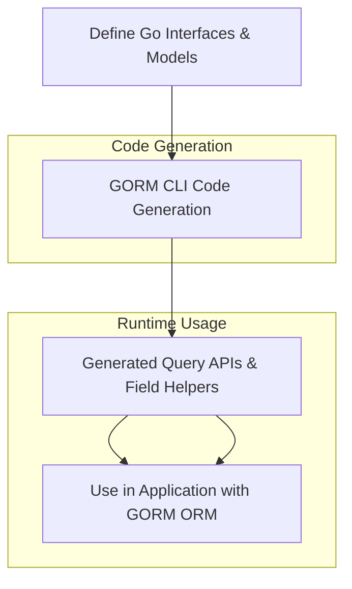

# Feature Overview at a Glance

Welcome to a concise tour of GORM CLI’s standout capabilities. This page highlights the key features that empower you to write safer, clearer, and more maintainable database access code in Go using GORM. Before diving into the finer details, gain a solid understanding of what GORM CLI offers and how it transforms your development workflow.

---

## Unlock Powerful Interface-Driven Query APIs

GORM CLI generates type-safe query APIs directly from your Go interface definitions enhanced with SQL templates. This approach eliminates repetitive boilerplate while giving you compile-time validation and a fluent coding experience.

- **Write plain Go interfaces with familiar SQL templating** as method comments.
- **Generate concrete implementations** that seamlessly integrate with GORM.
- **Benefit from automatic context injection** and parameter binding.

### Example:
```go
// Interface with SQL template in comment
// SELECT * FROM @@table WHERE id=@id
GetByID(id int) (T, error)
```
Generate code to call:
```go
user, err := generated.Query[User](db).GetByID(ctx, 123)
```


## Model-Driven Field Helpers for Easy Filters, Updates & Associations

Generate comprehensive field helpers from your model structs for basic columns as well as related associations. These helpers offer type-safe predicates, setters, and association operations ready to use in GORM’s fluent query chains.

- **Basic fields:** Int, string, bool, time, sql.Null* types, and custom mapped fields.
- **Associations:** Supports has one, has many, belongs to, many-to-many, and polymorphic relationships.
- **Operations:** Create, Update, Unlink, Delete, CreateInBatch with strong type guarantees.

### Example:
```go
gorm.G[User](db).
  Where(generated.User.Name.Eq("alice")).
  Set(generated.User.Age.Incr(1)).
  Update(ctx)
```

### Association Example:
```go
gorm.G[User](db).
  Set(
    generated.User.Pets.Create(generated.Pet.Name.Set("fido")),
  ).
  Create(ctx)
```


## Template-Based SQL DSL — Dynamic, Safe, Expressive

Write flexible SQL with embedded Go templating syntax for conditions, dynamic columns, loops, and more.

- `@@table`, `@@column` placeholders auto-resolve table and column names.
- Conditional blocks like `{{where}}...{{end}}` build dynamic WHERE clauses.
- Template directives (`{{if}}`, `{{for}}`) enable context-sensitive SQL generation.

### Example:
```sql
SELECT * FROM @@table
{{where}}
  {{if @user.Name != ""}} name=@user.Name {{end}}
  {{if @user.Age > 0}} AND age=@user.Age {{end}}
{{end}}
```


## Feature-Rich Configuration & Generation Control

Fine-tune code generation behavior without extra steps.

- Declare generation preferences with `genconfig.Config`.
- Map custom Go types and struct tags (e.g., using `gen:"json"`) to field helpers.
- Include/exclude patterns for interfaces and structs support large codebases.
- Per-file or bulk directory-based control.

### Example snippet:
```go
var _ = genconfig.Config{
  OutPath: "examples/output",
  FieldNameMap: map[string]any{
    "json": JSON{},
  },
  IncludeInterfaces: []any{"Query*"},
  ExcludeInterfaces: []any{"*Deprecated*"},
}
```


## Concrete Examples Illustrating Common Developer Tasks

See typical usage patterns and step through how GORM CLI helps you achieve them with clarity.

- Writing a query interface for simple retrieval and update.
- Generating and using field helpers for filtering and batch updates.
- Creating and managing complex associations efficiently.
- Handling JSON fields with custom helpers depending on your database.


---

## Why Feature Overview Matters

This page provides the big picture—key features and benefits you gain upfront. It prepares you to navigate the rest of the documentation efficiently by understanding the core building blocks.

Subsequent pages will unpack each feature with detailed examples, integration advice, and best practices.

---

## Quick Visual Reference




---

## Getting Started Preview

**What to do next:**

1. Explore the [Model-Driven Field Helpers](https://your-documentation-link/concepts/data-models-and-templates/model-driven-field-helpers) page to understand how to structure your models for optimal generation.
2. Dive into [Building Template-Based Query APIs](https://your-documentation-link/guides/essential-workflows/template-based-query-apis) to master writing interfaces with SQL templates.
3. Check out [Configuration & Customization Essentials](https://your-documentation-link/overview/features-and-integration/config-customization) to tailor generation to your project.

<Tip>
Start small: define a simple model and interface, generate code, then incrementally add features. This progressive approach ensures fast feedback and increases mastery.
</Tip>

<Warning>
Avoid skipping configuration for large projects; unchecked generation may include unnecessary interfaces or structs, increasing build time and complexity.
</Warning>