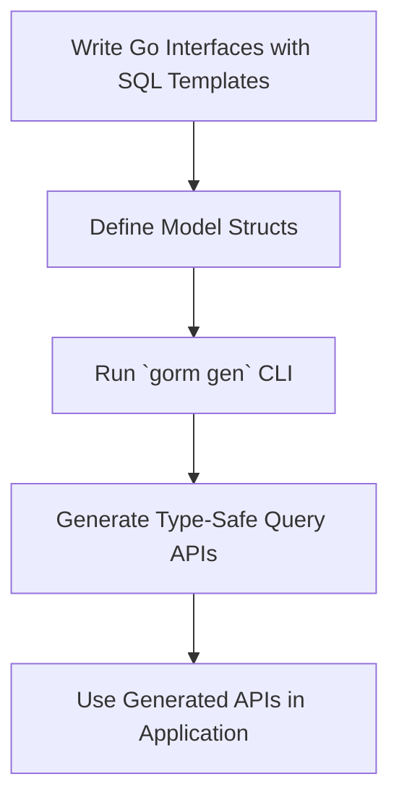

# Quickstart: From Models to Type-Safe APIs

## Introduction
Begin your journey with GORM CLI by following a streamlined, end-to-end workflow: design your Go interfaces with embedded SQL templates and your data models, generate code leveraging the command-line tooling, and start using the generated type-safe APIs to enjoy safer and more expressive database interactions.

This guide will walk you through the essential steps to take your models and interface definitions to fully functional, compile-time safe query APIs.

---

## Why Follow This Workflow?
This quickstart transforms manual, error-prone query building into an automated, type-safe experience:

- **Eliminate SQL errors early:** Interface annotations ensure your SQL matches query parameters.
- **Generate maintainable APIs:** No more boilerplate hand-crafting; the generator handles query code creation.
- **Boost developer productivity:** Use intuitive, discoverable methods generated from your interfaces.

---

## Step 1: Define Your Query Interfaces and Models

Your first task is to declare Go interfaces that describe the queries you want. Embed your SQL templates using GORM CLI's friendly template DSL inside method comments. Alongside, model your domain with Go structs.

### Example Query Interface:

```go
// examples/query.go
package examples

type Query[T any] interface {
  // Get a record by its ID
  // SELECT * FROM @@table WHERE id=@id
  GetByID(id int) (T, error)

  // Filter row by arbitrary column and value
  // SELECT * FROM @@table WHERE @@column=@value
  FilterWithColumn(column string, value string) (T, error)

  // Complex Query with conditional WHERE clauses
  // SELECT * FROM @@table
  // {{where}}
  //   {{if user.Name != ""}} name=@user.Name {{end}}
  //   {{if user.Age > 0}} AND age=@user.Age {{end}}
  // {{end}}
  QueryWith(user models.User) (T, error)

  // Update with conditional dynamic SET clause
  // UPDATE @@table
  // {{set}}
  //   {{if user.Name != ""}} name=@user.Name, {{end}}
  //   {{if user.Age > 0}} age=@user.Age, {{end}}
  //   {{if user.Age >= 18}} is_adult=1 {{else}} is_adult=0 {{end}}
  // {{end}}
  // WHERE id=@id
  UpdateInfo(user models.User, id int) error
}
```

### Example Model Struct:

```go
// examples/models/user.go
package models

type User struct {
  ID      uint
  Name    string
  Age     int
  Role    string
  IsAdult bool
}
```

---

## Step 2: Generate the Code Using the CLI

Once your interfaces and models are ready, invoke the GORM CLI generator to translate them into concrete, type-safe query APIs.

### Running the generator:

```bash
gorm gen -i ./examples -o ./generated
```

- `-i` points to the directory or Go file containing your interface definitions.
- `-o` specifies where to place the generated code.

The generated output includes:

- Typed query interfaces with implementations.
- Strongly typed method signatures matching your interface.
- Template DSL expansion with safe parameter bindings.

<Tip>
Always specify the input interfaces with the `-i` flag, as it is required.
</Tip>

---

## Step 3: Use the Generated APIs in Your Application

With generation complete, you can now perform database queries using the generated type-safe methods.

### Example usage:

```go
package main

import (
  "context"
  "gorm.io/gorm"
  "generated"       // your generated package
  "examples/models"
)

func main() {
  var db *gorm.DB // initialize DB connection

  query := generated.Query[models.User](db)
  ctx := context.Background()

  // SELECT * FROM users WHERE id=123
  user, err := query.GetByID(ctx, 123)
  if err != nil {
    // handle error
  }

  // SELECT * FROM users WHERE role='admin'
  adminUser, err := query.FilterWithColumn(ctx, "role", "admin")
  if err != nil {
    // handle error
  }

  // UPDATE with conditional set
  err = query.UpdateInfo(ctx, models.User{Name: "Alice", Age: 30}, 123)
  if err != nil {
    // handle error
  }

  // Compose complex queries easily
  result, err := query.QueryWith(ctx, models.User{Name: "Bob"})
  if err != nil {
    // handle error
  }
}
```

This API usage guarantees compile-time type safety, reducing bugs and making your database interactions clearer and more maintainable.

---

## Practical Tips & Best Practices

- **Model-Interface Pairing:** Keep your query interfaces and models closely related in packages or directories to simplify generation and usage.
- **Custom Configuration:** Use `genconfig.Config` in your packages to override output paths, field mappings, and filter inclusion/exclusion for more tailored generation.
- **Comment Your Templates:** The SQL template DSL inside comments is powerful; use its directives to express flexible queries without manual SQL concatenations.
- **Context Awareness:** Even if omitted in your interface methods, the generator injects `context.Context` for API calls to support request scoping and cancellations.

---

## Common Pitfalls to Avoid

<AccordionGroup title="Avoid These Common Issues">
<Accordion title="Missing Required Flags">
Always supply the `-i` flag with the input interface file or directory; otherwise, the generator errors out.
</Accordion>
<Accordion title="Incorrect SQL Template Syntax">
Follow the documented template DSL strictly. Unclosed tags or unsupported syntax will result in generation or runtime errors.
</Accordion>
<Accordion title="Model and Interface Mismatch">
Ensure your SQL template parameters and interface method signatures align exactly with your model fields to prevent binding errors.
</Accordion>
<Accordion title="Uninitialized DB in Usage">
Always initialize your GORM DB connection before using generated APIs. An uninitialized DB will cause runtime panics.
</Accordion>
</AccordionGroup>

---

## Summary Diagram: Workflow Overview



---

## Next Steps

- Explore the [Using Generated APIs](https://your-docs.com/guides/core-workflows/using-generated-apis) page for deeper insight on API usage techniques.
- Customize your code generation with [Configuration & Extensibility](https://your-docs.com/overview/features-and-workflows/configuring-generation).
- Understand the underlying [Template DSL](https://your-docs.com/guides/advanced-patterns/template-based-sql) for advanced query patterns.

By following this quickstart, you'll rapidly accelerate your development process with GORM CLI, harnessing strong typing and template-driven code generation.

---

## Reference Links

- [GORM CLI Introduction and Value](https://your-docs.com/overview/introduction-and-value/what-is-gorm-cli)
- [Feature Overview](https://your-docs.com/overview/features-and-workflows/feature-overview)
- [Integration with GORM and Your Project](https://your-docs.com/overview/architecture-and-core-concepts/integration-with-gorm-and-system)
- [Template-Based SQL](https://your-docs.com/guides/advanced-patterns/template-based-sql)

---

_This documentation page has been tailored to facilitate your first successful transition from Go model and interface definitions to effective, generated, type-safe query APIs using GORM CLI._