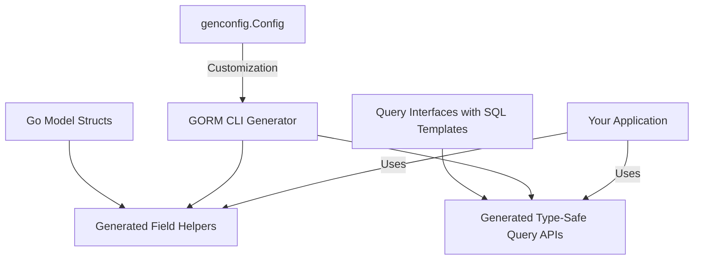

# Key Features at a Glance

Explore the standout capabilities of GORM CLI, designed to empower Go developers working with GORM by generating type-safe, fluent, and maintainable database APIs. This page highlights the core functional pillars that make GORM CLI indispensable for building robust database interactions with ease and confidence.

---

## 1. Type-Safe Query API Generation

### What It Does
GORM CLI converts simple Go interface definitions with embedded SQL templates into fully implemented, type-safe query APIs. This means you define your database queries declaratively and get a strongly typed API tailored for your models automatically.

### Why It Matters
- **Eliminates runtime SQL errors:** Compile-time checking ensures queries conform to expected types and parameters.
- **Boosts productivity:** No manual boilerplate SQL or query code — just write interface methods with SQL templates.
- **Improves readability:** Clear, intent-focused method signatures represent your queries directly.

### How It Works
Define Go interfaces with annotated method comments containing SQL templates. For example:

```go
// SELECT * FROM @@table WHERE id=@id
GetByID(id int) (T, error)

// WHERE name=@name AND age=@age
FilterByNameAndAge(name string, age int)
```

GORM CLI generates concrete implementations that use GORM's API, allowing you to call:

```go
user, err := generated.Query[User](db).GetByID(ctx, 123)
```

Each method automatically injects query parameters safely with full type validation.

---

## 2. Model-Driven Field Helpers

### What It Does
From your Go model structs, GORM CLI generates a rich set of field helpers with predicates, setters, and nested association operations. These field helpers provide fluent, discoverable methods to build complex queries and updates effortlessly.

### Why It Matters
- **More expressive queries:** Build predicates like `Name.Like()`, `Age.Between()`, or handle nullable types safely.
- **Consistent, reusable helpers:** Type-safe field operations tailored exactly to your model fields.
- **Simplifies updates and filters:** Express updates (`Set()`, `Incr()`) in idiomatic Go code.

### Example
Given a `User` model:

```go
type User struct {
  ID    uint
  Name  string
  Age   int
  IsAdult bool
}
```

You get helpers like:

```go
// id = 1
generated.User.ID.Eq(1)

// name LIKE '%jinzhu%'
generated.User.Name.Like("%jinzhu%")

// age BETWEEN 18 AND 65
generated.User.Age.Between(18, 65)

// update is_adult to false
generated.User.IsAdult.Set(false)
```

Use them within GORM queries for clear, type-safe query building.

---

## 3. Advanced Association Operations

### What It Does
GORM CLI supports comprehensive association handling on generated field helpers, enabling safe and expressive creation, updating, unlinking, and deletion of related records.

### Why It Matters
- **Maintain referential integrity:** Association operations respect foreign key semantics.
- **Batch and conditional operations:** Perform complex linked-data mutations seamlessly.
- **Clear semantics by association type:** Different operations (Unlink, Delete, CreateInBatch) clearly follow relationship rules.

### Key Operations
- **Create:** Insert a related row and link it (e.g., create a Pet for a User).
- **Update:** Conditionally update association records.
- **Unlink:** Remove association links without deleting data (e.g., clear FK).
- **Delete:** Remove associated records or join rows.

### Example
```go
// Create a user with one pet
gorm.G[User](db).
  Set(
    generated.User.Name.Set("alice"),
    generated.User.Pets.Create(generated.Pet.Name.Set("fido")),
  ).
  Create(ctx)

// Unlink pets named 'fido'
gorm.G[User](db).
  Where(generated.User.ID.Eq(1)).
  Set(generated.User.Pets.Where(generated.Pet.Name.Eq("fido")).Unlink()).
  Update(ctx)
```

---

## 4. Customizable Generation via Config

### What It Does
GORM CLI supports per-package configuration through `genconfig.Config`, letting you fine-tune code generation behavior, including output paths, interface or struct inclusion/exclusion, and custom field type mappings.

### Why It Matters
- **Fine-grained control:** Restrict generation to specific interfaces or structs.
- **Custom field helpers:** Map Go types or struct field tags (e.g., `gen:"json"`) to custom generated helpers.
- **Flexible output:** Customize where code is generated to fit your project layout.

### Example Config
```go
var _ = genconfig.Config{
  OutPath: "examples/output",
  FieldTypeMap: map[any]any{
    sql.NullTime{}: field.Time{},
  },
  FieldNameMap: map[string]any{
    "json": JSON{},
  },
  IncludeInterfaces: []any{"Query*"},
  ExcludeInterfaces: []any{"*Deprecated*"},
}
```

### Benefits
- Keep generated code clean and relevant
- Extend functionality with custom field helpers
- Organize generated files to your preferences

---

## 5. Use-Case-Driven Exploration

### Who Benefits Most
- Go developers seeking type safety and clarity in their data layer.
- Teams building maintainable microservices and SaaS backends.
- Projects with complex relational data needing safe association handling.

### Gain Real-World Advantages
- Avoid runtime errors by catching mismatched query parameters at compile time.
- Reduce boilerplate and repetitive query code.
- Write expressive, idiomatic Go code for database access.

---

## Getting Started with These Features
1. Define your query interfaces with annotated SQL templates.
2. Write your Go model structs with desired field tags.
3. Optionally create a `genconfig.Config` to customize generation.
4. Run `gorm gen` CLI to produce generated code.
5. Use the generated APIs and helpers in your application code.

---

## Learn More
- [What is GORM CLI?](../product-intro/what-is-gorm-cli)
- [Core Architecture & Workflow](../core-concepts/how-gorm-cli-works)
- [Using Generated APIs: First Query](../../getting-started/core-workflow-quickstart/using-generated-code)
- [Customizing Code Generation](../../guides/advanced-patterns/customizing-generation)

---

For detailed examples, API references, and guides, visit the [official GORM CLI GitHub repository](https://github.com/go-gorm/cli).

---

### Diagram: How Key Features Integrate


This diagram depicts the flow from your inputs — model structs and query interfaces — through configuration and generation, to the generated APIs and helpers consumed by your app.

---

This page summarizes GORM CLI's core standout features to help you grasp its power and value quickly. Dive deeper into each area with linked documentation to master effective, safe, and productive database programming in Go using GORM CLI.
