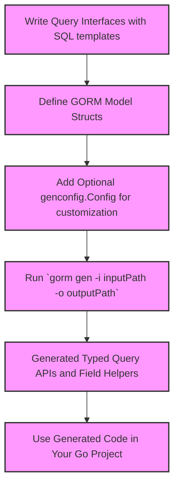

# Quickstart & Configuration

Welcome to your first step with GORM CLI! This guide walks you through the essential steps to install the tool, generate your first type-safe query APIs and field helpers, and customize your code generation using the powerful `genconfig.Config` file. Whether you’re setting up a new project or integrating GORM CLI into an existing codebase, this page helps you configure your workflow to maximize productivity and safety.

---

## Getting Started: Installation & Initial Code Generation

### Step 1: Install GORM CLI

GORM CLI requires Go 1.18+ due to its use of generics.

Install the CLI with a single command:

```bash
// Install the latest version of gorm CLI
 go install gorm.io/cli/gorm@latest
```

Once installed, the `gorm` executable is added to your Go bin path. You can verify installation by running:

```bash
gorm --help
```

This confirms you have access to GORM CLI commands.


### Step 2: Write Your Query Interfaces and Models

To generate code, start by defining your SQL-annotated query interfaces and model structs in your Go project.

Here’s a quick example:

```go
// examples/query.go
package examples

type Query[T any] interface {
  // SELECT * FROM @@table WHERE id=@id
  GetByID(id int) (T, error)

  // where("name=@name AND age=@age")
  FilterByNameAndAge(name string, age int)
}

// examples/models/user.go
package models

type User struct {
  gorm.Model
  Name string
  Age  int
}
```

> The `@@table` and `@param` placeholders in comments will be parsed by GORM CLI to generate type-safe implementations.


### Step 3: Run the Generator

With your interface and model ready, generate the code:

```bash
gorm gen -i ./examples -o ./generated
```

- `-i` points to your interface source files.
- `-o` specifies the output directory for generated code.

If no output directory is specified, generated code goes into the default `./g` folder.


### Step 4: Use the Generated Code in Your Project

After generating, your project gains strongly typed query APIs and model-driven field helpers.

Example usage:

```go
// SELECT * FROM users WHERE id=123
u, err := generated.Query[User](db).GetByID(ctx, 123)

// SELECT * FROM users WHERE age > 18
users, err := gorm.G[User](db).Where(generated.User.Age.Gt(18)).Find(ctx)
```

This approach removes runtime errors from mismatched queries and improves discoverability with fluent APIs.


---

## Configuring Code Generation with `genconfig.Config`

The generator is highly customizable through Go-level configuration declarations using `genconfig.Config`. This gives you fine-grained control over output paths, field mappings, inclusion/exclusion rules, and more.


### Where to Define Configuration

Place a package-level `var _ = genconfig.Config{...}` literal in any Go source file within the target package or directory. The generator automatically picks up this configuration during code generation.

Example:

```go
package examples

import (
	"database/sql"
	"gorm.io/cli/gorm/field"
	"gorm.io/cli/gorm/genconfig"
)

var _ = genconfig.Config{
	// Output files will go here, overriding CLI default
	OutPath: "examples/output",

	// Map Go types to field helpers
	FieldTypeMap: map[any]any{
		sql.NullTime{}: field.Time{},
	},

	// Map `gen:"json"` tags to a custom JSON field helper
	FieldNameMap: map[string]any{
		"json": JSON{},
	},

	// Include or exclude types or interfaces with shell-style patterns
	IncludeInterfaces: []any{"Query*"},
	ExcludeStructs: []any{"*DTO"},
}
```

This configuration influences which files are generated, how fields are wrapped, and where output lands.


### Key Configuration Options

| Option              | Purpose                                                                                           | Example                                   |
|---------------------|-------------------------------------------------------------------------------------------------|-------------------------------------------|
| `OutPath`           | Override the default output directory for generated files                                        | `OutPath: "examples/output"`             |
| `FieldTypeMap`      | Map Go types to typed field helper wrappers for customized behavior                              | `map[any]any{sql.NullTime{}: field.Time{}}` |
| `FieldNameMap`      | Map struct field tags (e.g., `gen:"json"`) to custom field helpers                             | `map[string]any{"json": JSON{}}`          |
| `IncludeInterfaces` | Whitelist interface patterns or types to generate APIs only for specific query interfaces        | `[]any{"Query*"}`                        |
| `ExcludeInterfaces` | Blacklist interfaces to skip entirely from generation                                           | `[]any{"*Deprecated*"}`                   |
| `IncludeStructs`    | Whitelist struct types or patterns to include in generation                                     | `[]any{"User", "Account*"}`             |
| `ExcludeStructs`    | Blacklist struct types or patterns to exclude from generation                                   | `[]any{"*DTO"}`                           |
| `FileLevel`         | If true, config only applies to current file, not entire package or directory                   | `FileLevel: true`                           |


### Practical Tips & Best Practices

- **Start simple:** You don’t need a config to generate basic query APIs; defaults work well initially.
- **Use patterns:** Use shell-style patterns (with `*`) for flexible inclusion/exclusion across multiple files or types.
- **Custom field helpers:** Map custom types or tags to specialized field helpers (e.g., JSON) to extend generated querying capabilities.
- **Manage configuration scope:** Use `FileLevel` to localize config effects or directory-level configs to manage entire subtrees.
- **Keep configs in source:** Place your `genconfig.Config` close to relevant code for clarity and version control.


---

## Example Configuration: Mapping JSON Fields & Struct Filters

```go
package examples

import "gorm.io/cli/gorm/genconfig"

var _ = genconfig.Config{
	OutPath: "examples/output",
	FieldNameMap: map[string]any{
		"json": JSON{},
	},
	IncludeInterfaces: []any{"Query*"},
}
```

This example tells generator:

- Output generated files to `examples/output`
- Use a custom `JSON` field helper for fields marked with `gen:"json"` tag
- Only generate interfaces with names starting with "Query"


---

## Troubleshooting & Common Pitfalls

<AccordionGroup title="Common Quickstart Issues">
<Accordion title="Generator not creating files">
- Ensure the input path (`-i`) correctly points to the directory or Go file with your query interfaces.
- Check for Go syntax errors or missing SQL annotations in interface comments.
- Confirm your `genconfig.Config` does not exclude all interfaces or structs unintentionally.
</Accordion>

<Accordion title="Incorrect or missing field helpers">
- Verify field mapping rules in `FieldTypeMap` and `FieldNameMap`.
- Check struct tags for correct `gen:"tag"` usage.
- Remember that custom helpers must be imported or defined in your project.
</Accordion>

<Accordion title="Output path not honored">
- Confirm you are setting `OutPath` in a package-level config.
- Remember that configs can be overridden by more specific configs in subdirectories.
- Use `FileLevel` flag to localize config effects if needed.
</Accordion>
</AccordionGroup>


---

## Next Steps

- Explore [Defining Query Interfaces & Models](/getting-started/project-bootstrapping/writing-query-interfaces) to understand how to write raw SQL templates correctly.
- See [Running the Generator](/getting-started/project-bootstrapping/basic-generation-workflow) for manual and automated generation workflows.
- Dive into [Optional: Customizing Generation with Config](/getting-started/project-bootstrapping/initial-configuration) for deeper config customization.

---

## Summary Diagram: Code Generation Workflow



Harness this flow to steadily build a type-safe, maintainable data access layer with GORM CLI.
