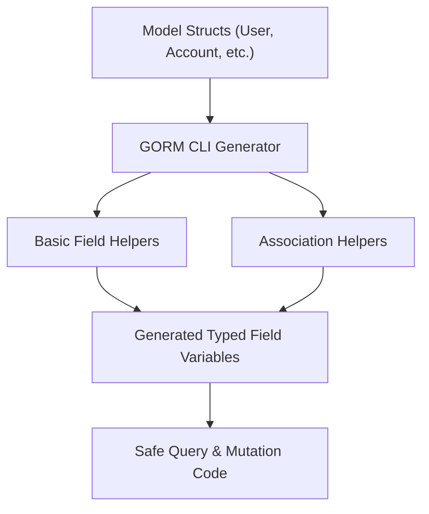

# Model-Driven Field & Association Helpers

Unlock the full potential of your GORM models by generating strongly typed field and association helpers that empower you to build safe, expressive, and efficient database queries and mutations—all verified at compile time.

---

## Why Model-Driven Helpers Matter

When working with GORM, managing columns and related records often involves stringly-typed field names or verbose manual code. Model-driven field and association helpers eliminate this problem by generating tailored, discoverable, and type-safe constants and methods from your model structs.

This approach brings clarity and safety to how you filter, update, and manage associations in your Go code—detecting errors before runtime and significantly enhancing developer productivity.

---

## What Are Field & Association Helpers?

At their core, helpers are generated Go variables and types produced from your struct definitions. They represent your model’s fields and relationships with precise typing, allowing fluent and safe API calls.

- **Field helpers** provide predicate and setter methods for basic columns — strings, numbers, booleans, times, nullable types, and custom mapped types.
- **Association helpers** represent related entities (has one, has many, belongs to, many2many) with typed operations for creating, updating, unlinking, and deleting associated records.

Together, these helpers form a comprehensive, user-friendly API that closely aligns with your domain model.

---

## How Model Helpers Are Generated

GORM CLI scans your model structs to create:

1. **Field Definitions:** For each basic field, a helper is generated, e.g., `generated.User.Name` as a `field.String` helper linked to the `name` column.
2. **Association Helpers:** For relations defined with GORM tags or standard idioms, typed helpers like `generated.User.Pets` (a slice helper for has-many pets) are generated.
3. **Custom Field Mapping:** Using generation configurations (e.g., via `genconfig.Config`), you can customize how specific fields are mapped, including custom types like JSON.

This process guarantees that the helper names, types, and column mappings stay perfectly synchronized with your actual models.

---

## Working with Basic Fields

Each basic field in your model struct transforms into a helper with a rich API for predicates and updates.

### Example Model
```go
// User model example
type User struct {
    ID        uint
    Name      string
    Email     string
    Age       int
    Status    string
    CreatedAt time.Time
}
```

### Common Predicate & Setter Usage
```go
// Predicates
generated.User.ID.Eq(1)                 // WHERE id = 1
generated.User.Name.Like("%jinzhu%")   // WHERE name LIKE '%jinzhu%'
generated.User.Age.Between(18, 65)      // WHERE age BETWEEN 18 AND 65
generated.User.Score.IsNull()            // WHERE score IS NULL

// Updates
gorm.G[User](db).
  Where(generated.User.Name.Eq("alice")).
  Set(
    generated.User.Name.Set("jinzhu"),
    generated.User.IsAdult.Set(false),
  ).
  Update(ctx)

// Create
gorm.G[User](db).
  Set(
    generated.User.Name.Set("alice"),
    generated.User.Age.Set(0),
  ).
  Create(ctx)
```

These strongly typed operations remove guesswork and spelling errors from your queries.

---

## Managing Associations via Helpers

Association helpers correspond to your GORM relationships, allowing atomic, fluent commands to manage linked records.

Supported operations are:
- **Create:** Create and link new related entities
- **CreateInBatch:** Batch create multiple related entities
- **Update:** Update related entities matching conditions
- **Unlink:** Remove association links without deleting data
- **Delete:** Remove associated records or join rows

### Association Helper Example
```go
// Create a new user with a linked pet
gorm.G[User](db).
  Set(
    generated.User.Name.Set("alice"),
    generated.User.Pets.Create(generated.Pet.Name.Set("fido")),
  ).
  Create(ctx)

// Update a specific pet
gorm.G[User](db).
  Where(generated.User.ID.Eq(1)).
  Set(generated.User.Pets.Where(generated.Pet.Name.Eq("fido")).Update(generated.Pet.Name.Set("rex"))).
  Update(ctx)

// Unlink all pets from a user
gorm.G[User](db).
  Where(generated.User.ID.Eq(1)).
  Set(generated.User.Pets.Unlink()).
  Update(ctx)

// Delete pets matching condition
gorm.G[User](db).
  Where(generated.User.ID.Eq(1)).
  Set(generated.User.Pets.Where(generated.Pet.Name.Eq("old")).Delete()).
  Update(ctx)
```

### Semantics by Association Type
- **Belongs To:** Unlink sets parent FK to NULL; Delete removes associated rows
- **Has One/Has Many:** Unlink sets child FK to NULL; Delete removes child rows
- **Many2Many:** Unlink/Delete remove join table rows only; both sides remain intact

### Parent Operation
- `Create(ctx)` inserts new parent rows and applies all association operations
- `Update(ctx)` updates matched parent rows and then applies association operations

---

## Real-World Scenario: Filtering & Upgrading Users

Imagine you want to find all users older than 18 with active roles and then upgrade their status:

```go
var users []models.User
err := gorm.G[models.User](db).
    Where(generated.User.Age.Gt(18), generated.User.Role.Eq("active")).
    Find(ctx).
    Scan(&users)

// Now update statuses
_, err = gorm.G[models.User](db).
    Where(generated.User.Role.Eq("pending")).
    Update(ctx, "role", "active")
```

The strongly-typed helpers ensure you can't accidentally query or update with invalid field names or wrong types.

---

## Custom Field Helpers (JSON Example)

Through the `genconfig.Config`, you can customize generation behavior, such as mapping a JSON string field to a specialized JSON helper.

```go
// In your config
var _ = genconfig.Config{
  FieldNameMap: map[string]any{
    "json": JSON{},
  },
}

// On your model's JSON field
Profile string `gen:"json"`

// Usage
gorm.G[User](db).
  Where(generated.User.Profile.Equal("$.vip", true)).
  Take(ctx)
```

This enables database-specific JSON functions to be used seamlessly.

---

## Best Practices & Tips

- **Keep Models Clean:** Define your GORM model structs with proper types and relationships for the generator to process accurately.
- **Use Configuration:** Customize generation behavior with `genconfig.Config` in your packages for overrides like output paths and field mappings.
- **Always Use Generated Helpers:** Avoid manual string column references to prevent runtime errors.
- **Combine Conditions:** You can combine multiple predicate helpers in `Where` clauses for expressive queries.
- **Aware of Associations:** Understand GORM’s relationship types to predict the behavior of unlink and delete operations.

---

## Troubleshooting Common Issues

<AccordionGroup title="Common Problems & Solutions">
<Accordion title="Generated Helpers Missing or Incorrect">
- Ensure your models are correctly defined and exported.
- Run the generator on the correct package or directory containing models.
- Verify any config filters don't exclude needed structs.
</Accordion>
<Accordion title="Type Mismatch Errors">
- Confirm your models' field types align with expected GORM and database types.
- Add custom field mappings in `genconfig.Config` for non-standard types.
</Accordion>
<Accordion title="Association Update Not Working">
- Check the association GORM tags.
- Confirm correct usage of `Where` conditions on associations.
</Accordion>
</AccordionGroup>

---

## Getting Started Preview

### Quick Steps
1. Define your GORM model structs with fields and relations.
2. Run GORM CLI generator pointing to your model package:

```bash
gorm gen -i ./examples -o ./generated
```

3. Use the generated field and association helpers in your querying or mutation workflows.

### Prerequisites
- Go 1.18+ with generics support
- GORM v2 integration

### Next Steps
- Explore the [Generating Type-Safe Query APIs](overview/features-quicktour/query-api-generation) page to combine interfaces with your fields.
- Review the [Working with Generated APIs in Your Project](guides/core-workflows/using-generated-apis) guide to deepen usage expertise.
- Customize your generation using the [Advanced Code Generation Configuration](guides/core-workflows/configuring-generation) documentation.

---

For more examples and detailed explanations, refer to the [README](README.md) and the [Field Helpers Test Suite](examples/output/models_field_helpers_test.go) included with GORM CLI source.

---

### Diagram: Field & Association Helpers Generation Workflow



---

Unlock your models' full expressiveness today—generate GORM field and association helpers for safer, cleaner, and more powerful database interactions.
