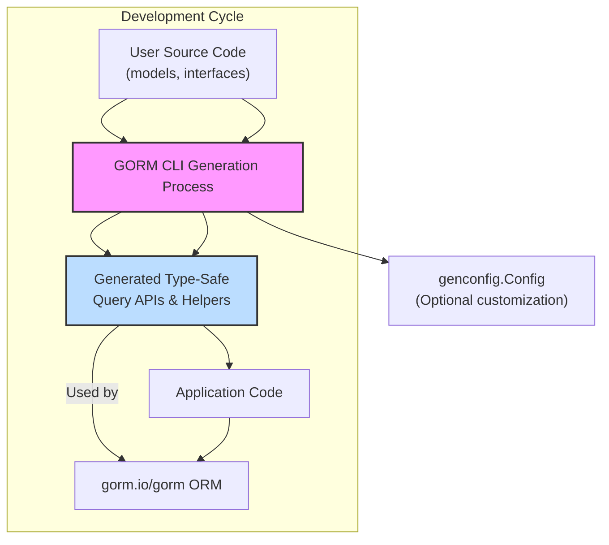

# Integration with GORM & the Go Ecosystem

Unlock the full power of GORM CLI with seamless integration into GORM and idiomatic Go 1.18+ generics. This guide walks you through how the generated code fits within your Go projects, enabling you to replace raw SQL with fluent, type-safe, and discoverable query and model APIs.

---

## Why Integration Matters

GORM CLI is designed not as a standalone tool but as a natural extension of your existing GORM workflows. By generating type-safe query interfaces and model-driven field helpers directly from your Go interfaces and structs, it empowers you to work within GORM’s idioms without losing safety or productivity.

This integration means:

- **Fluent Query Building:** Use generated methods that compile-time verify your SQL logic.
- **Type-Safe Field Helpers:** Access model fields and associations with strongly typed helpers.
- **Seamless Compatibility:** Works with any GORM-based project targeting Go 1.18+.

Whether adding to a new codebase or enhancing existing applications, GORM CLI bridges the gap between handwritten SQL and GORM’s expressive ORM capabilities.

---

## How Generated Code Plugs into GORM

### Idiomatic Use of Generics

All generated query APIs and helpers leverage Go's powerful generics introduced in Go 1.18. Instead of hand-writing repetitive CRUD methods, you get generic interfaces and types that operate with your model types safely. This reduces boilerplate drastically and unlocks:

- Compile-time type safety for queries and updates.
- API discoverability with conventional Go method signatures.
- Automatic context injection for cancellation and tracing.

### Example: Generated Query API Usage

```go
// Generated interface with type parameter
userQuery := generated.Query[models.User](db)

// Fetch user by ID with type-safe method
user, err := userQuery.GetByID(ctx, 42)
if err != nil {
    // handle error
}

// Dynamic filtering using fluent chain
users, err := userQuery.FilterByNameAndAge(ctx, "jinzhu", 25).Find(ctx)
```

Here, the `Query[User]` interface abstracts away raw SQL and GORM boilerplate, letting you focus on business logic while maintaining full correctness.

### Example: Model-Driven Field Helper Usage

```go
// Use generated fields for safe queries and updates
u := generated.User

// Query users older than 18
users, err := gorm.G[models.User](db).
    Where(u.Age.Gt(18)).
    Find(ctx)

// Update a user's name and mark as adult
err = gorm.G[models.User](db).
    Where(u.ID.Eq(1)).
    Set(
        u.Name.Set("Alice"),
        u.IsAdult.Set(true),
    ).
    Update(ctx)
```

This approach ensures your query and update code is fully type-checked, reducing runtime errors and improving maintenance.

---

## Compatibility & Best Practices

To make the most of GORM CLI’s generated code in your Go projects, observe these key compatibility guidelines and recommended workflows:

### Compatibility

- Requires **Go 1.18 or higher** for generics support.
- Fully interoperable with **gorm.io/gorm** ORM library.
- Supports all primary GORM database drivers via GORM’s standard APIs.
- No external dependencies beyond GORM and the Go standard library.

### Project Structure & Integration

- Place your **model structs** and **query interface definitions** (with SQL templates) in your source tree.
- Run the CLI `gorm gen` command to produce generated code in a dedicated output directory.
- Import the generated packages in your application logic.
- Use the generated query interfaces and field helpers as drop-in replacements for raw SQL.

### Recommended Workflow

<Steps>
<Step title="Define Models and Query Interfaces">
Create Go structs for your database models and interfaces annotated with SQL templates.
</Step>
<Step title="Run Code Generator">
Invoke `gorm gen -i ./path/to/input -o ./generated` to generate APIs.
</Step>
<Step title="Use Generated Code in Application">
Replace raw SQL calls with generated type-safe methods and helpers.
</Step>
<Step title="Build and Test Continuously">
Keep interfaces and models synced, rerun generator as needed, and validate code correctness.
</Step>
</Steps>

---

## Practical Tips for Smooth Integration

- **Context Awareness:** If your query methods omit `context.Context`, the generator automatically adds it as the first parameter to support cancellation.
- **Output Path Configuration:** Use `genconfig.Config` to override default output directories per package for cleaner organization.
- **Custom Field Mapping:** Map special types (e.g., `sql.NullTime`) to custom field helpers via configurations to better match your database schemas.
- **Association Helpers:** Use generated associations such as `user.Pets` and `user.Languages` for fluent and safe relational operations.
- **Incremental Generation:** Run the generator frequently during development to keep generated code up to date.

---

## Common Integration Scenarios

### Adding GORM CLI to an Existing Project

1. Start by defining query interfaces for frequently used queries that currently use raw SQL.
2. Generate the corresponding APIs with the CLI.
3. Refactor existing repository or service code to call generated methods instead.
4. Gradually add model-driven field helpers to replace manual query construction.

### Building a New Project from Scratch

1. Model your database tables as structured Go types.
2. Define explicit query interfaces leveraging SQL template annotations.
3. Generate your type-safe ORM layer before writing business logic.
4. Use generated APIs directly for all database reads and writes.

---

## Integration Diagram Overview



This workflow illustrates where the generated code fits into your development pipeline, providing a robust, type-safe interface to GORM’s core ORM features.

---

## Troubleshooting Integration Issues

<AccordionGroup title="Common Integration Pitfalls">
<Accordion title="Missing Context Parameter in Methods">
If your interface methods don't define `context.Context` explicitly, the generator inserts it automatically. Ensure your code uses the generated method signatures to avoid mismatches.
</Accordion>
<Accordion title="Incorrect Output Path or Imports">
Use `genconfig.Config` in your packages to specify custom output paths and control import resolution, especially for multi-module projects or nested packages.
</Accordion>
<Accordion title="Type Mapping Inconsistencies">
Configure `FieldTypeMap` and `FieldNameMap` to map Go types or struct field tags to the correct field helpers. This prevents runtime errors and enhances code clarity.
</Accordion>
<Accordion title="Generated Code Not Updating">
Always rerun generation after changing your interfaces or models, as stale generated code may cause compilation errors.
</Accordion>
</AccordionGroup>

---

## Next Steps

- Explore [Quickstart Workflow](/overview/features-workflows/quickstart-workflow) to see a hands-on integration example.
- Deep dive into [Generating Model-driven Field Helpers](/guides/core-workflows/generate-field-helpers) to leverage associations and field predicates.
- Customize your generation via [Customizing Code Generation with Configurations](/guides/advanced-usage-patterns/customizing-generation).
- Understand the underlying [System Architecture Overview](/overview/concepts-architecture/system-architecture) for optimization and troubleshooting.

---