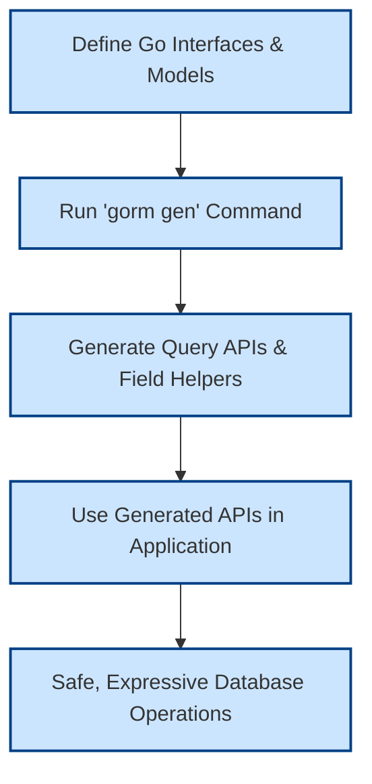

# Quickstart Workflow

Welcome to the **Quickstart Workflow** for GORM CLI—your streamlined path from defining interfaces and models to generating type-safe, fluent database APIs that unlock safer, more expressive Go code with GORM. This page guides you step-by-step through the core process of writing code, generating artifacts, and using the resulting APIs to achieve your database operation goals.

---

## Why This Workflow Matters

Many Go developers using GORM want to avoid repetitive boilerplate, reduce runtime errors caused by mismatched query logic, and gain IDE-friendly, discoverable APIs for working with the database. This quickstart workflow delivers exactly that by combining:

- **Interface-driven type-safe query APIs:** Define raw SQL queries as Go interface methods, embedded with SQL templates.
- **Model-driven field helpers:** Generate strongly typed expressions for filters, updates, and associations based on model struct fields.

Following this workflow ensures your queries and updates are correctly typed and validated at compile time, while drastically improving development speed and maintainability.

---

## Step 1: Define Your Interfaces and Models

Start by writing **Go interfaces** to declare methods representing your database queries, embedding raw SQL or templated SQL in method comments. Alongside these interfaces, define your **Go struct models** representing database tables.

**Example:**

```go
// Define your generic query interface with SQL templates
// examples/query.go

type Query[T any] interface {
  // SELECT * FROM @@table WHERE id=@id
  GetByID(id int) (T, error)

  // SELECT * FROM @@table WHERE @@column=@value
  FilterWithColumn(column string, value string) (T, error)

  // SELECT * FROM users
  //   {{if user.ID > 0}}
  //       WHERE id=@user.ID
  //   {{else if user.Name != ""}}
  //       WHERE name=@user.Name
  //   {{end}}
  QueryWith(user User) (T, error)

  // UPDATE @@table
  //  {{set}}
  //    {{if user.Name != ""}} name=@user.Name, {{end}}
  //    {{if user.Age > 0}} age=@user.Age, {{end}}
  //    {{if user.Age >= 18}} is_adult=1 {{else}} is_adult=0 {{end}}
  //  {{end}}
  // WHERE id=@id
  UpdateInfo(user User, id int) error
}

// Model representing a user table
// examples/models/user.go

type User struct {
  ID   uint
  Name string
  Age  int
}
```

### Key Tips:
- Use the `@@table` directive to automatically bind to the model’s table name.
- Use `@param` placeholders to bind Go method params into SQL safely.
- Leverage conditional and iteration directives (`{{if}}`, `{{where}}`, `{{for}}`) for dynamic queries.

---

## Step 2: Generate Code Using GORM CLI

With your interfaces and models declared, run GORM CLI's code generation command to produce fluent, type-safe APIs and field helpers.

```bash
gorm gen -i ./examples -o ./generated
```

- `-i` (`--input`) points to the directory or file containing your interfaces and models.
- `-o` (`--output`) defines where generated Go code will be placed.

### What Happens:
- The CLI parses your Go interfaces and extracts methods and embedded SQL templates.
- Model structs are scanned for field and association metadata.
- Two main code artifacts are generated:
  - Interface implementations with type-safe query methods.
  - Field helper constants and methods for all model fields.

<Tip>
Ensure your Go environment meets prerequisites: Go 1.18+ is required for generics support.
</Tip>

---

## Step 3: Use the Generated Fluent APIs

Once generated, import and use the resulting APIs for your database operations with clean, error-resistant code. The generated code includes:

- **Query APIs** matching your interface methods, offering fluent calls with `ctx` context injection.
- **Field helpers** exposed via generated variables, enabling strong typing and method chaining for filters, updates, and associations.

**Example usages:**

```go
// Import statement for generated package
import "generated"

// Use the Query[T] interface for typed queries
u, err := generated.Query[User](db).GetByID(ctx, 123)
if err != nil {
  // Handle error
}

// Use field helpers for expressive filtering
users, err := gorm.G[User](db).
  Where(generated.User.Age.Gt(18)).
  Find(ctx)

// Update user info using generated set helpers
err = generated.Query[User](db).
  UpdateInfo(ctx, User{Name: "Alice", Age: 30}, 123)

// Create with association
err = gorm.G[User](db).
  Set(
    generated.User.Name.Set("alice"),
    generated.User.Pets.Create(generated.Pet.Name.Set("fido")),
  ).Create(ctx)
```

### Best Practices:
- Always pass a `context.Context` when calling generated methods.
- Use generated fields (e.g., `generated.User.Name.Eq(...)`) to build predicates.
- Take advantage of association helpers for safe, concise related data operations.

---

## How This Workflow Fits in Your Development Cycle

This quickstart workflow is the foundation for harnessing GORM CLI’s full potential. It enables:

- Rapid prototyping of database queries directly from typed interfaces.
- Safer database interactions validated at compile time.
- Cleaner application code by eliminating error-prone raw SQL strings.

Explore additional pages for deeper insights:

- [Generating Type-Safe Query APIs](/guides/core-workflows/generate-type-safe-queries) to master interface design.
- [Generating Model-driven Field Helpers](/guides/core-workflows/generate-field-helpers) for advanced filter and association operations.
- [Customizing Generation](/guides/advanced-usage-patterns/customizing-generation) to tailor the CLI to your needs.

---

## Troubleshooting Common Issues

<AccordionGroup title="Common Issues Running Quickstart Workflow">
<Accordion title="Code Generation Command Fails">
- Verify input path is correct and points to Go files containing interfaces and models.
- Confirm Go modules and environment are properly set up.
- Check you have Go 1.18+ installed for generics support.
</Accordion>
<Accordion title="Generated Code Not Found or Empty">
- Ensure your interfaces have methods with valid SQL template comments.
- Check for `genconfig.Config` overrides that might exclude certain files or interfaces.
</Accordion>
<Accordion title="Runtime Errors Using Generated APIs">
- Confirm database schema matches your model struct fields.
- Use field helpers to build queries, not raw strings.
- Double check context is properly passed.
</Accordion>
</AccordionGroup>

---

## Illustration of the Core Quickstart Workflow



This simplified flow begins with your source code declarations, proceeds through CLI code generation, and concludes with safer, cleaner database usage in Go.

---

## Next Steps

- Read [Key Features at a Glance](/overview/features-workflows/feature-list) to understand all capabilities unlocked by this workflow.
- Proceed to [Getting Started with GORM CLI](/guides/core-workflows/getting-started) for a deeper code walkthrough.
- Explore [Integration with GORM & the Go Ecosystem](/overview/features-workflows/integration-gorm-ecosystem) to see how this fits in your larger project.

Use this workflow as your base to confidently develop robust, type-safe Go applications powered by GORM.


---

## References

- [GORM CLI Overview & Introduction](../intro-and-value/what-is-orm-cli)
- [Business Value & Use Cases](../intro-and-value/business-value-use-cases)
- [Core Concepts & Terminology](../concepts-architecture/core-concepts-glossary)
- [Generating Type-Safe Query APIs Guide](../../guides/core-workflows/generate-type-safe-queries)
- [Generating Model-driven Field Helpers Guide](../../guides/core-workflows/generate-field-helpers)
- [CLI Installation & Setup](../../getting-started/setup-installation/cli-installation)


---

Keep this guide handy as your quickest path to unlocking type safety, discoverability, and powerful query expressivity with GORM CLI!
