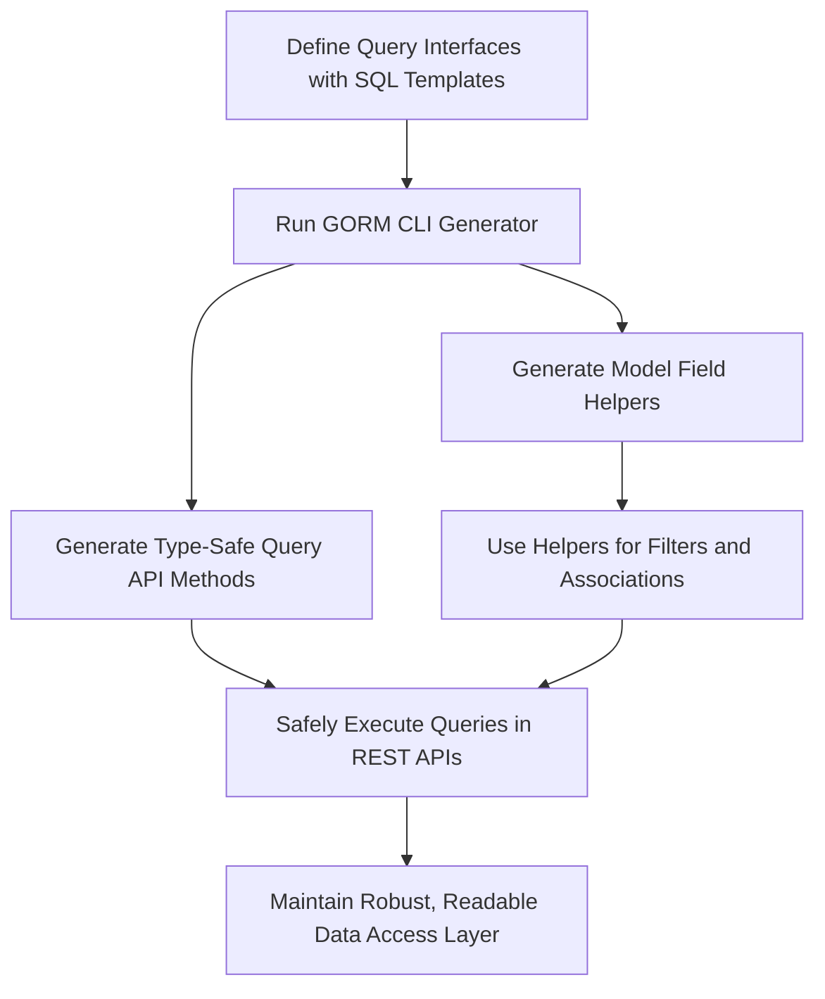

# Primary Use Cases

Explore practical, real-world scenarios where GORM CLI empowers Go developers to build robust, maintainable, and type-safe database access layers. This page focuses on four core usage patterns that showcase the power of generated interfaces, filters, association handling, and multi-database SQL support via templated DSLs.

---

## Building REST APIs with Type Safety

Imagine you are developing a REST API that requires precise, type-safe queries to your database. GORM CLI enables you to define query interfaces using Go generics and embed SQL templates directly in method comments. This approach eliminates runtime SQL errors by shifting verification to compile time.

For example, define an interface:

```go
// Query[T any] interface defines DB queries with templated SQL
// SELECT * FROM @@table WHERE id=@id
GetByID(id int) (T, error)
```

From this, GORM CLI generates the corresponding implementation:

- Type-safe methods
- Automatic parameter binding
- Fluent chaining with GORM

This transforms your typical string-based query approach into a strongly-typed API, boosting confidence when building REST endpoints.

> **Tip:** Method comments support a rich DSL, so you can express conditional where clauses, dynamic set updates, and more, enabling elegant expression of complex queries.

---

## Enforcing Compile-Time Checks on Filters

Filtering data often involves building dynamic SQL conditions. With GORM CLI, you get model-driven helper structs that expose predicate methods corresponding to your fields. These helpers ensure:

- Field names match your models exactly
- Types of filter values are validated at compile time
- Common predicates like `Eq`, `Like`, `Between`, and `Incr` are prebuilt

Consider the `User` model with fields like `Name string` and `Age int`:

```go
generated.User.Name.Eq("alice")       // name = 'alice'
generated.User.Age.Between(18, 65)    // age BETWEEN 18 AND 65
```

Use these in your chains:

```go
gorm.G[User](db).Where(
  generated.User.Name.Like("%jinzhu%"),
  generated.User.Age.Gt(20),
).Find(ctx)
```

This feature prevents typos and mismatches common in manual string-building filters, improving code reliability.

---

## Managing Complex Associations Fluently

Handling associations—such as _has one_, _has many_, _belongs to_, and _many to many_—requires precise operations that are error-prone manually. GORM CLI generates association helpers for your models exposing methods to:

- Create or insert associated records
- Update associated records with condition filters
- Unlink associations (clear foreign keys or remove join table entries)
- Delete associated records safely
- Batch-create linked records

For example, creating a user and associated pets in one operation:

```go
gorm.G[User](db).
  Set(
    generated.User.Name.Set("alice"),
    generated.User.Pets.Create(generated.Pet.Name.Set("fido")),
  ).
  Create(ctx)
```

Update and unlink operations use fluent filter methods for precision:

```go
gorm.G[User](db).
  Where(generated.User.ID.Eq(1)).
  Set(
    generated.User.Pets.Where(generated.Pet.Name.Eq("fido")).Update(
      generated.Pet.Name.Set("rex"),
    ),
  ).
  Update(ctx)
```

The fluent, strongly-typed API simplifies managing nested relational data, reducing bugs and improving maintainability.

---

## Supporting Multi-Database SQL via Template DSLs

GORM CLI's template DSL empowers you to write SQL templates that adapt dynamically to:

- Different SQL dialect nuances
- Conditional filters and sets
- Dynamic column filtering

Example DSL features:

| Directive    | Purpose                                   | Example                                            |
| ------------ | ----------------------------------------- | ------------------------------------------------- |
| `@@table`    | Resolves to model’s database table name   | `SELECT * FROM @@table WHERE id=@id`              |
| `@@column`   | Dynamic column name substitution           | `SELECT * FROM @@table WHERE @@column=@value`     |
| `@param`     | Bind Go parameters to SQL safely           | `WHERE name=@user.Name`                            |
| `{{where}}`  | Conditional WHERE clause                    | `{{where}} age > 18 {{end}}`                       |
| `{{set}}`    | Conditional SET clause in UPDATE            | `{{set}} name=@name {{end}}`                      |
| `{{if}}`     | Conditional inclusion of SQL fragments     | `{{if age > 0}} AND age=@age {{end}}`             |
| `{{for}}`    | Iterate over collections for dynamic SQL   | `{{for _, tag := range tags}} tags LIKE @tag OR {{end}}` |

This DSL allows writing database-agnostic query logic and easily customizing queries for complex, dynamic conditions.

---

## Putting It All Together

These use cases integrate seamlessly:

1. Define your models and query interfaces with embedded SQL templates.
2. Run the generator with optional filters to whitelist or blacklist specific interfaces or structs.
3. Use generated code for type-safe query methods, filter helpers, and association operations.
4. Harness the SQL template DSL to write adaptable and maintainable query logic.

This approach delivers:

- Compile-time safety increasing developer confidence
- Reduction of runtime surprises and SQL injection vulnerabilities
- Code that communicates intent clearly and is easy to maintain
- Support for complex relational data structures

---

## Practical Configuration Examples

### Whitelisting Interfaces and Structs

By creating config files with `IncludeInterfaces` or `IncludeStructs`, you can generate code only for relevant APIs, controlling output size and focus.

```go
var _ = genconfig.Config{
  IncludeInterfaces: []any{"Query*"},
  IncludeStructs: []any{"User", "Account*"},
}
```

### Blacklisting Deprecated or Unused Items

Alternatively, use `ExcludeInterfaces` and `ExcludeStructs` to filter out legacy or unnecessary parts.

```go
var _ = genconfig.Config{
  ExcludeInterfaces: []any{"Old*", "Legacy*"},
  ExcludeStructs: []any{"*DTO"},
}
```

### Folder-Level Filters

Hierarchical filtering across directories ensures consistency when working with nested packages.

---

## Troubleshooting Common Pitfalls

- **No generated methods appear:** Check if your interfaces and structs match your config filters.
- **Template syntax errors:** Review SQL templates for correct DSL directive usage.
- **Unexpected code output:** Validate that your model fields have proper tags and that the generator sees the latest code.

> **Note:** Always verify your SQL templates in interface method comments carefully — the DSL enables powerful features but requires precise syntax.

---

## Summary

GORM CLI’s primary use cases demonstrate how to transform Go interfaces and structs into powerful, type-safe database APIs with:

- Statically verified REST API query methods
- Compile-time safe, expressive filter helpers
- Fluent, safe manipulation of complex associations
- Dynamic multi-database SQL queries with a flexible template DSL

Understanding these patterns will help you adopt GORM CLI effectively to elevate your Go project's database layer quality and maintainability.

---

## See Also

- [Feature Overview](/overview/features-workflows/feature-overview): Core capabilities underpinning these use cases
- [Quick Start & Typical Workflow](/overview/features-workflows/quickstart-workflow): Step-by-step getting started instructions
- [Working with Associations](/guides/advanced-patterns/guide-associations): Deep dive into association helpers
- [Template-Driven Query Interfaces](/guides/advanced-patterns/guide-sql-templates): Mastering the SQL template DSL
- [Customizing Generation with genconfig.Config](/guides/advanced-patterns/guide-genconfig): Tailor generation to your project

---

## Visual Workflow Diagram



---