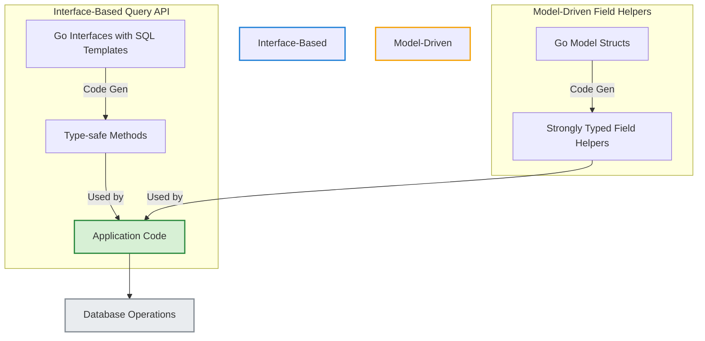

# Feature Highlights

Explore at-a-glance the dual code generation workflow in GORM CLI, designed to accelerate your development with enhanced type safety and fluent database operations. This page focuses on the two core generation paths:

1. Generating type-safe query APIs directly from your Go interfaces embedded with SQL templates.
2. Generating model-driven field helpers from your structs to compose expressive filters, updates, and association operations.

Together, these features create a sophisticated yet approachable layer that improves code quality, maintainability, and productivity.

---

## Two Complementary Code Generation Workflows

GORM CLI blends two powerful generation mechanisms to streamline database access:

### 1. Query API Generation from Go Interfaces

- **How it works:** Write Go interfaces with method comments including SQL template DSL. GORM CLI parses these to generate concrete methods that are fully type-safe and integrate seamlessly with GORM's query builder.
- **What you get:**
  - Methods with compile-time verified parameters and return types.
  - Automatic context injection if omitted.
  - SQL templates with dynamic placeholders (`@@table`, `@param`, `{{where}}`, `{{set}}`, etc.) that bind safely and clearly.

**Example:**
```go
// Query interface with SQL templates
 type Query[T any] interface {
  // Get user by id
  // SELECT * FROM @@table WHERE id=@id AND name = "@name"
  GetByID(id int) (T, error)

  // Filter query by any column
  // SELECT * FROM @@table WHERE @@column=@value
  FilterWithColumn(column string, value string) (T, error)

  // Update with a dynamic set clause
  // UPDATE @@table
  // {{set}}
  //   {{if user.Name != ""}} name=@user.Name, {{end}}
  //   {{if user.Age > 0}} age=@user.Age, {{end}}
  //   {{if user.Age >= 18}} is_adult=1 {{else}} is_adult=0 {{end}}
  // {{end}}
  // WHERE id=@id
  UpdateInfo(user models.User, id int) error
}
```

This approach reduces boilerplate while giving you control over your SQL logic and guarantees output correctness.

### 2. Model Structs to Field Helpers

- **How it works:** GORM CLI analyzes your Go model structs, including field types and struct tags, and generates strongly typed field helpers.
- **What they enable:**
  - Fluent predicates like `.Eq()`, `.Lt()`, `.Like()` for filtering.
  - Setters like `.Set()`, `.Incr()`, `.SetExpr()` for updates and creations.
  - Specialized helpers for associations (`HasOne`, `HasMany`, `BelongsTo`, `Many2Many`).

**Example:**
```go
// Generated fluent field helpers
generated.User.Name.Eq("alice")            // name = 'alice'
generated.User.Age.Between(18, 65)            // age BETWEEN 18 AND 65

gorm.G[User](db).
  Where(generated.User.Name.Eq("alice"), generated.User.IsAdult.Set(false)).
  Update(ctx)

// Association create & unlink
gorm.G[User](db).
  Set(generated.User.Pets.Create(generated.Pet.Name.Set("fido"))).
  Create(ctx)
```

Field helpers eliminate error-prone string-based conditions and let you build complex queries and updates with confidence.

---

## Key Benefits of Feature Highlights

- **Compile-time Safety:** Avoid subtle bugs by enforcing types and method signatures before runtime.
- **Expressive API:** Compose complex queries and updates with readable, fluent code.
- **Maintainability:** Centralize query logic in interfaces and model-driven helpers to keep code clean and consistent.
- **Efficiency:** Save significant development time by auto-generating repetitive boilerplate.

---

## How These Work Together: A Developer Workflow

1. **Write domain-specific query interfaces** with embedded SQL templates.
2. **Define your data models** as Go structs, optionally customizing field mappings.
3. **Run GORM CLI generator** to produce:
   - Concrete query implementations for your interfaces.
   - Strongly typed field helpers for all your models.
4. **Use generated code** in your application:
   - Call generated query methods for complex SQL logic.
   - Use model field helpers for filtering, updates, and sophisticated association management.

This integration creates a fully typesafe, discoverable API surface over your database, reducing bugs and boosting confidence in refactoring.

---

## Practical Tips & Best Practices

- Leverage the SQL Template DSL in query interfaces to declaratively express complex SQL with conditional logic, iteration, and parameter binding.
- Use field helpers to manage associations reliably — create, update, unlink, or delete related records with clear semantics.
- Define package-level `genconfig.Config` structures to customize generation paths, include/exclude patterns, and type mappings for your project.
- Explore examples in `examples/query.go` and generated test files (`examples/output/query_test.go`) for real-world usage.

<Note>
The generator automatically adds `context.Context` to methods that don't declare it, promoting consistent context passing.
</Note>

---

## Troubleshooting Common Scenarios

- **Code generation errors:** Errors caused by malformed SQL templates or absent return types will halt generation with detailed messages explaining the problem and method.
- **Missing generated helpers:** Verify your interfaces and structs are included based on configuration filters (`IncludeInterfaces`, `ExcludeStructs`).
- **Incorrect field types:** Use `FieldTypeMap` and `FieldNameMap` in `genconfig.Config` to specify custom mappings for unusual or database-specific field types.

Refer to the Troubleshooting page for resolution steps on common issues encountered during generation.

---

## Visualizing the Feature Interaction



---

## Next Steps

- Dive deeper into writing your first query interface in [Your First Code Generation](/guides/getting-started/your-first-generation).
- Learn field helper capabilities and best practices in [Advanced Field Helpers and Predicate Patterns](/guides/real-world-examples/working-with-field-helpers).
- Customize your code generation with [Configuring the Generator](/concepts/customization-integration/generator-config-concept).

Equip yourself to harness the full power of GORM CLI's dual code generation and elevate your Go database access layer.

---

## Related Documentation

- [Product Introduction & Value](/overview/getting-started-core/overview-intro)
- [Target Audience & Use Cases](/overview/getting-started-core/overview-audience-usecases)
- [Getting Started: Your First Code Generation](/guides/getting-started/your-first-generation)
- [Configuring the Generator](/concepts/customization-integration/generator-config-concept)

---

## References
- Source code repository: [https://github.com/go-gorm/cli](https://github.com/go-gorm/cli)
- Configuration example snippet:

```go
var _ = genconfig.Config{
    OutPath: "examples/output",
    FieldTypeMap: map[any]any{
        sql.NullTime{}: field.Time{},
    },
    FieldNameMap: map[string]any{
        "json": JSON{},
    },
    IncludeInterfaces: []any{"Query*"},
}
```

- Query interface example excerpt:

```go
type Query[T any] interface {
    // SELECT * FROM @@table WHERE id=@id
    GetByID(id int) (T, error)

    // where("name=@name AND age=@age")
    FilterByNameAndAge(name string, age int)
}
```

---

Empower your Go applications with GORM CLI's intelligent code generation—accelerate development, reduce bugs, and write clearer, more maintainable database access code.