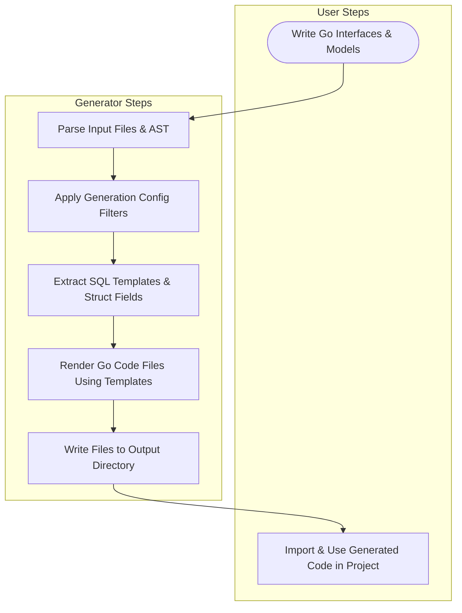

# How Code Generation Works

Discover the journey that transforms your Go interfaces and model structs into powerful, type-safe, and fluent data access APIs with GORM CLI. This guide walks you through the key steps—from writing your source code to running the GORM CLI generator, and finally, integrating the generated code into your project automation.

---

## Introduction

At the heart of GORM CLI’s workflow is a simple yet robust process that converts interface-driven SQL templates and model-driven struct definitions into ready-to-use query methods and field helpers.

### Why Understanding This Matters

Being familiar with the generation workflow empowers you to optimize your source code, customize outputs through configuration, and seamlessly embed code generation into your build or CI pipelines—maximizing productivity and ensuring type-safe database queries in your Go projects.

---

## Step 1: Writing Your Go Interfaces & Models

Your journey begins by defining abstract query interfaces and declarative model structs in Go source files:

- **Interface-Driven Queries:** Write Go interfaces where method comments include SQL templates with named placeholders. This defines the shape of your queries in a type-safe, readable manner.
- **Model Structs:** Define your data models as struct types with fields annotated for database mapping, including optional generator tags for custom field helpers.

#### Example Interface with SQL Templates
```go
// Query represents your query interface for generic type T.
type Query[T any] interface {
  // SELECT * FROM @@table WHERE id=@id
  GetByID(id int) (T, error)

  // UPDATE @@table
  // {{set}}
  //   {{if user.Name != ""}} name=@user.Name, {{end}}
  // {{end}}
  // WHERE id=@id
  UpdateInfo(user User, id int) error
}
```

#### Example Model Struct
```go
type User struct {
  ID        uint
  Name      string
  Email     string
  Age       int
  CreatedAt time.Time
}
```

***Tip:*** Use struct tags with `gen:"customTag"` to specify field helper types for custom SQL generation.

---

## Step 2: Configuring Generation (Optional)

You can customize how the generator processes your code by declaring a package-level `genconfig.Config` literal. This allows you to:

- Set the output directory per package.
- Map Go types or field tags to specialized field helper types.
- Whitelist or blacklist interfaces and structs for generation using shell-style patterns or type literals.
- Apply generation at the file or package level.

#### Sample Configuration Snippet
```go
var _ = genconfig.Config{
  OutPath: "examples/output",
  FieldTypeMap: map[any]any{
    sql.NullTime{}: field.Time{}, // map sql.NullTime to custom Time helper
  },
  FieldNameMap: map[string]any{
    "json": JSON{}, // map `gen:"json"` field to JSON helper
  },
  IncludeInterfaces: []any{"Query*"},
}
```

***Best Practice:*** Use the `IncludeInterfaces` or `ExcludeStructs` settings to focus generation only on relevant code, speeding up builds and reducing clutter.

---

## Step 3: Running the GORM CLI Generator

The core engine translates your Go source files and configuration into generated code through a two-phase process:

1. **Parsing and Filtering:**
   - Scans your input directory or file for Go interfaces and structs.
   - Applies config filters to select relevant types.
   - Extracts SQL templates and struct fields for code generation.

2. **Code Rendering:**
   - Uses text templates to generate Go files with concrete methods implementing your SQL queries.
   - Generates field helper variables and types from your structs.
   - Ensures imports and output directory structure match your project setup.

#### How to Execute the Generator
```bash
gorm gen -i ./path/to/your/interfaces -o ./generated
```

- Replace `-i` with the path to your Go interface file or directory.
- Replace `-o` with your desired output directory.

***Note:*** The generator will automatically detect any config literals declared inside your packages and respect their settings.

---

## Step 4: Consuming the Generated Code

Once generated, your new Go packages provide:

- **Type-Safe Query Interfaces:** Use generated concrete implementations of your query interfaces with context-aware methods returning your model types.

- **Field Helpers:** Access field-level helpers for building where clauses, updates, and association operations with compile-time safety.

#### Example Using Generated Query API
```go
// Fetch a user by ID
user, err := generated.Query[User](db).GetByID(ctx, 123)
if err != nil {
  // handle error
}

// Filter users by name and age
users, err := generated.Query[User](db).FilterByNameAndAge("Alice", 30).Find(ctx)
```

#### Example Using Field Helpers
```go
// Increment age and update name
err := gorm.G[User](db).
 Where(generated.User.Name.Eq("Alice")).
 Set(
   generated.User.Age.Incr(1),
   generated.User.Name.Set("Alicia"),
 ).
 Update(ctx)
```

***Pro Tip:*** Integrate code generation into your build or CI by scripting `gorm gen` commands, ensuring generated code stays up-to-date with your source.

---

## Command-Line Interface Overview

The `gorm gen` command is powered by the Cobra package, providing a flexible CLI:

- **Required Input:** `-i` or `--input` specifies Go source file or directory.
- **Optional Output:** `-o` or `--output` sets the destination directory (default `./g`).

Sample CLI usage:
```bash
gorm gen -i ./examples/query.go -o ./generated
```

Errors encountered during parsing or generation will be reported with clear messages, facilitating quick corrections.

---

## Troubleshooting Common Issues

<AccordionGroup title="Troubleshooting and Tips">
<Accordion title="No Output Files Generated">
Check that your interface and struct types are not excluded by configuration filters such as `IncludeInterfaces` or `ExcludeStructs`. Also verify that the input path is correct and files contain valid SQL template comments.
</Accordion>
<Accordion title="SQL Template Parsing Errors">
Ensure SQL template comments follow the documented DSL syntax and placeholders correspond exactly to method parameters. Mistakes in templating directives like `{{where}}`, `{{set}}`, or placeholder naming will cause generation failure.
</Accordion>
<Accordion title="Import Path or Package Issues in Generated Code">
Custom output paths or mismatched package declarations can cause import errors. Confirm the `OutPath` and package declarations are consistent and the generator can map import paths correctly.
</Accordion>
<Accordion title="Type Mapping Not Applying">
If custom type mappings don't seem to apply, check your `genconfig.Config` declaration and confirm the field types or tag names exactly match those in your structs.
</Accordion>
</AccordionGroup>

---

## Summary Diagram of the Generation Workflow


---

## Next Steps

- Dive into **[Integration with GORM](overview/integration-and-use/integration-overview)** to learn how to use generated code to extend GORM’s functionality.
- Explore **[Customizing Code Generation with Config](guides/advanced-usage/customizing-generation)** to tailor the generator to complex project requirements.
- Review **[First Code Generation Walkthrough](guides/getting-started/first-code-generation)** for a detailed step-by-step example.


---

For detailed API usage and advanced features, please see other sections such as the **Template DSL**, **Association Operations**, and **Field Helper Management** in this documentation.


---

*Empower your development by embracing type-safe, maintainable, and expressive database access via the GORM CLI generation workflow.*