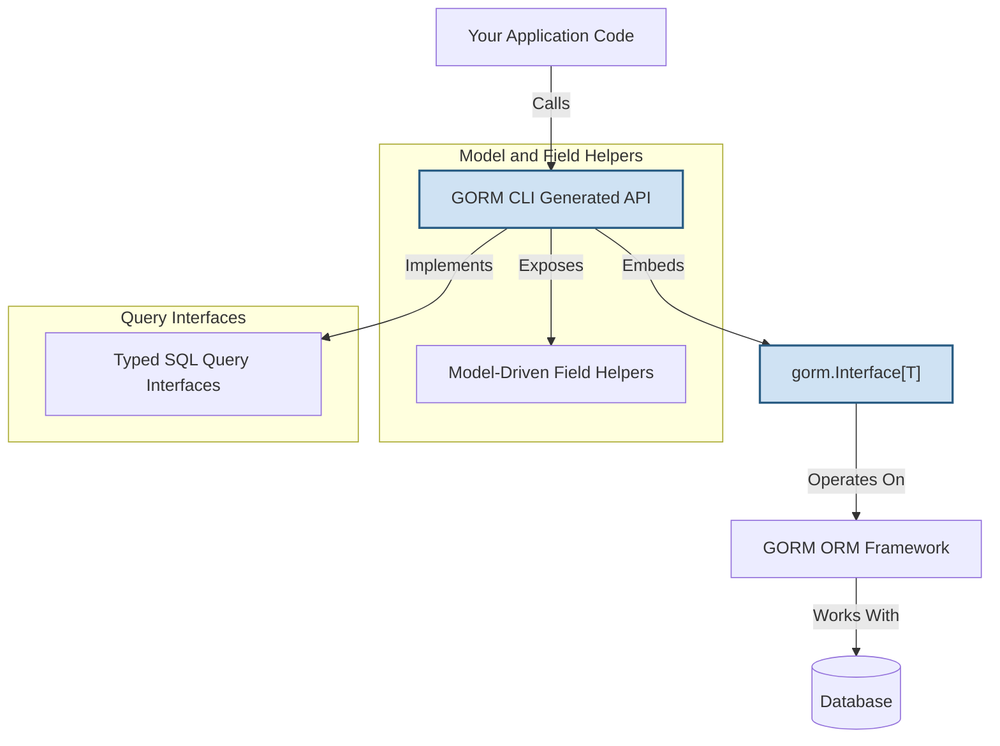

# Integration with GORM

GORM CLI-generated code is designed to seamlessly extend and complement the existing GORM ORM framework, creating a smooth developer experience for data access and manipulation. This page guides you through the typical workflows and best practices for integrating generated APIs into your GORM-based projects. We'll cover how the generated interface-driven query methods and model-driven field helpers interact with native GORM patterns to empower your data layer with type safety, discoverability, and flexibility.

---

## Why Integration Matters: Unlocking GORM CLI's Full Potential

Imagine you're building an application with complex data access needs—filtering, updating, and associating related records while maintaining type safety and clean code. GORM CLI-generated code provides exactly that by generating:

- **Typed Interfaces**: Fluent, interface-driven query methods from your annotated Go query interfaces.
- **Model-Driven Field Helpers**: Strongly typed field expressions and association operations mapped directly from your GORM model structs.

By integrating these seamlessly with GORM's native API, you achieve powerful, compile-time checked queries and updates without sacrificing the simplicity and flexibility you're accustomed to.


## How GORM CLI-Generated Code Extends GORM

At its core, GORM CLI produces generated code—Go packages containing:

- **Typed Interface Implementations:** For each interface you define with SQL templates, the generator produces an implementation struct embedding `gorm.Interface[T]` internally. This ensures you keep full access to GORM’s native chainable methods while gaining your custom query methods.

- **Field Helper Constants and Types:** For each model struct, you get a strongly typed set of field helpers such as `field.String`, `field.Number[int]`, or `field.Struct[T]`. These helpers provide convenient, expressive predicates and setters that integrate directly into GORM's `Where`, `Set`, and other methods.

This layered approach means generated code does not replace GORM—it **embeds** and **extends** it, enriching your development workflow.

## Using Generated Interfaces in Your Data Access Code

### Creating an Instance of a Generated Query Interface

Each generated interface gets a corresponding constructor function that accepts a `*gorm.DB` instance and optional clause expressions. For example:

```go
// Construct a typed query interface for User model
userQuery := generated.Query[models.User](db)
```

This returns a concrete implementation embedding a `gorm.Interface[T]` that has all native GORM methods plus your custom query methods.

### Calling Generated Query Methods

You can call your typed query methods directly, with context automatically injected if missing:

```go
ctx := context.Background()
user, err := userQuery.GetByID(ctx, 123)
```

Under the hood, these methods translate your SQL templates into parameterized queries, then execute through GORM's raw or chained execution paths.

### Combining Generated Queries with Native GORM Chaining

Because the generated interface embeds native GORM methods, you can chain calls for filtering, ordering, and eager loading in familiar ways:

```go
activeUsers, err := userQuery.Where(generated.User.Status.Eq("active")).Order(generated.User.CreatedAt.Desc()).Find(ctx)
```

This composition blends type-safe field helpers with flexible GORM clauses.


## Leveraging Generated Model-Driven Field Helpers

The generated field helpers give you compact, strongly typed accessors and operations for filtering, updating, and association management.

### Example: Filtering with Field Helpers

```go
// Find users older than 18
adultUsers, err := gorm.G[models.User](db).
  Where(generated.User.Age.Gt(18)).
  Find(ctx)
```

### Example: Updates with Set Helpers

```go
gorientedDb := gorm.G[models.User](db)
err := orientedDb.
  Where(generated.User.ID.Eq(1)).
  Set(
    generated.User.Name.Set("alice"),
    generated.User.IsActive.Set(true),
  ).
  Update(ctx)
```

### Association Operations

Association helpers model your relationships (has many, belongs to, many2many) as nested field helpers:

- `generated.User.Pets` as `field.Slice[Pet]`
- `generated.Order.Customer` as `field.Struct[Customer]`

You can perform create, update, unlink, or delete operations on associations directly through these helpers:

```go
gorientedDb.
  Where(generated.User.ID.Eq(1)).
  Set(
    generated.User.Pets.Create(generated.Pet.Name.Set("fido")),
  ).
  Update(ctx)
```


## Code Example: Using Generated APIs in a Workflow

This example demonstrates building a data access flow combining generated query methods and field helpers within GORM’s fluent API:

```go
func GetActiveAdultUsersWithPets(ctx context.Context, db *gorm.DB) ([]models.User, error) {
  userQuery := generated.Query[models.User](db)

  // Use generated query method
  users, err := userQuery.FilterByNameAndAge(ctx, "", 18).Find(ctx)
  if err != nil {
    return nil, err
  }

  // Further filter with generated field helpers
  var filtered []models.User
  err = db.
    Where(generated.User.IsActive.Eq(true)).
    Where(generated.User.Age.Gt(18)).
    Preload("Pets").
    Find(&filtered).Error
  if err != nil {
    return nil, err
  }

  return filtered, nil
}
```

This approach leverages the best of both worlds — interface-defined queries alongside GORM’s flexible model querying.


## Best Practices for Integration

- **Always initialize generated interfaces passing the current `*gorm.DB` instance** to maintain transaction and context propagation.

- **Use generated field helpers for filters and updates instead of raw strings** to gain compile-time safety and IDE autocompletion.

- **Combine generated query methods with GORM chain methods** to customize SQL clauses while keeping type safety.

- **Employ association helpers for related model operations** instead of manual joins or nested queries for clarity and correctness.

- **Review and customize `genconfig.Config` to control inclusion/exclusion of interfaces and structs** to keep generated code tailored to your project scope.


## Common Integration Pitfalls & Troubleshooting

<AccordionGroup title="Common Issues When Integrating GORM CLI-Generated Code">
<Accordion title="Generated Methods Not Found or Unavailable">
Ensure you run the code generation step correctly with the `-input` flag targeting the interfaces file, and `-output` points to an importable package in your project. Missing interfaces or incomplete generation will cause missing methods.

To verify, check the generated Go files for your interface implementations.
</Accordion>
<Accordion title="Type Conflicts or Field Helper Mismatches">
If you receive type errors regarding field helpers, confirm your `genconfig.Config` properly maps custom Go types (e.g. `sql.NullTime`) to the appropriate field helpers.

Also, confirm your model struct field tags for `gen` are consistent.
</Accordion>
<Accordion title="Context Missing in Method Calls">
Generated methods automatically add a `context.Context` parameter if missing in your interface signatures. Always use contexts in your calls and pass them explicitly when chaining native GORM methods.
</Accordion>
<Accordion title="Association Operations Not Reflecting in Database">
Verify your association configurations in models are correct with proper GORM tags.

Use the generated association helpers as intended and check if your `Update(ctx)` or `Create(ctx)` calls complete successfully.
</Accordion>
</AccordionGroup>


## Visual Overview of Integration Flow




## Next Steps

- Explore the [How Code Generation Works](../generation-workflow) page to deepen your understanding of the generation mechanism behind this integration.

- See [Working with Model-Driven Field Helpers](../../guides/core-workflows/model-field-helpers) for hands-on examples and best practices.

- Review [Managing Associations and Relationships](../../guides/core-workflows/association-operations) to gain mastery over complex association manipulations.

- For configuration and customization details to tailor generated code and integration, visit [Customizing Code Generation with Config](../../guides/advanced-usage/customizing-generation).


---

By mastering integration with GORM, you unlock the full power of GORM CLI: type-safe, expressive, and maintainable data access that fits naturally into your existing workflows and tooling.


---

For more comprehensive usage examples and troubleshooting, consider exploring:
- [What is GORM CLI?](../intro-and-value/product-overview)
- [Feature Highlights](../../architecture-and-concepts/quick-feature-overview)
- [Interface-Driven Query Generation](../../concepts/data-models-apis/interface-concepts)
- [Model-Driven Field Helpers](../../concepts/data-models-apis/model-concepts)