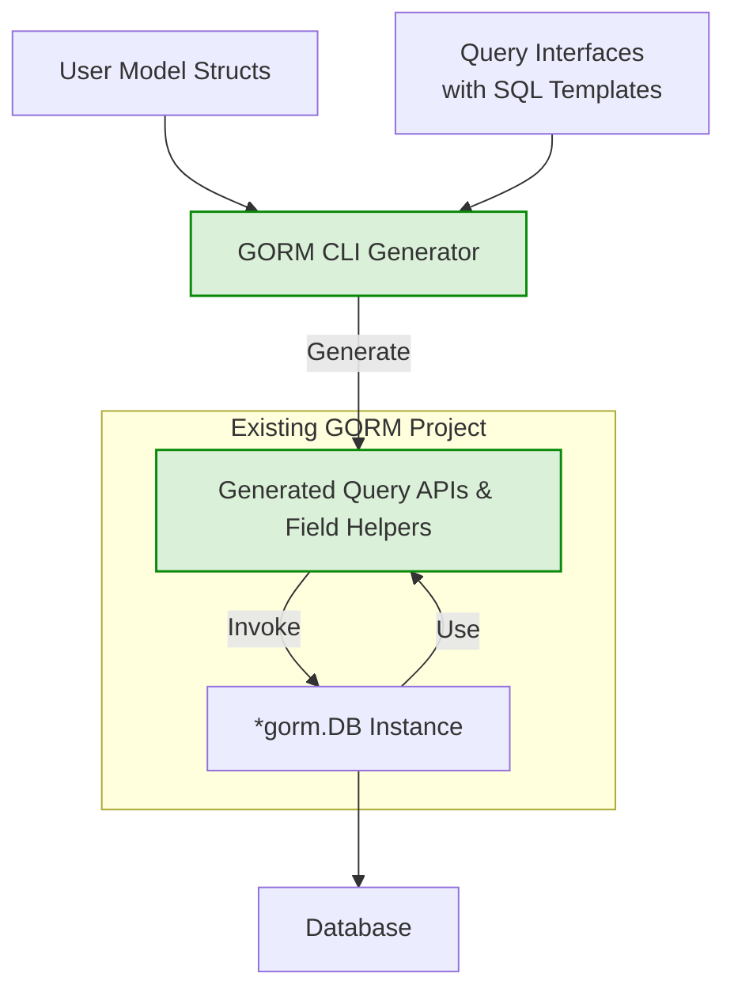

# Integration with GORM

Seamlessly integrate the powerful, generated code from GORM CLI into your existing GORM projects. This page explains how the generated APIs and field helpers connect to native GORM constructs, empowering you with type-safe query methods and model-driven helpers without changing your workflow.

---

## Why Integration Matters

As a user of GORM, your priority is to work efficiently with type-safe, clear, and maintainable database operations. GORM CLI generates statically typed, interface-driven query APIs and model-based field helpers that plug directly into GORM’s API surface. This lets you write database code with enhanced safety and clarity while fully leveraging GORM’s mature features.

In other words, the generated code *does not replace* GORM—it *extends* it to make your data access layer safer and easier to author and maintain.

---

## How the Generated Code Fits into GORM

### 1. Fluent, Type-Safe Query APIs from Interfaces

You write Go interfaces annotated with SQL templates describing your queries. GORM CLI generates implementations of these interfaces bound to your GORM `*gorm.DB` instances.

- Generated query interfaces wrap a `*gorm.DB` and add custom methods
- You work with generic, type-safe methods like `GetByID(ctx, id)`
- All queries operate on your model structs, so you get compile-time type checks

Example usage:
```go
u, err := generated.Query[User](db).GetByID(ctx, 123)
if err != nil {
    // handle error
}
fmt.Println("Found user:", u.Name)
```

This approach removes guesswork and error-prone manual query building, giving you discoverable, readable APIs.

### 2. Model-Driven Field Helpers

GORM CLI generates a companion set of *field helpers* for each model struct. These help you express filters, updates, sort orders, and association operations with static typing and code completion.

For example, `generated.User.Name` is a strongly typed helper for the `name` column, enabling predicates like `.Eq(...)` or `.Like(...)`. Similarly, associations like `Pets` or `Languages` get rich helpers for creating, updating, unlinking, or batch creating related records.

Example — filtering users where age is greater than 18:
```go
db.Where(generated.User.Age.Gt(18)).Find(ctx)
```

Example — creating a user with a pet and linking languages:
```go
err := gorm.G[User](db).
  Set(
    generated.User.Name.Set("alice"),
    generated.User.Pets.Create(generated.Pet.Name.Set("fido")),
    generated.User.Languages.CreateInBatch([]models.Language{{Code: "EN"}, {Code: "FR"}}),
  ).
  Create(ctx)
```

These helpers integrate seamlessly with `*gorm.DB` chains, reducing boilerplate and runtime errors.

### 3. Convention and Output Structure

- Generated code is organized under the output directory you specify via `genconfig.Config.OutPath`.
- Model field helpers are generated per struct, exposing typed columns and associations.
- Query implementations are generated for all included interfaces filtered by config patterns.

Because code is generated into your Go packages, you import and use them like any other Go module without friction.

---

## User Flow: From Your Model to Database Calls

1. **Define your models and interfaces:**
   - Declare your GORM model structs with standard tags.
   - Write query interfaces embedding SQL templates.

2. **Configure and run the generator:**
   - Optionally define `genconfig.Config` to control output paths and type mappings.
   - Run `gorm gen` to produce query APIs and field helpers.

3. **Use generated code alongside GORM:**
   - Import generated packages.
   - Call strongly typed query methods via the generated interfaces.
   - Use field helpers in GORM queries and updates.

4. **Turn your intents into safe, verified SQL:**
   - The generator emits code that respects your SQL templates with bound parameters.
   - Association helpers allow batch operations with compile-time checking.

### Practical Example (Query and Filter)
```go
// Use generated query API
queryAPI := generated.Query[models.User](db)
user, err := queryAPI.GetByID(ctx, 123)
if err != nil {
    // handle error
}

// Use generated field helpers to query
var activeUsers []models.User
err = db.Where(generated.User.Role.Eq("active")).Find(ctx, &activeUsers)
```

---

## Best Practices for Integration

- **Use generics and interfaces consistently:** Always call generated query implementations via `generated.Query[T](db)` where `T` is your model.
- **Leverage field helpers for clarity:** Avoid embedding raw SQL strings when you can use generated helpers for columns and associations.
- **Keep model definitions GORM idiomatic:** The generator works best when models are defined per GORM conventions.
- **Define interfaces close to models:** This encourages coherent code generation and reduces configuration complexity.

> Tip: Consider enabling `FieldNameMap` and `FieldTypeMap` in your `genconfig.Config` to customize how fields like JSON or timestamps are handled in the generated helpers.

---

## Troubleshooting Common Integration Scenarios

<AccordionGroup title="Troubleshooting Integration">
<Accordion title="Generated Query Methods Not Found or Not Recognized">
Ensure your `genconfig.Config` includes the interface patterns correctly under `IncludeInterfaces`. Run the generator fresh and check your import paths.
</Accordion>
<Accordion title="Field Helpers Not Matching My Model Fields">
Verify that your model struct tags and the config mapping for custom field types (like `json` or `date`) are consistent. Regenerate after any model changes.
</Accordion>
<Accordion title="Association Helpers Not Working as Expected">
Confirm association tags in your model structs match GORM conventions (`has many`, `many2many`), as generated helpers depend on these.
</Accordion>
<Accordion title="SQL Templates Do Not Bind Parameters Correctly">
Check your interface method comments follow the supported template DSL, and your parameters correspond by name and type.
</Accordion>
</AccordionGroup>

---

## Visual Overview of Integration



This diagram maps the flow from your base models and interfaces through generation, resulting in typed APIs that consume and extend your existing GORM `*gorm.DB` usage.

---

## Next Steps

- Review [Quickstart Workflow](https://yourdocs/overview/integration-getting-started/quickstart-workflow) to see how to define interfaces and models.
- Explore [Using Model-Driven Field Helpers](https://yourdocs/guides/core-workflows/field-helpers) for advanced usage.
- For integration best practices and troubleshooting, consult [Integration & Best Practices](https://yourdocs/guides/advanced-patterns/integration-and-best-practices).


---

By leveraging GORM CLI’s generated code as an extension of your existing GORM usage, you unlock safer, clearer, and more maintainable database operations tailored to your Go applications.

Happy coding!
