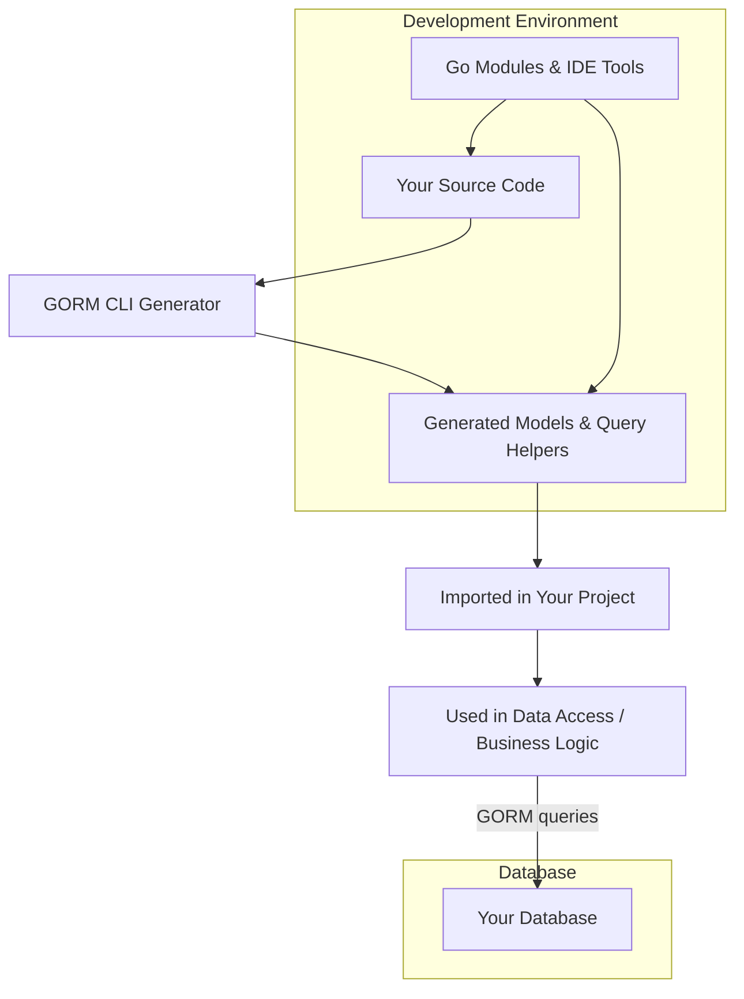

# Integration with GORM & Other Systems

Seamlessly integrate the powerful GORM CLI-generated code into your standard GORM projects. This section guides you through the essentials of incorporating GORM CLI helpers and APIs alongside your existing application code, understanding Go modules support, working with diverse field types, and configuring generation to suit your needs.

---

## Why Integration Matters

GORM CLI is designed to enhance your development workflow without disrupting your existing GORM-based application structure. By integrating smoothly, it ensures that generated query APIs and field helpers coexist with your handwritten code, empowering you with compile-time safety and fluent querying capabilities without complex migration or boilerplate duplication.

Imagine you have an established GORM project with models and database schemas already defined. GORM CLI plugs into this familiar landscape and supercharges your codebase by auto-generating type-safe query interfaces and helpers that feel native to GORM, dramatically reducing runtime errors and improving development efficiency.

---

## Getting Started with Integration

### 1. Setup Your Project with Go Modules

GORM CLI fully supports projects structured with Go modules. Your project should already have a valid `go.mod` file referencing `gorm.io/gorm` and other dependencies. GORM CLI-generated code will integrate as a normal Go package under your module, so typical Go tooling (imports, vendoring, versioning) works seamlessly.

### 2. Organizing Your Source

Place your GORM models and your query interfaces in the same or related packages. When you invoke the generator (`gorm gen -i ./examples -o ./generated`), it will produce generated code into the designated output directory (e.g., `./generated`).

This output directory will contain:

- Strongly typed, model-driven field helpers
- Interface implementations with SQL templates

You import and use these generated packages just like any other Go package in your project.

### 3. Using Generated Helpers and APIs Alongside Your Code

Your handwritten models remain untouched and fully compatible with GORM. The generated code complements them by:

- Providing typesafe field helpers you can use in `Where` clauses, `Set` updates, and associations
- Offering interface-driven query methods that wrap underlying GORM calls with fluent APIs

This coexistence allows you to gradually adopt generated helpers anywhere in your project without breaking your existing data access logic.

### Example: Using Generated APIs Next to Your Model

```go
import (
  "gorm.io/gorm"
  "your_project/generated"
  "your_project/models"
  "context"
)

func FetchAdultUsers(db *gorm.DB, ctx context.Context) ([]models.User, error) {
  // Use generated field helpers and GORM CLI interfaces
  return gorm.G[models.User](db).
    Where(generated.User.IsAdult.Eq(true)).
    Find(ctx)
}

func UpdateUserName(db *gorm.DB, ctx context.Context, id uint, newName string) error {
  return generated.Query[models.User](db).
    UpdateInfo(ctx, models.User{Name: newName}, int(id))
}
```

This approach promotes clarity and compile-time checks, reducing likelihood of common SQL errors.

---

## Support for Diverse Field Types

GORM CLI generates field helpers adapted to the types declared in your GORM models, accommodating the full breadth of Go’s native and SQL-compatible types.

### Basic Fields Supported

- Primitive types: `int`, `string`, `bool`, `float64`, etc.
- Time types: `time.Time`, `sql.NullTime`
- Nullable types: `sql.NullInt64`, `sql.NullString`
- Custom types implementing GORM's `Scanner` and `Valuer` interfaces

### Associations and Polymorphic Relations

Associations defined via GORM tags (`has one`, `has many`, `belongs to`, `many2many`, and polymorphic relations) are recognized and generate corresponding powerful helpers to easily manipulate related data.

### Example of Generated Field Struct for User Model

```go
var User = struct {
  ID        field.Number[uint]
  Name      field.String
  Age       field.Number[int]
  Pets      field.Slice[models.Pet]
  Languages field.Slice[models.Language]
  Profile   examples.JSON
}{ /* field mappings omitted for brevity */ }
```

This enables you to write clear, fluent queries, e.g.,

```go
gorm.G[models.User](db).
  Where(generated.User.Name.Like("%adin%"),
        generated.User.Age.Between(18, 65)).
  Find(ctx)
```

---

## Configuration-Driven Customizations

GORM CLI allows you to customize code generation through a configuration struct `genconfig.Config`. This package-level configuration influences:

- Output directory and file organization (`OutPath`)
- Field name and type mappings (`FieldNameMap`, `FieldTypeMap`)
- Inclusion/exclusion filters for interfaces and structs
- File-level generation control

### Example: Mapping JSON Fields for Custom SQL

For fields that store JSON data, you can customize generation to use specialized JSON helpers that generate dialect-aware SQL expressions.

```go
var _ = genconfig.Config{
  OutPath: "examples/output",
  FieldNameMap: map[string]any{
    "json": JSON{}, // Map fields tagged with `gen:"json"` to a JSON helper
  },
}
```

This lets your code support database-specific JSON querying seamlessly.

### Practical Use Case

In your model:

```go
type User struct {
  // ...
  Profile string `gen:"json"`
}
```

And you can write queries like:

```go
gorm.G[models.User](db).
  Where(generated.User.Profile.Equal("$.vip", true)).
  Take(ctx)
```

GORM CLI generates the appropriate SQL for MySQL, SQLite, and PostgreSQL behind the scenes.

---

## Best Practices for Integration

- **Start incrementally:** Integrate generated code gradually alongside existing data access code to ensure smooth migration.
- **Use Go modules:** Keep dependencies clean and avoid version conflicts.
- **Leverage configuration:** Customize generation for your domain-specific types and naming conventions.
- **Test your integration:** Use provided test helpers and examples (e.g., in-memory SQLite or MySQL setups) to validate generated code behavior.

---

## Troubleshooting Common Issues

<AccordionGroup title="Common Integration Challenges">
<Accordion title="Generated Code Not Recognized by IDE or Build">
Ensure your `go.mod` and module paths correctly reference the generated code directory. Run `go mod tidy` and reload your IDE.
</Accordion>
<Accordion title="Type Conflicts Between Generated and Handwritten Models">
Verify that the package import paths are correct and consistent. Avoid duplicate type declarations in multiple packages.
</Accordion>
<Accordion title="Issues With Custom Field Types">
Confirm your configuration mappings in `genconfig.Config` correctly map Go custom types to corresponding field helpers.
</Accordion>
</AccordionGroup>

---

## Summary

Integrating GORM CLI with your existing GORM projects unlocks powerful, type-safe query and data manipulation capabilities while preserving your existing codebase integrity. Support for standard Go modules, comprehensive field type handling, and flexible configuration make the experience smooth and adaptable to varied project needs.

By adopting this integration approach, your team will benefit from stronger compile-time guarantees, improved code discoverability, and easier maintenance.

---

## Next Steps

- Review [Writing Your First Models and Query Interfaces](/getting-started/first-steps-usage/writing-models-interfaces)
- Learn how to [Generate Code with GORM CLI](/getting-started/first-steps-usage/generating-code)
- Explore [Using the Generated APIs in Your Project](/getting-started/first-steps-usage/using-generated-apis)
- For advanced customization, see [Tailoring Code Generation with genconfig.Config](/guides/advanced-patterns/configuring-generation)

---

## Visual Overview of Integration Flow



This simple diagram illustrates how your existing code and databases interact with the GORM CLI generator outputs in your development cycle.

---

For detailed examples and source code on integration, see the `examples/` directory in the repository, including in-memory SQLite and MySQL configuration examples, test helpers, and usage patterns.


---