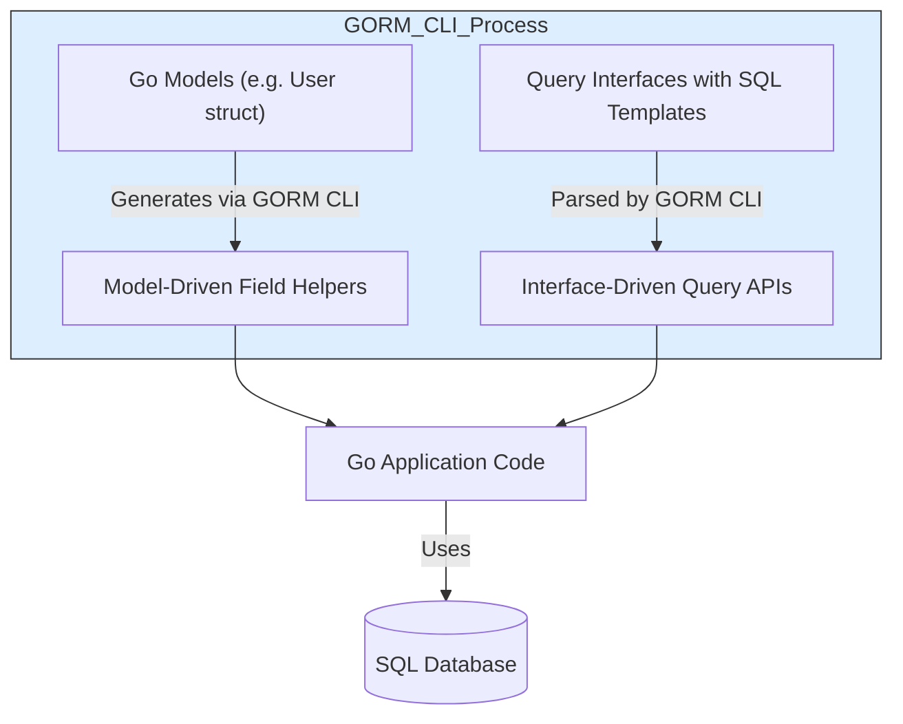

# What is GORM CLI?

## Unlock Powerful, Type-Safe Code Generation for Your Go Applications

GORM CLI is an advanced code generation tool explicitly designed for Go developers leveraging the GORM ORM framework. It creates _type-safe, interface-driven query APIs_ alongside _model-driven field helpers_ that transform how you write queries and manipulate data. By automating the creation of efficient, compile-time checked APIs, GORM CLI liberates you from tedious boilerplate code and reduces runtime errors—making your data access layer both modern and dependable.

### Why It Matters

- **Eliminates boilerplate:** Stops you from manually writing repetitive query code
- **Enforces compile-time safety:** Finds mistakes early, before your code runs
- **Provides discoverable APIs:** Makes working with your data more intuitive and fluent
- **Accelerates development:** Focus on business logic instead of plumbing

### Who This Is For

GORM CLI is ideal for Go developers building applications on GORM who want robust, maintainable, and performant data access layers with less manual effort.

---

## Core Purpose of GORM CLI

At its heart, GORM CLI generates two complementary and interconnected pieces of code from your existing Go source files:

1. **Interface-Driven Query APIs**
    
   Write Go interfaces with SQL templates in method comments; GORM CLI generates concrete implementations with full type safety and parameter binding.

2. **Model-Driven Field Helpers**

   From your Go model structs, it creates typed field helpers representing columns and associations, which you use to build elegant, compiler-verified query predicates and update setters.

Together, these empower you to write queries and perform data manipulations in an expressive, fluent way that the Go compiler can check for correctness.

### What Problem Does It Solve?

Typical ORM usage often involves writing raw SQL strings with embedded literals or crafting repetitive query boilerplate, leaving room for subtle bugs and reducing maintainability. GORM CLI:

- Bridges your Go code and SQL through templated interfaces
- Generates strongly typed, reusable query and update methods
- Provides fields and helper types that mirror your schema, including associations between entities
- Keeps queries concise, discoverable, and resistant to errors

This results in safer, cleaner, and more productive database interactions.

---

## Key Features & Capabilities

### 1. Interface-Driven Query API Generation

Define Go interfaces like `Query[T any]` with embedded SQL templates in method comments. GORM CLI parses these interfaces and produces implementations:

- Automatic query generation with parameter substitution
- Compile-time validation of method signatures and results
- Support for complex SQL templating constructs like conditional `{{where}}` and iterative `{{for}}` blocks

#### Example

```go
// Query interface
// SELECT * FROM @@table WHERE id=@id
GetByID(id int) (T, error)
```

Produces a strongly-typed `GetByID` method querying by ID.

### 2. Model-Driven Field Helper Generation

Given your GORM models, GORM CLI produces typed field helpers to represent basic fields and associations such as has-one, has-many, belongs-to, many-to-many, and polymorphic relationships.

- Fields such as numbers, strings, times have associated predicate builders like `.Eq()`, `.Like()`, `.Between()`
- Associations generate methods for Create, Update, Unlink, Delete, and batch operations with compile-time type checks
- Works with nullable and custom JSON fields, supporting advanced SQL constructs

#### Example snippet from generated code:

```go
var User = struct {
  ID field.Number[uint]
  Name field.String
  Pets field.Slice[models.Pet]
  Company field.Struct[models.Company]
  // ...
}{
  ID: field.Number[uint]{}.WithColumn("id"),
  Name: field.String{}.WithColumn("name"),
  Pets: field.Slice[models.Pet]{}.WithName("Pets"),
  Company: field.Struct[models.Company]{}.WithName("Company"),
}
```

### 3. Compile-Time Safety and Discoverability

By generating type-safe APIs:

- Queries accept only valid parameters matching your models
- Return values are strongly typed, reducing runtime errors
- Fluent builder pattern improves discoverability when chaining conditions and updates

### 4. Configurable and Extensible Generation

Via `genconfig.Config`, you can customize:

- Output paths
- Inclusion/exclusion filters for interfaces and structs
- Custom mapping of Go types to field helpers
- Support for special field tags (e.g., JSON with custom SQL behavior)

---

## Real-World User Flow Example

### Scenario:
You want to fetch a user by ID and update their pets' names smoothly.

1. Define your User model normally in Go.
2. Create a query interface with method signatures and SQL templates.
3. Run GORM CLI to generate queries and field helpers.
4. Call generated APIs:

```go
user, err := generated.Query[models.User](db).GetByID(ctx, 123)

err = gorm.G[models.User](db).
  Where(generated.User.ID.Eq(123)).
  Set(
    generated.User.Pets.Where(generated.Pet.Name.Eq("fido")).Update(generated.Pet.Name.Set("rex")),
  ).
  Update(ctx)
```

This is simpler, safer, and more maintainable than manual SQL string concatenation.

---

## Practical Tips & Common Pitfalls

- **Always define your query interfaces with clear SQL templates.** Placeholders like `@@table` and `@param` enable automatic parameter binding.
- **Annotate model fields with tags only when customization is needed.** For example, use `gen:"json"` tag to engage JSON helpers.
- **Use association helpers consistently** to maintain referential integrity in create/update operations.
- **Watch for zero-value semantics** in updates; GORM CLI handles zero values explicitly in the generated code.
- **When extending, configure your generation via `genconfig.Config`** to avoid generating unwanted code.

---

## Understanding the Generated Files

Generated code includes:

- Struct variables representing database columns and associations (e.g., `User`, `Account`, `Pet`).
- Interface implementations for your query interfaces (e.g., `Query[T]`).
- Methods for filtered queries, updates, batch operations, and association management.

All code is marked with a generation hint comment:

```go
// Code generated by 'gorm.io/cli/gorm'. DO NOT EDIT.
```

---

## Next Steps: Getting Started with GORM CLI

- Write your models and query interfaces in Go
- Customize your configuration optionally via `genconfig.Config`
- Run the CLI command `gorm gen -i <input-dir> -o <output-dir>`
- Import and use the generated APIs directly in your application

Explore other docs:
- [Basic Configuration and First Generation](/getting-started/first-steps/your-first-generation)
- [Working with Associations](/guides/real-world-patterns/working-with-associations)

---

## Summary
GORM CLI transforms your GORM project by auto-generating type-safe, fluent query and data manipulation APIs that dramatically improve developer productivity, code safety, and maintainability. It bridges the gap between Go models, SQL templating, and GORM's power, empowering you to write clean, expressive, and compile-time verified database code.


---

## Additional Resources
- [GORM CLI README](https://github.com/go-gorm/cli/blob/main/README.md)
- [Template DSL Reference](https://github.com/go-gorm/cli#template-dsl)
- [Examples Directory](https://github.com/go-gorm/cli/tree/main/examples)
- [Configuring Code Generation](https://github.com/go-gorm/cli/blob/main/examples/filters/pattern/config.go)


---

<Accordion title="Example Generated Field Helper Structure">
```go
var User = struct {
  ID        field.Number[uint]
  Name      field.String
  Age       field.Number[int]
  Pets      field.Slice[models.Pet]
  Company   field.Struct[models.Company]
  // ... more fields
}{
  ID:   field.Number[uint]{}.WithColumn("id"),
  Name: field.String{}.WithColumn("name"),
  Age:  field.Number[int]{}.WithColumn("age"),
  Pets: field.Slice[models.Pet]{}.WithName("Pets"),
  Company: field.Struct[models.Company]{}.WithName("Company"),
}
```
</Accordion>

<Accordion title="Example Query Interface Method with Template">
```go
type Query[T any] interface {
  // SELECT * FROM @@table WHERE id=@id
  GetByID(id int) (T, error)
}
```
</Accordion>


---

## Mermaid.js Diagram



