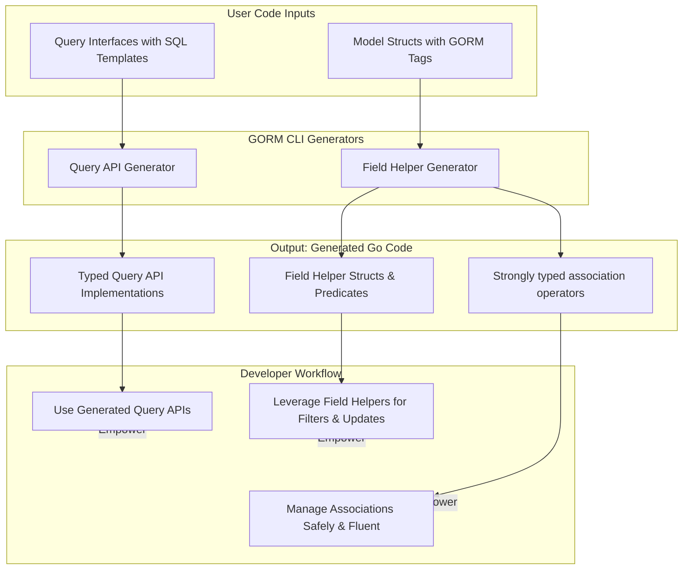

# Key Features & Value Proposition

Discover how GORM CLI transforms your GORM project with its powerful code generation capabilities. This page explores the core features of GORM CLI—focusing on interface-driven query APIs and model-derived field helpers—highlighting how their combination delivers safer, more productive, and more discoverable interactions with your data.

---

## Unlocking Safer and Fluent Access to Your Database

GORM CLI generates two tightly integrated components from your existing Go code:

- **Interface-driven, type-safe query APIs** generated from Go interfaces annotated with SQL templates.
- **Model-driven field helpers** created from your struct models, providing strongly-typed filters, setters, and association helpers.

Together, these generators eliminate typical pitfalls in query construction by enforcing compile-time safety and providing intuitive APIs that are easy to explore and extend.

### Why You Should Care

- **Compile-time Safety:** Catch query and update errors early, before runtime, ensuring your code’s correctness and stability.
- **Fluent, Discoverable APIs:** Method names and field helpers are intuitive, reducing guesswork and boosting developer efficiency.
- **Seamless Integration:** Works naturally with GORM’s core APIs, preserving your existing workflows.

Beyond just generating code, GORM CLI creates a unified experience that empowers developers to build robust, maintainable data layers faster and with more confidence.

---

## Core Features and How They Work

### 1. Interface-Driven Query APIs

Define Go interfaces with embedded SQL templates in method comments to describe your queries. GORM CLI reads those interfaces and generates concrete, type-safe implementations.

- **Flexible SQL Templates:** Use placeholder directives like `@@table`, `@@column`, and parameter bindings `@param` for dynamic, safe SQL.
- **Conditional Clauses:** Write optional filters and dynamic query logic directly inside comments using `{{where}}`, `{{set}}`, and conditionals like `{{if}}`.
- **Automatic Context Injection:** If missing, `context.Context` is automatically added to your method signatures for better lifecycle management.

Example interface snippet:

```go
// Query interface example
// SELECT * FROM @@table WHERE id=@id
GetByID(id int) (T, error)

// UPDATE @@table
// {{set}}
//   {{if user.Name != ""}} name=@user.Name, {{end}}
//   {{if user.Age > 0}} age=@user.Age, {{end}}
// {{end}}
// WHERE id=@id
UpdateUser(user User, id int) error
```

### 2. Model-Derived Field Helpers

From your GORM model structs, GORM CLI generates field helpers that form the building blocks for filters, updates, ordering, and associations in a type-safe manner.

- **Basic Field Helpers:** For fields like integers, strings, booleans, time, and even custom types implementing Scanner or Valuer, helpers produce predicates (`Eq`, `Like`, `Between`, `IsNull`, etc.) and setters (`Set`, `Incr`, `SetExpr`).
- **Association Helpers:** Handles relationships (has one, has many, belongs to, many-to-many, including polymorphic) with helpers for creating, updating, unlinking, deleting, and batch operations all with compile-time checks.

Example predicate usages:

```go
generated.User.Age.Between(18, 65)         // Generate SQL: age BETWEEN 18 AND 65
generated.User.Name.Like("%jinzhu%")    // name LIKE '%jinzhu%'
generated.User.Score.IsNull()              // score IS NULL
```

Example update with zero values and expressions:

```go
gorm.G[User](db).
  Where(generated.User.Name.Eq("alice")).
  Set(
    generated.User.Name.Set("jinzhu"),
    generated.User.IsAdult.Set(false),
    generated.User.Score.Set(sql.NullInt64{}),
    generated.User.Age.Incr(1),
    generated.User.Age.SetExpr(clause.Expr{SQL: "GREATEST(?, ?)", Vars: []any{clause.Column{Name: "age"}, 18}}),
  ).
  Update(ctx)
```

### 3. Rich Association Operation Support

GORM CLI brings full lifecycle management for associations with methods that let you:

- **Create** and link related records in parent-child relationships.
- **Update** associated data with condition filtering.
- **Unlink** associations cleanly without deleting the child records.
- **Delete** associated rows or join table entries.
- **Batch-create** and link multiple associated records efficiently.

Example: Creating a user with pets and languages linked

```go
gorm.G[User](db).
  Set(
    generated.User.Name.Set("polyglot"),
    generated.User.Pets.Create(generated.Pet.Name.Set("fido")),
    generated.User.Languages.CreateInBatch([]models.Language{{Code: "EN"}, {Code: "FR"}}),
  ).
  Create(ctx)
```

Each association type behaves as expected:

- **Belongs To:** Unlink clears foreign key, Delete removes rows.
- **Has One / Has Many:** Unlink nullifies foreign key on children, Delete removes children.
- **Many-to-Many:** Unlink/Delete remove join rows only, preserving related entities.

---

## The Combined Advantage: Safer, Faster, and More Discoverable APIs

### What Outcomes Can Developers Expect?

- **Reduced Runtime Errors:** Type-safety and generated code prevent common mistakes like mismatched parameters or invalid SQL snippets.
- **Improved Productivity:** Fluent APIs and auto-generated helpers make constructing queries and updates faster and less error-prone.
- **Better Code Maintainability:** Centralized template and model-driven generation means your data API evolves with your schema and interface definitions.

### Real-World Use Cases

- Building large GORM projects with complex queries that benefit from type checking and discoverability.
- Managing intricate model relationships requiring safe, precise association operations.
- Providing a clear, maintainable codebase by codifying query patterns and field helpers.

### Before & After Adopting GORM CLI

| Aspect             | Without GORM CLI                     | With GORM CLI                         |
|--------------------|-----------------------------------|-------------------------------------|
| Query Construction | Manual SQL string concatenation, prone to typos and injection | Compile-time checked methods with SQL templates and typing |
| Filtering Logic    | Error-prone hand-crafted filters  | Generated, intuitive predicates and composable clauses |
| Association Handling| Manual FK management and join tables| Built-in helpers with safe unlinking, updates, and batch creates |

---

## Getting Started Preview

### Quick Start

1. **Define Your Query Interfaces and Models**
   Place Go interfaces with embedded SQL template comments alongside your GORM models.

2. **Run the Code Generator**
   Use `gorm gen -i ./yourpkg -o ./generated` to generate the typed APIs and helpers.

3. **Use Generated APIs in Your App**
   Build queries with fluent, type-safe methods.

```go
user, err := generated.Query[User](db).GetByID(ctx, 123)
users, err := gorm.G[User](db).Where(generated.User.Age.Gt(18)).Find(ctx)
```

### Prerequisites

- Go 1.18 or higher, enabling generics support.
- A GORM project with your models and query interfaces defined.

### Next Steps

Explore the following to deepen your mastery:

- [Prepare Your Project](../getting-started/first-usage-configuration/project-structure) for setup conventions.
- [Run Generator](../getting-started/first-usage-configuration/run-generator) for detailed instructions.
- [Use Generated APIs](../getting-started/first-usage-configuration/using-generated-code) for practical application.

---

## Summary Diagram: How GORM CLI Components Interact



---

Embracing GORM CLI unlocks a new level of productivity and robustness in GORM projects by bridging the gap between model definitions and query execution with type-safe, expressive, and maintainable code generation.

---

<Check>
GORM CLI's key features combine to:
- Ensure compile-time safety of queries and updates
- Provide rich, generated field helpers for fine-grained control
- Simplify complex association operations
- Enhance developer experience through fluent, discoverable APIs
</Check>

---