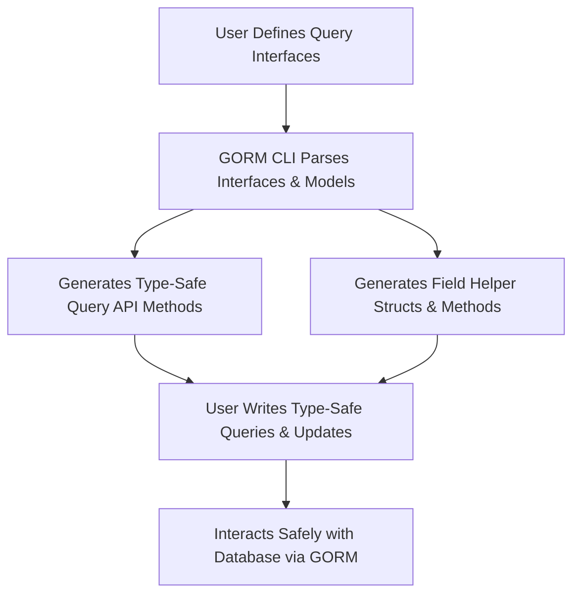

# Core Concepts & Terminology

GORM CLI powers your Go database development with a sophisticated, yet approachable set of concepts designed to reduce boilerplate, enhance type safety, and streamline your interaction with GORM. This page unpacks the fundamental ideas behind GORM CLI and explains how each enables you to write faster, safer, and cleaner data access code.

---

## Interface‑Driven Query APIs

### What It Is
GORM CLI allows you to define your database queries declaratively using Go interfaces annotated with SQL templates. These interfaces act like blueprints for query operations, describing *what* data you want and *how* to filter or update it — without writing repetitive boilerplate code.

### Why You Need It
- **Type safety with generics:** Compile-time guarantees prevent bugs caused by mismatched fields or wrong data types.
- **Declarative query design:** You write descriptive methods with embedded SQL templates, which the tool generates into concrete, ready-to-use implementations.
- **Expressive yet concise:** Embed conditional logic, dynamic columns, and flexible filters inside method comments to cover complex queries clearly.

### Core Principles
- Methods in interfaces include SQL written with `@@table`, `@@column`, and parameter markers like `@param`.
- SQL templating directives (`{{where}}`, `{{set}}`, `{{if}}`, `{{for}}`) let you encode dynamic behavior within static methods.
- GORM CLI generates functions that take Go types as arguments and return strongly typed results.

### Example
```go
// SELECT * FROM @@table WHERE id=@id
GetByID(id int) (T, error)
```
This simple interface method lets you fetch a record by ID using a type-safe generated function.

---

## Field Helpers

### What Are Field Helpers?
Field helpers are generated structs and methods that model your database columns and associations explicitly in Go. For each model field, GORM CLI creates helper methods to build queries, updates, or set conditions easily and type-safely.

### How Field Helpers Work
- **Basic fields:** Support predicates like `.Eq()`, `.Like()`, `.Gt()`, `.Set()`, `.Incr()`, letting you write fluent and expressive query conditions.
- **Associations:** Automatically generate helpers for related tables (has one/many, belongs to, many2many) to create, update, unlink, or delete linked records.
- **Custom fields:** You can define special helpers (e.g., JSON fields) for database-specific operations.

### Benefits for Users
- Write less code: no need to manually specify column names or associations.
- Discoverable API: IDE auto-completion guides your query construction.
- Safer queries: avoid common SQL injection mistakes with parameterized conditions.

### Snippet
```go
generated.User.Name.Like("%jinzhu%")   // WHERE name LIKE '%jinzhu%'
generated.User.Age.Between(18, 65)       // WHERE age BETWEEN 18 AND 65
```

---

## SQL Templating Language

### Purpose
GORM CLI extends standard SQL with a simple templating DSL to add conditional logic, loops, and dynamic binding directly inside your query definitions.

### Key Features
- `@@table` and `@@column`: Dynamically injected table and column names
- `@param`: Binds Go method parameters to SQL safely
- `{{where}}` and `{{set}}`: Conditional SQL blocks for WHERE and UPDATE clauses
- `{{if}}`, `{{else}}`, and `{{for}}`: Flow control to generate variable query fragments

### User Benefits
Your queries adapt automatically at runtime based on parameters, eliminating the need for multiple hardcoded query functions.

### Example
```sql
SELECT * FROM @@table
{{where}}
  {{if @user.Name}} name=@user.Name {{end}}
  {{if @user.Age > 0}} AND age=@user.Age {{end}}
{{end}}
```
---

## Associations

### What Does This Mean?
Associations describe relationships between database tables in your models, such as "has one", "has many", "belongs to", or "many to many".

### How GORM CLI Supports Them
- Generates field helpers for associations to create, update, unlink, or delete related records with type safety.
- Supports polymorphic associations, single-table recursive relationships (e.g., Manager and Team in Users).
- Makes complex nested operations straightforward and declarative.

### Practical Scenario
For a `User` model with many `Pets`:
- Create a user and simultaneously add pets
- Update or unlink specific pets matching conditions
- Batch link many languages via many-to-many relationship

### Example
```go
gorm.G[User](db).
  Set(
    generated.User.Name.Set("alice"),
    generated.User.Pets.Create(generated.Pet.Name.Set("fido")),
  ).
  Create(ctx)
```

---

## Code Generation

### What is Generated?
GORM CLI produces two main code outputs:

1. **Query Interfaces Implementation:** Concrete methods typed to your models, enabling safe and efficient queries
2. **Field Helpers:** Typed structs and fluent API for your models’ fields and associations

### Why Generation Matters
- Eliminates manual CRUD boilerplate
- Ensures API consistency with your evolving DB schema
- Helps you focus on business logic instead of repetitive SQL

### How It Works
- Based on your Go interfaces with embedded SQL templates
- Plus your model structs annotated with struct tags and field types
- The CLI tool parses, analyzes, and outputs Go code you can immediately use

### Example Workflow
```bash
gorm gen -i ./examples -o ./generated
```

---

## Visual Overview of Concepts



---

## Best Practices & Tips

- **Define clear interfaces:** Keep query methods focused and descriptive to leverage the DSL fully.
- **Leverage associations:** Use generated helpers for nested CRUD to avoid manual join/update code.
- **Use templating DSL wisely:** Conditional and looping templates empower flexible queries but keep them readable.
- **Regularly regenerate code:** Keep generated APIs in sync with model changes to avoid type mismatches.

---

## Troubleshooting Common Pitfalls

<AccordionGroup title="Common Pitfalls & Solutions">
<Accordion title="Missing or Incorrect Table Names">
Ensure `@@table` resolves properly by verifying your model's table name conventions or annotations. The generator depends on this to map interfaces to tables.
</Accordion>
<Accordion title="Template Syntax Errors">
SQL templates must use supported directives (`{{if}}`, `{{where}}`) correctly. Invalid syntax may cause generation failures or unexpected query behavior.
</Accordion>
<Accordion title="Association Helper Misuse">
Operations like `Unlink()` or `Delete()` on associations have semantic differences (e.g., nullifying FK vs deleting rows). Consult the Association Operations guide to understand your operation's effect.
</Accordion>
<Accordion title="Field Helper Type Mismatches">
Make sure your custom field type mappings (like JSON helpers) are declared properly in `genconfig.Config` to avoid generation issues.
</Accordion>
</AccordionGroup>

---

Explore the rest of the documentation to deepen your mastery of GORM CLI's capabilities and integrate it smoothly into your workflow.