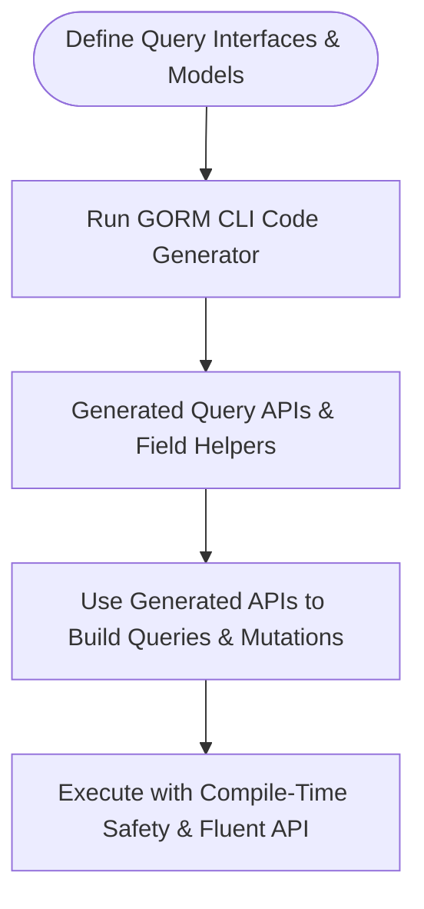

# Value Proposition & Unique Features

## Unlock Compile-Time Safety and Fluent APIs for Your GORM Projects

GORM CLI transforms your database interaction through automated code generation that delivers type-safe, interface-driven query APIs and model-based field helpers. By generating strongly typed, discoverable methods from your Go interfaces and model structs, GORM CLI eliminates guesswork, reduces runtime errors, and drastically improves development speed.

### Why GORM CLI Matters

- **Type-Safe APIs from Raw SQL Interfaces:** Write your query method signatures once, with embedded SQL templates, and get generated, fully type-checked methods that guarantee correctness before you run your application.
- **Model-Driven Field Helpers:** Instead of manually crafting filters, updates, or association logic, rely on auto-generated, strongly typed field helpers that reflect your model's fields and relationships.
- **Fluent, Discoverable Usage:** Navigate generated APIs like native Go code — with intuitive method names, autocompletion, and strict typing — to build complex queries and updates effortlessly.
- **Compile-Time Checks:** Catch invalid field usage, SQL parameter mismatches, or broken association operations at compile time, saving you countless debugging hours.
- **Seamless Integration:** Designed as a companion to `gorm.io/gorm`, GORM CLI-generated code feels like a natural extension, making adoption seamless.

### The Heart of GORM CLI’s Innovation

At its core, GORM CLI leverages Go’s powerful generics and interface embedding to generate two powerful artifacts:

- **Interface-Driven Query APIs:** You write Go interfaces with embedded SQL in comments (using a powerful template DSL). The CLI tool generates implementations supporting fluent query methods bound to your database schema.

- **Model-Driven Field Helpers:** From your model structs, it derives strongly typed accessors and setters for normal fields and associations, enabling type-safe filters, updates, creations, and deletes.

These two outputs combine to create a cohesive workflow that accelerates your data access layer development with confidence.

---

## What Sets GORM CLI Apart?

### 1. Type-Safe Query APIs from Interfaces with SQL Templates

Forget raw SQL strings scattered in your code. Define your queries declaratively as Go interface methods, annotated with template SQL. The generator creates concrete implementations that enforce type safety for inputs and outputs and even inject context transparently.

**Example:**

```go
// Define an interface with SQL template
// SELECT * FROM @@table WHERE id=@id
GetByID(id int) (T, error)
```

Generated code enables calls like:

```go
user, err := generated.Query[User](db).GetByID(ctx, 123)
```

With full type safety, no more fragile string-based queries.

---

### 2. Model-Driven Field Helpers for Robust Filtering and Mutations

Your model structs become the basis for generating strongly-typed helpers that precisely represent your schema's fields, including primitive types and complex associations.

These helpers enable expressive, chainable filters and updates:

```go
gorm.G[User](db).
  Where(generated.User.Age.Gt(18)).
  Set(generated.User.Name.Set("alice"), generated.User.IsAdult.Set(true)).
  Update(ctx)
```

They support predicates such as `Eq()`, `Like()`, `Between()`, and advanced operations like `SetExpr()` for custom SQL expressions.

---

### 3. Comprehensive Association Operations with Compile-Time Safety

GORM CLI unlocks powerful association methods automatically generated for relations like has-one, has-many, belongs-to, and many-to-many. You get:

- **Create & Batch Create:** Insert and link related entities seamlessly.
- **Update:** Modify associated records with conditions.
- **Unlink:** Clear foreign keys or remove join table rows safely.
- **Delete:** Remove associated rows or join rows based on conditions.

**Example:** Create a user with pets linked atomically:

```go
gorm.G[User](db).
  Set(
    generated.User.Name.Set("alice"),
    generated.User.Pets.Create(generated.Pet.Name.Set("fido")),
  ).
  Create(ctx)
```

This workflow reduces boilerplate and enforces referential integrity upfront.

---

### 4. Highly Configurable Generation

Through `genconfig.Config`, fine-tune generation behavior:

- **Output paths and file structuring**
- **Custom field mappings and wrappers** (e.g., JSON helpers for specific columns)
- **Selective interface and struct inclusion/exclusion** using patterns or type references

This allows tailoring the generated code to fit various project conventions.

---

### 5. Template-Based SQL DSL for Dynamic Queries

Write templates with placeholders and conditional logic embedded in interface comments. The generator resolves:

- Table and column names dynamically
- Parameter binding mapped from Go function arguments
- Conditional WHERE and SET clauses
- Iterations and branching within SQL

This provides maximum expressiveness while retaining the advantages of static type checking.

---

## How It Fits Together

Here's a simplified workflow snapshot:



Each stage hands off to the next, culminating in safer, more maintainable database access code.

---

## Practical Example

You write this interface:

```go
type Query[T any] interface {
  // SELECT * FROM @@table WHERE id=@id
  GetByID(id int) (T, error)

  // where("name=@name AND age=@age")
  FilterByNameAndAge(name string, age int)
}

// Model struct

type User struct {
  gorm.Model
  Name string
  Age  int
}
```

Run the CLI:

```bash
gorm gen -i ./examples -o ./generated
```

Then consume:

```go
u, err := generated.Query[User](db).GetByID(ctx, 123)
users, err := gorm.G[User](db).Where(generated.User.Age.Gt(18)).Find(ctx)
```

This eliminates tedious manual query crafting and offers autocompletion and type checks.

---

## Why Should You Choose GORM CLI?

- **Boost Developer Productivity:** Spend less time writing repetitive SQL and more time focusing on business logic.
- **Minimize Runtime Errors:** Catch invalid queries and operations at compile time before deployment.
- **Leverage Modern Go Features:** Generics and interface-driven generation play to Go’s strengths.
- **Future-Proof Your Codebase:** The generated API evolves automatically with your models and interfaces.

---

Explore the next steps to see how easy it is to install, configure, and start generating immediately.


---

## Related Links

- [What is GORM CLI?](/overview/intro-value-core/what-is-gorm-cli) for foundational understanding
- [Quickstart: Generate Type-Safe APIs](/guides/getting-started/quickstart-workflow) for hands-on tutorial
- [Customizing Code Generation](/guides/advanced/customizing-generation) for advanced scenarios

---

<Note>
This page centers specifically on the value and key features that differentiate GORM CLI from traditional ORM or query building approaches — focusing on benefits you unlock by adopting the code generation paradigm.
</Note>
