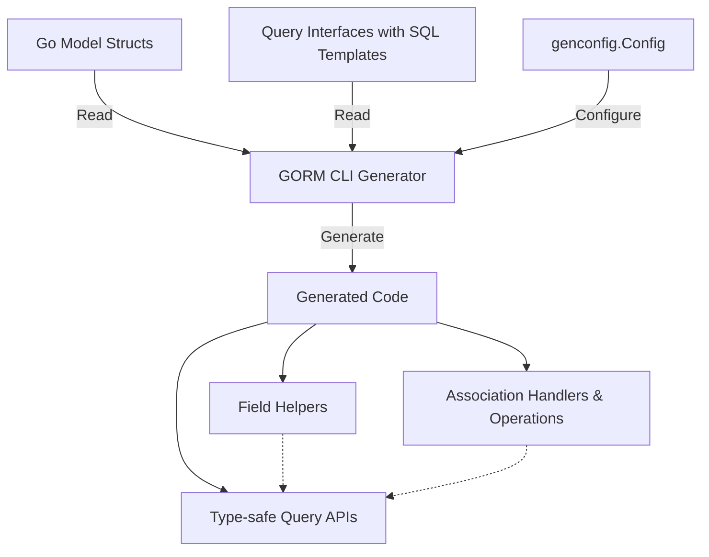

# Core Concepts & Terminology

Discover the foundational concepts and terminology essential to mastering GORM CLI. This page guides you through key ideas like query API generation, model-driven field helpers, handling associations, compile-time safety, and the configurable model — empowering you to confidently read examples and leverage documentation.

---

## Unlocking the Power of GORM CLI: Essential Concepts

GORM CLI transforms your Go GORM projects by generating code that is both type-safe and fluent. It's built upon a few pivotal concepts you'll use daily:

- **Query API Generation:** Define your database queries through Go interfaces annotated with SQL templates. GORM CLI converts these into concrete, strongly typed methods that ensure compile-time safety and intuitive usage.

- **Model-Driven Field Helpers:** Based on your Go model structs, GORM CLI creates field helpers tailored to each column and association. These helpers empower you to build expressive, error-resistant filters, updates, and ordering in queries.

- **Association Handling:** Relations such as has-one, has-many, belongs-to, and many-to-many are automatically recognized and represented as dedicated helpers. This unlocks operations like create, update, unlink, and delete on associated data with full type safety.

- **Compile-Time Safety:** By generating code from your models and interfaces, GORM CLI eliminates common runtime errors by enforcing checks at build time, providing confidence and reducing debugging overhead.

- **Configuration Model:** Customize your generation process using `genconfig.Config` structures. They govern inclusion/exclusion filters, output paths, and field helper mappings — enabling tailored code generation aligned to your project needs.

---

## Key Terminology Explained

Understanding GORM CLI means speaking its language. Here are the terms that form the backbone of your journey:

### Field Helpers
These are strongly typed constructs generated for every field in your models. They come in forms like:

- **Basic Field Helpers:** For primitive fields such as `int`, `string`, `bool`, `time.Time`, and custom types implementing Scanner and Valuer. Example: `generated.User.Age` returns a number field helper allowing you to write `generated.User.Age.Gt(18)`.

- **Association Field Helpers:** For relationships, represented as `field.Struct[T]` or `field.Slice[T]`, e.g., `generated.User.Account` or `generated.User.Pets`. They support operations like `Create()`, `Update()`, `Unlink()`, and `Delete()` on related data.

### Generics
GORM CLI leverages Go generics (`[T any]`) throughout the code generation pipeline, enabling flexible, reusable query interfaces and helpers regardless of the specific model.

Example:
```go
func Query[T any](db *gorm.DB) QueryInterface[T] { ... }
```

### Association Operations
Operations defined on associations that enable managing related data records efficiently and safely:

- **Create/CreateInBatch:** Insert and link related rows in one fluent call.
- **Update:** Change fields on related rows matching optional conditions.
- **Unlink:** Detach associations without deleting related records — for instance, setting foreign keys to NULL or removing join table entries.
- **Delete:** Remove associated rows outright, such as deleting child rows or join table entries.

These operations are carefully designed to adhere to the semantics of the association type (belongs to, has one, has many, many-to-many).

### Template DSL (Domain Specific Language)
In your query interfaces, you write SQL with templating directives that bind Go parameters and control query structure dynamically:

| Directive   | Purpose                           | Example                                     |
|-------------|---------------------------------|---------------------------------------------|
| `@@table`   | Resolves to the model’s table    | `SELECT * FROM @@table WHERE id=@id`        |
| `@@column`  | Dynamic column binding           | `WHERE @@column=@value`                      |
| `@param`    | Bind Go method parameters         | `WHERE name=@user.Name`                      |
| `{{where}}` | Conditional WHERE clause          | `{{where}} age > 18 {{end}}`                 |
| `{{set}}`   | Conditional SET for UPDATE        | `{{set}} name=@name {{end}}`                 |
| `{{if}}`    | Conditional SQL fragments         | `{{if age > 0}} AND age=@age {{end}}`        |
| `{{for}}`   | Looping over collections          | `{{for _, tag := range tags}} ... {{end}}` |

This DSL makes your queries expressive, reusable, and easy to maintain.

---

## How These Concepts Work Together

Here’s how the core pieces interlock to provide a seamless developer experience:

1. **Write Go model structs** representing your database schema, including associations.
2. **Define interfaces with method declarations and SQL templates** using GORM CLI’s template DSL.
3. **Run the GORM CLI generator,** which reads your models and interfaces, and produces:
   - Strongly typed **query APIs** matching your interfaces.
   - **Field helpers** for each model field and association.
4. **Use generated code** in your applications to build safe, fluent queries and manipulate related data with confidence.

Example snippet illustrating the usage of field helpers:

```go
// Fetch a user where Age > 18 and Name matches pattern
users, err := generated.Query[User](db).FilterByNameAndAge("jinzhu", 25).Find(ctx)

// Update a user's pet name
err := gorm.G[User](db).
  Where(generated.User.ID.Eq(1)).
  Set(generated.User.Pets.Where(generated.Pet.Name.Eq("fido")).Update(generated.Pet.Name.Set("rex"))).
  Update(ctx)
```

---

## Practical Tips & Best Practices

- **Start with defining clear model structs** including associations with proper GORM tags. This foundation enables accurate field helper generation.
- **Use generics in your interfaces** to keep your query APIs flexible and reusable.
- **Leverage the template DSL** for conditional queries and updates to reduce boilerplate and handle dynamic query logic elegantly.
- **Use the association helpers** to perform complex related data operations concisely and safely, replacing error-prone manual handling.
- **Employ configuration via `genconfig.Config`** to customize which models and interfaces are included or excluded, specify output locations, and map custom field types.

---

## Common Pitfalls to Avoid

- **Skipping association specification in models:** Without proper association tags in your struct, association helpers cannot be generated.
- **Malformed or missing SQL templates:** Queries without templated SQL or with incorrect placeholders will yield generation failures or unusable methods.
- **Ignoring configuration options:** Overlooking `IncludeInterfaces`, `ExcludeStructs`, or field type mappings can lead to unexpected files or missing helpers.
- **Assuming runtime safety:** GORM CLI enforces compile-time safety; bypassing generated APIs in favor of manual SQL risks losing these benefits.

---

## Next Steps

Now that you understand the core concepts and terminology:

- Visit the [What is GORM CLI?](https://docs.gorm.io/overview/introduction-and-key-concepts/what-is-gorm-cli) page to see the product introduction and value proposition.
- Explore practical [Value Proposition & Use Cases](https://docs.gorm.io/overview/introduction-and-key-concepts/value-and-use-cases) to see real-world scenarios and benefits.
- Start writing query interfaces and defining your models, then use the [Getting Started Guides](https://docs.gorm.io/getting-started/essential-setup/first-code-generation) to generate your first code.

---

For more detailed understanding, consult related guides on [Working with Field Helpers](https://docs.gorm.io/guides/core-workflows/working-with-field-helpers) and [Managing Associations](https://docs.gorm.io/guides/core-workflows/associations-guide).


---

## Conceptual Mermaid Diagram: How Core Components Relate



This flow reflects the user’s journey from defining models and queries, configuring the generator, to utilizing the produced code.

---