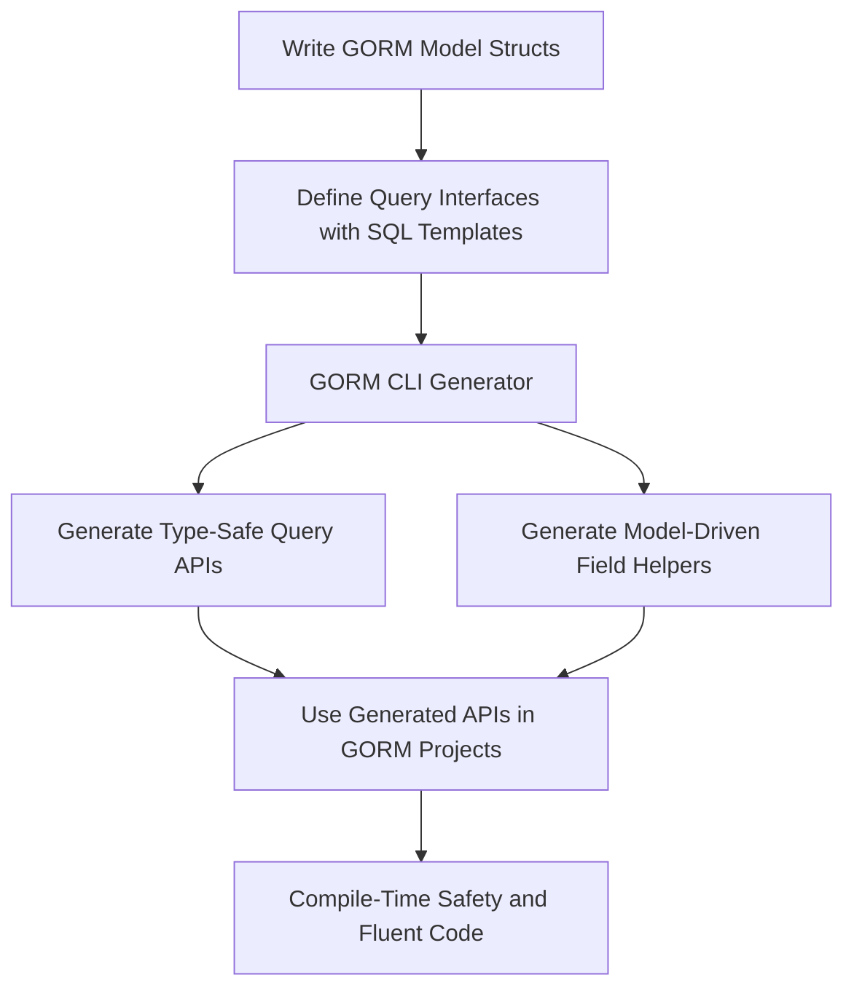

# What is GORM CLI?

Unlock the full potential of your GORM projects with GORM CLI — a powerful code generation tool that crafts type-safe, interface-driven query APIs and model-driven field helpers. Designed to eliminate runtime errors and streamline database operations, GORM CLI empowers you with compile-time safety and enhanced maintainability.

---

## Introducing GORM CLI

GORM CLI is a command-line tool tailored to generate high-quality Go code that seamlessly integrates with GORM. It produces two essential components:

- **Interface-driven, type-safe query APIs:** Defined through Go interfaces embedded with SQL templates, these APIs provide fluent and safe database querying, catching mistakes at compile time rather than runtime.

- **Model-driven field helpers:** Generated based on your GORM model structs, these helpers assist with constructing queries for filters, updates, ordering, and managing associations.

By bridging your models and raw SQL interfaces, GORM CLI removes the repetitive and error-prone coding often involved in manual query handling.

### The Problem It Solves

Writing raw SQL queries or using generic ORM interfaces often leads to subtle bugs, typos, and mismatched types that surface only under execution. Debugging these issues consumes valuable development time and introduces instability.

GORM CLI solves this by:

- Generating **type-safe APIs** that confirm all query parameters and returns match your struct definitions
- Providing **field helpers** that enforce proper column usage and simplify query construction
- Enabling **interface-driven design** that helps maintain clean, testable, and reusable query logic

---

## Key Features & Capabilities

### 1. Type-Safe Query APIs from Interfaces

Define your queries as Go interfaces with embedded SQL templates. GORM CLI reads these interfaces and produces concrete implementations, enforcing:

- Strong typing for input parameters and return types
- Correct parameter binding to prevent SQL injection
- Template DSL support for dynamic WHERE and SET clauses

**Example:**

```go
// Define the query interface with SQL templating
type Query[T any] interface {
  // SELECT * FROM @@table WHERE id=@id
  GetByID(id int) (T, error)

  // Dynamic WHERE using struct fields
  FilterByNameAndAge(name string, age int)
}
```

Generating code produces `Query[User]` implementations, allowing safe fetching by ID or filtering by attributes.

### 2. Model-Driven Field Helpers

From your GORM model structs, GORM CLI generates field helpers tailored to each field type, supporting:

- Predicates for filters, e.g., `Eq()`, `Like()`, `Between()`, `IsNull()`
- Update setters, including special expressions like `Incr()` or raw SQL clauses
- Association helpers allowing create, update, unlink, delete operations on related models with compile-time checking

**Example:**

```go
// Filter users older than 18
db.Where(generated.User.Age.Gt(18)).Find(ctx)

// Create a user with an associated pet
gorm.G[User](db).
  Set(
    generated.User.Name.Set("alice"),
    generated.User.Pets.Create(generated.Pet.Name.Set("fido")),
  ).
  Create(ctx)
```

### 3. Association Operations with Safety

GORM CLI imbues association operations (has one, has many, belongs to, many-to-many) with clarity and type correctness:

- Create, update, unlink, and delete associations through generated fluent APIs
- Fine-grained conditions on association operations
- Batch operations for efficiency

### 4. Configurable Generation

Tailor generation according to your project:

- Output directory customization
- Inclusion or exclusion of specific interfaces or structs
- Custom field type mappings (e.g., JSON or custom SQL fields)
- File-level or package-level generation control

---

## Why Use GORM CLI?

### Unlock These Benefits:

- **Compile-time safety:** Catch query errors early before runtime
- **Increased productivity:** Automate repetitive boilerplate code
- **Improved maintainability:** Clear, interface-driven query design
- **Discoverable APIs:** Use IDE autocomplete with strongly-typed methods
- **Seamless integration:** Fully compatible with GORM’s idiomatic API

### Real-World Scenarios

- Building large-scale applications where maintaining raw SQL queries and models manually is error-prone
- Teams enforcing strict type safety and consistent query patterns
- Projects requiring complex associations and dynamic query conditions

**Before GORM CLI:**
```go
// Potentially error-prone manual SQL construction, typo-prone filters
rows, err := db.Raw("SELECT * FROM users WHERE id=?", id).Rows()
```

**After GORM CLI:**
```go
user, err := generated.Query[User](db).GetByID(ctx, id)
```

---

## How Does It Work? (High-Level Workflow)

1. **Write your data models:** Define your GORM models as structs normally.

2. **Define query interfaces:** Declare Go interfaces annotated with SQL templates in method comments.

3. **Run GORM CLI generator:** Point the CLI to your interfaces directory.

4. **Generated code output:** GORM CLI creates two sets of code—query API implementations and field helper variables.

5. **Use in your app:** Import the generated package and use type-safe querying and association operations.

<Steps>
<Step title="Write Query Interfaces">
Create interfaces with SQL queries using the template DSL.
</Step>
<Step title="Run Generator">
Execute `gorm gen -i ./path/to/interfaces -o ./generated`.
</Step>
<Step title="Integrate and Code">
Leverage generated APIs in your GORM workflow for filters and associations.
</Step>
</Steps>

---

## Tips, Best Practices, and Common Pitfalls

- **Keep interfaces focused:** Define query methods relevant to business operations for clear API design.
- **Consistent model location:** Define models in the same package or directory as interfaces or configure accordingly.
- **Use custom field mappings:** For special fields like JSON or custom timestamp types, apply config mappings.
- **Review generated code:** Use it as a learning aid and check for correctness before integrating.
- **Avoid editing generated files:** Generated code includes a hint to not edit to prevent overwrites.

<Warning>
Avoid direct modification of generated files. Instead, update your interfaces or configs and regenerate.
</Warning>

---

## Getting Started Preview

To begin with GORM CLI:

- **Ensure Go 1.18+ installed** (required for generics).
- **Install GORM CLI:**

```bash
go install gorm.io/cli/gorm@latest
```

- **Write your model and query interface:** As described above.

- **Run generation:**

```bash
gorm gen -i ./examples -o ./generated
```

- **Import and use:** Simply import your `generated` package and start coding with confidence.

Visit the [Quick Start: Generate and Use APIs](https://docs.gorm.io/getting-started/first-run/quickstart-sample) for detailed walkthrough.

---

## Summary

GORM CLI modernizes your GORM development by automating the creation of precise, type-safe query APIs and field helpers. It reduces bugs, accelerates development, and offers fluent, expressive database access.

Explore more in the documentation:

- [Value Proposition & Target Audience](../value-prop-target-audience)
- [Building Type-Safe Queries with Interfaces](../../guides/core-workflows/interface-driven-queries)
- [Using Field Helpers for Filters, Updates, and Ordering](../../guides/core-workflows/model-driven-helpers)

Harness the power of code generation with GORM CLI to make your Go-GORM projects more robust and maintainable than ever before.

---

## Additional Resources

- [GORM CLI GitHub Repository](https://github.com/go-gorm/cli)
- [GORM Official Site](https://gorm.io)
- [Examples and Sample Code](https://github.com/go-gorm/cli/tree/main/examples)

---

## Illustrative Mermaid Diagram — Code Generation Workflow


