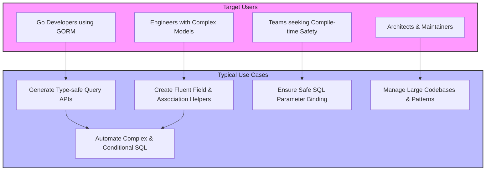

# Who Should Use GORM CLI? Target Audience & Use Cases

## Unlock Safe, Scalable, and Maintainable Query Logic with GORM CLI

GORM CLI is built for Go engineers who rely on GORM to interact with databases and want to elevate their productivity by generating reliable, type-safe, and composable query APIs and model helpers. If you're struggling with verbose query code, error-prone string concatenations, or maintaining complex associations, this page will help you determine if GORM CLI matches your needs.

---

## Why This Page Matters

This documentation answers the key question: *Is GORM CLI right for me?* It guides Go developers through a clear understanding of the ideal users and typical scenarios where adopting GORM CLI delivers immediate and strategic advantages.

You’ll discover the user profiles for whom GORM CLI was designed and real-world use cases illustrating where its benefits are undeniable.

---

## Who Should Use GORM CLI?

- **Go Developers Using GORM:** If your projects base data operations on `gorm.io/gorm` and you want to automate and safeguard your query logic, GORM CLI provides a seamless generation of type-safe, fluent APIs.

- **Engineers Managing Complex Models or Associations:** When your data models have intricate relationships (e.g., belongs to, has many, many to many, polymorphic associations), GORM CLI's model-driven helpers simplify maintaining and manipulating these associations.

- **Teams Seeking Compile-time Safety:** Developers who want to catch SQL and interface-related bugs early, by converting SQL query interfaces into strongly typed Go methods guarded at compile-time.

- **Architects Focusing on Maintainability and Scalability:** If your application needs scalable code organization with clean separation of query logic, GORM CLI lets you define query interfaces clearly and safely.

- **Developers Looking to Reduce Boilerplate:** Automate repetitive patterns like common filters, updates, and association management without hand-writing every line.

---

## Typical Use Cases

### 1. Generating Type-Safe Query APIs from Interface Definitions

Imagine a service defining interfaces with embedded SQL templates, such as this:

```go
// examples/query.go
// Query[T any] interface defines structured query methods
type Query[T any] interface {
  // SELECT * FROM @@table WHERE id=@id
  GetByID(id int) (T, error)

  // SELECT * FROM @@table WHERE @@column=@value
  FilterWithColumn(column string, value string) (T, error)

  // Complex conditional query
  QueryWith(user models.User) (T, error)
  
  // UPDATE with SET clauses based on struct fields
  UpdateInfo(user models.User, id int) error
}
```

With GORM CLI, these interfaces become type-safe, ready-to-use APIs, avoiding runtime SQL errors and cumbersome manual query building.

### 2. Creating Fluent Helpers for Model Fields and Associations

Your model structs, like `User` with nested associations (`Account`, `Pets`, `Languages`), automatically generate helpers:

- Basic field helpers with methods like `.Eq()`, `.Between()`, `.Set()`, sharpening predicates and update expressions.
- Association operations such as `.Create()`, `.Update()`, `.Unlink()`, and `.Delete()` that respect database relationships and constraints.

This promotes robust, intuitive code such as:

```go
gorm.G[User](db).
  Where(generated.User.ID.Eq(1)).
  Set(
    generated.User.Name.Set("alice"),
    generated.User.Pets.Create(generated.Pet.Name.Set("fido")),
  ).
  Update(ctx)
```

### 3. Automating Complex Queries and Conditional SQL

Users faced with frequent custom queries involving dynamic `WHERE` and `SET` clauses can encode their logic in SQL templates comments inside query interfaces. GORM CLI generates implementations that handle conditional logic automatically, helping maintain clean and DRY code.

### 4. Ensuring Consistent SQL Binding and Parameter Safety

By leveraging templated SQL combined with Go generics, GORM CLI minimizes risks of SQL injection and query errors, backing your data access layer with compile-time checks.

### 5. Teams Managing Large Codebases with Multiple Query Patterns

By configuring inclusion/exclusion patterns, projects can selectively generate code for specific interfaces or structs — streamlining workflows and integrating with existing codebases without disruption.

---

## Before and After GORM CLI Adoption

| Without GORM CLI                             | With GORM CLI                                    |
|--------------------------------------------|-------------------------------------------------|
| Hand-written SQL in strings prone to bugs  | SQL templates in interfaces with compile-time validation |
| Manually maintain query builders for each case | Auto-generated fluent APIs reduce boilerplate and errors |
| Complex association handling is tedious   | Association helpers provide structured, safe operations |
| Risk of runtime query failures and injection | Safer, parameterized, strongly-typed queries |
| Inconsistent query methods across teams   | Standardized generated APIs improving code uniformity |

---

## Practical Tips to Identify Fit

- If you write many custom SQL queries mixed with GORM and find it error-prone, GORM CLI fits.
- If your models have relationships requiring multiple CRUD operations on associated data, consider adopting GORM CLI.
- If your team values compile-time safety, code generation for consistent patterns, and minimizing runtime bugs, GORM CLI is ideal.

<Note>
GORM CLI requires Go 1.18+ for generics support and presumes familiarity with GORM's core API.
</Note>

---

## Summary of Why GORM CLI is a Perfect Match

- **Enhances developer productivity with compile-time safety** — shifting bugs from runtime to compile time.
- **Automates type-safe generation from your interfaces and models** — saving time and eliminating boilerplate.
- **Supports complex and scalable data models with robust association helpers.**

For Go engineers adopting GORM who crave safer, cleaner, and more maintainable database interactions, GORM CLI is the strategic tool for elevating your codebase.

---

## Next Steps

Ready to see how it works?

- Explore [What is GORM CLI?](./what-is-gorm-cli) to deepen your understanding of the product.
- Check out the [Value Proposition & Key Features](./value-proposition-and-key-features) page to discover core benefits.
- Start with the [Quickstart Workflow](../../feature-highlights-getting-started/quickstart-workflow) for a hands-on introduction.


---

## Further Reading

- [Using Generated Field Helpers for Filtering and Updates](../../guides/core-workflows/using-generated-field-helpers)
- [Working with Associations: Create, Update, Unlink, Delete](../../guides/core-workflows/associations-best-practices)
- [Configuring Generation with genconfig.Config](../../guides/advanced-usage/configuring-generation)


## Related Examples

Explore the following example files that illustrate the typical usage patterns:

- [examples/query.go](../../examples/query.go) — defining query interfaces with SQL templates
- [examples/models/user.go](../../examples/models/user.go) — complex models demonstrating association types
- [examples/output/query_test.go](../../examples/output/query_test.go) — tests showcasing generated API usage

---

Embrace type-safe, scalable, and maintainable querying with GORM CLI — your trusted partner for Go + GORM projects.


---

### Reference Diagram


